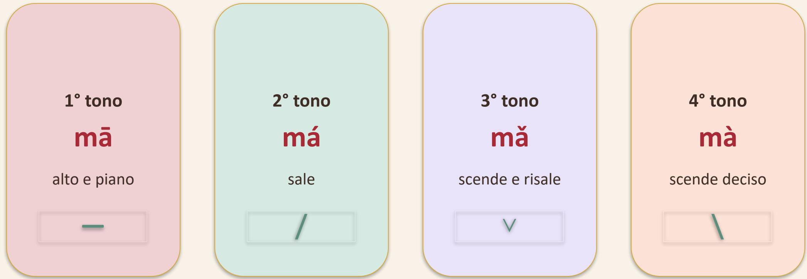

## Pinyin e pronuncia cinese

> [!abstract] Guida di Studio
> Benvenuti nel percorso di apprendimento del cinese. Questa sezione introduce le basi fonetiche fondamentali: i toni, le consonanti e le vocali.
> 
> 
> 
> *Ricorda: Leggi sempre prima il tono, poi il suono della sillaba.*
> *Esempio pratico: mā / má / mǎ / mà*

---

## 🎵 I Toni Cinesi

> [!tip] Nota del Tutor
> Impara i toni come una melodia. La differenza tra un tono e l'altro può cambiare completamente il significato di una parola.

| Tono       | Simbolo   | Descrizione                         | Curva       | Esempio |
| :--------- | :-------- | :---------------------------------- | :---------- | :------ |
| **1**      | $\bar{a}$ | Alto e stabile, come una nota lunga | $\text{—}$  | mā      |
| **2**      | á         | Ascendente, come una domanda        | $/$         | má      |
| **3**      | ǎ         | Scende profondamente e risale       | $\lor$      | mǎ      |
| **4**      | à         | Scende bruscamente e si interrompe  | $\setminus$ | mà      |
| **Neutro** | a         | Breve, leggero e quasi "senza tono" | $.$         | ma      |

---

## 🗣️ Classificazione delle Consonanti

> [!abstract] Guida all'articolazione
> La sfida principale per un italiano è la distinzione tra suoni aspirati e non aspirati e la corretta posizione della lingua. Noi non abbiamo questi suoni e un po' come con l'inglese che abbiamo imparato a emettere il suono della `h` anche qui dobbiamo imparare a pronunciarli. Omettendo questi suoni potresti dire roma per toma, se sei fortunato. 

| Gruppo        | Consonanti                      | Esempi          | Caratteri |
| :------------ | :------------------------------ | :-------------- | --------- |
| **Labiali**   | b, p, m, f                      | bà, mā, fàn     | 爸，拍，妈，饭     |
| **Dentali**   | d, t, n, l                      | dào, tā, nǐ, lǎo shī | 到，他，你，老师    |
| **Velari**    | g, k, h                         | hǎo, gē, kě yǐ  | 好， 哥，可以   |
| **Sibilanti** | j, q, x, z, c, s, zh, ch, sh, r | shì, xiè, qǐng  | 是， 谢， 请，金，在，次，这，吃，上，人 |

### Labiali
| Consonante | Note                                            | Esempio | Caratteri |
| :--------- | :---------------------------------------------- | :------ | --------- |
| b          | simile a una p morbida, senza forta aspirazione | bà      | 爸         |
| p          | simile a b, ma con più aria in uscita           | pàn     | 拍         |
| m          | come mamma                                      | mā      | 妈         |
| f          | come in italiano "fata"                         | fàn     | 饭         |

### Dentali
| Consonante | Note | Esempio | Caratteri |
| :--- | :--- | :--- | :--- |
| d | simile alla d italiana | dào | 到 |
| t | simile alla t italiana | tā | 他 |
| n | simile alla n italiana | nǐ | 你 |
| l | simile alla l italiana, ma con la lingua leggermente più retroflessa | lǎo shī | 老师 |

### Velari
| Consonante | Note                                                             | Esempio | Caratteri |
| :--------- | :--------------------------------------------------------------- | :------ | --------- |
| g          | simile alla g italiana                                           | gē      | 哥       |
| k          | simile alla k italiana                                           | kě yǐ   | 可以     |
| h          | un sospiro profondo che viene dalla gola (non è una "h" inglese) | hǎo     | 好       |

### Sibilanti
| Consonante | Note                                       | Esempio | Caratteri |
| :--------- | :----------------------------------------- | :------ | --------- |
| j          | palatale, simile a un "i" molto dolce      | jǐn     | 金       |
| q          | palatale, simile a una "c" dolce e soffice | qǐng    | 请       |
| x          | palatale, simile a una "s" dolce e soffice | xiè     | 谢       |
| z          | simile alla "z" italiana                   | zài     | 在       |
| c          | simile a un suono "ts"                     | cì      | 次       |
| s          | simile alla "sc"                           | sì     | 是       |

### Retroflesse

| Consonante | Note                                                                                                | Esempio | Caratteri |
| :--------- | :-------------------------------------------------------------------------------------------------- | :------ | --------- |
| zh         | retroflessa (lingua arrotolata), simile a una "j" italiana ma con la lingua più indietro            | zhè     | 这       |
| ch         | retroflessa (lingua arrotolata), simile a una "c" (come in "ciao") ma con la lingua più indietro    | chī     | 吃       |
| sh         | retroflessa (lingua arrotolata), simile a una "sc" (come in "sciare") ma con la lingua più indietro | shàng   | 上       |
| r          | retroflessa, suono dolce e quasi sussurrato, non vibrante                                           | rèn     | 人       |

> [!tip] Nota del Tutor
> Per un italiano, la sfida principale è distinguere tra:
> - **Palatali (j, q, x):** la lingua si appoggia al palato duro.
> - **Retroflesse (zh, ch, sh):** la lingua si "arrotola" verso la parte posteriore del palato.
> - **Altro (z, c, s):** suoni simili alle sibilanti italiane ma con una posizione della lingua leggermente diversa.
> 
> È fondamentale ascoltare bene la differenza tra 's' (dentale) e 'sh' (retroflessa).

---

> [!info] Scioglilingua di riferimento (Differenziazione s vs sh)
> In fonetica cinese lo scioglilingua per eccellenza per allenare questa coppia minima è:
> 四是四，十是十
> Sì shì sì, shí shì shí.
> ("Quattro è quattro, dieci è dieci.")
> sì [s] $\rightarrow$ sibilante secca dentale.
> shì / shí [ʂ] $\rightarrow$ retroflesso profondo. 

## 👄 Vocali e Dittonghi

Vocali base: **a, o, e, i, u, ü**
Dittonghi comuni: **ai, ei, ui, ao, ou, iu**

> [!tip] Nota del Tutor
> - **Suono "ü":** Immagina di dire "iu" ma con le labbra arrotondate come se dovessi fischiare. Somiglia a un suono vocalico francese.
> - **Suono "ui":** Si pronuncia come "uei".
> - **Suono "iu":** Si peonuncia come "iou".
> 
> **Suggerimento:** Pronuncia prima la vocale chiaramente, poi aggiungi il tono. È la base per una pronuncia fluida.

> [!info] Arch Chinese Pinyin Table
> [Arch Chinese Pinyin Table](https://www.archchinese.com/chinese_pinyin.html) è una pagina web che contiene una tabella *Consonanti* x *Vocali* con tutte le pronunce. Al netto di essere loggato permette il download di ogni pronuncia in formato *mp3*. Contiene anche giochi, esercizi per scrittura a mano libera e molto altro. 
> Valida alternativa è [Yabla](https://chinese.yabla.com/)

---

## Saluti e Cortesia

Questa sezione include le espressioni fondamentali per i primi incontri e la cortesia quotidiana.

---

### 你好

- **Pinyin:** nǐ hǎo
- **Significato:** ciao / salve
- **Esempio d’uso:** 你好！Nǐ hǎo! (Ciao!)

**Analisi Fonetica:**

| Carattere | Pinyin | Scomposizione |
| :--- | :--- | :--- |
| 你 | nǐ | n + i |
| 好 | hǎo | h + a + o |

> [!tip] Nota del Tutor
> Il 'nǐ' è in tono 3 e il 'hǎo' è in tono 3. Quando due toni 3 sono vicini, il primo tende a diventare quasi un tono 2.

---

### 谢谢

- **Pinyin:** xiè xie
- **Significato:** grazie
- **Esempio d’uso:** 谢谢你。Xiè xie nǐ. (Grazie.)

**Analisi Fonetica:**

| Carattere | Pinyin | Scomposizione |
| :--- | :--- | :--- |
| 谢 | xiè | x + i + e |
| 谢 | xie | x + i + e (tono neutro) |

> [!tip] Nota del Tutor
> Nota come la seconda sillaba "xie" perda la forza del tono; in cinese il tono neutro è fondamentale per dare fluidità alla frase.

---

### 再⻅

- **Pinyin:** zài jiàn
- **Significato:** arrivederci
- **Esempio d’uso:** 明天再⻅。Míng tiān zài jiàn. (A domani.)

**Analisi Fonetica:**

| Carattere | Pinyin | Scomposizione |
| :--- | :--- | :--- |
| 再 | zài | z + a + i |
| 見 | jiàn | j + i + a + n |

---

### 对不起

- **Pinyin:** duì bu qǐ
- **Significato:** scusa / mi dispiace
- **Esempio d’uso:** 对不起，我迟到了。Duì bu qǐ, wǒ chí dào le. (Scusa, sono in ritardo.)

**Analisi Fonetica:**

| Carattere | Pinyin | Scomposizione |
| :--- | :--- | :--- |
| 对 | duì | d + u + i |
| 不 | bu | b + u |
| 起 | qǐ | q + i |

---

### 没关系

- **Pinyin:** méi guān xi
- **Significato:** non importa / non fa niente
- **Esempio d’uso:** 没关系。Méi guān xi. (Non fa niente.)

**Analisi Fonetica:**

| Carattere | Pinyin | Scomposizione |
| :--- | :--- | :--- |
| 没 | méi | m + e + i |
| 关 | guān | g + u + a + n |
| 系 | xi | x + i |

> [!tip] Nota del Tutor
> Questa è la risposta standard a "对不起". Imparala come un blocco unico (chunk) di suono.

---

### 早上好

- **Pinyin:** zǎo shàng hǎo
- **Significato:** buongiorno
- **Esempio d’uso:** 早上好！Zǎoshang hǎo! (Buongiorno!)

**Analisi Fonetica:**

| Carattere | Pinyin | Scomposizione |
| :--- | :--- | :--- |
| 早 | zǎo | z + a + o |
| 上 | shàng | sh + a + n + g |
| 好 | hǎo | h + a + o |

---

### 晚上好

- **Pinyin:** wǎn shàng hǎo
- **Significato:** buonasera
- **Esempio d’uso:** 晚上好！Wǎnshang hǎo! (Buonasera!)

**Analisi Fonetica:**

| Carattere | Pinyin | Scomposizione |
| :--- | :--- | :--- |
| 晚 | wǎn | w + a + n |
| 上 | shàng | sh + a + n + g |
| 好 | hǎo | h + a + o |

---

## Domande e Risposte Personali

Questa sezione contiene le frasi base per presentarsi e interagire socialmente.

---

### 你好吗？

- **Pinyin:** nǐ hǎo ma?
- **Significato:** come stai?
- **Esempio d’uso:** 你好吗？我很好。Nǐ hǎo ma? Wǒ hěn hǎo.

**Analisi Fonetica:**

| Carattere | Pinyin | Scomposizione |
| :--- | :--- | :--- |
| 你 | nǐ | n + i |
| 好 | hǎo | h + a + o |
| 吗 | ma | m + a (neutro) |

> [!tip] Nota del Tutor
> La particella interrogativa 'ma' è sempre in tono neutro e viene aggiunta alla fine della domanda.

---

### 我很好

- **Pinyin:** wǒ hěn hǎo
- **Significato:** sto bene
- **Esempio d’uso:** 我很好，谢谢。Wǒ hěn hǎo, xièxie.

**Analisi Fonetica:**

| Carattere | Pinyin | Scomposizione |
| :--- | :--- | :--- |
| 我 | wǒ | w + o |
| 很 | hěn | h + e + n |
| 好 | hǎo | h + a + o |

---

### 你叫什么名字？

- **Pinyin:** nǐ jiào shén me míng zi?
- **Significato:** come ti chiami?
- **Esempio d’uso:** 你叫什么名字？Nǐ jiào shénme míngzi?

**Analisi Fonetica:**

| Carattere | Pinyin | Scomposizione |
| :--- | :--- | :--- |
| 你 | nǐ | n + i |
| 叫 | jiào | j + i + a + o |
| 什么 | shén me | sh + e + n + me |
| 名字 | míng zi | m + i + ng + zi |

---

### 我叫 Mario

- **Pinyin:** wǒ jiào Mario
- **Significato:** mi chiamo Mario
- **Esempio d’uso:** 我叫 Mario。Wǒ jiào Mario.

**Analisi Fonetica:**

| Carattere | Pinyin | Scomposizione |
| :--- | :--- | :--- |
| 我 | wǒ | w + o |
| 叫 | jiào | j + i + a + o |

---

## Shopping e Richieste

Espressioni utili per gestire acquisti e richieste di base.

---

### 多少钱？

- **Pinyin:** duō shǎo qián?
- **Significato:** quanto costa?
- **Esempio d’uso:** 这个多少钱？ zhè ge duō shǎo qián? (Quanto costa questo?)

**Analisi Fonetica:**

| Carattere | Pinyin | Scomposizione |
| :--- | :--- | :--- |
| 多少 | duō shao | d + u + o + shao |
| 钱 | qián | q + i + a + n |

---

### 我要这个

- **Pinyin:** wǒ yào zhè ge
- **Significato:** voglio questo / prendo questo
- **Esempio d’uso:** 我要这个。Wǒ yào zhège. (Prendo questo.)

**Analisi Fonetica:**

| Carattere | Pinyin | Scomposizione |
| :--- | :--- | :--- |
| 我 | wǒ | w + o |
| 要 | yào | y + a + o |
| 这个 | zhè ge | zh + e + g + e |

---

### 请

- **Pinyin:** qǐng
- **Significato:** per favore / prego
- **Esempio d’uso:** 请坐。Qǐng zuò. (Prego, siediti/si sieda.)

**Analisi Fonetica:**

| Carattere | Pinyin | Scomposizione |
| :--- | :--- | :--- |
| 请 | qǐng | q + i + n + g |

> [!tip] Nota del Tutor
> 'Qǐng' è una parola chiave per la cortesia. Usala all'inizio di una richiesta per renderla immediatamente più educata.

---

## Frasi di Sopravvivenza

Frasi essenziali per comunicare la comprensione o la mancanza della stessa.

---

### 我不知道

- **Pinyin:** wǒ bù zhī dào
- **Significato:** non lo so
- **Esempio d’uso:** 我不知道。Wǒ bù zhīdào. (Non lo so.)

**Analisi Fonetica:**

| Carattere | Pinyin | Scomposizione |
| :--- | :--- | :--- |
| 我 | wǒ | w + o |
| 不 | bù | b + u |
| 不知道 | zhī dào | zh + i + d + a + o |

---

### 我听不懂

- **Pinyin:** wǒ tīng bù dǒng
- **Significato:** non capisco
- **Esempio d’uso:** 对不起，我听不懂。Duì bu qǐ, wǒ tīng bù dǒng. (Scusa, non capisco.)

**Analisi Fonetica:**

| Carattere | Pinyin | Scomposizione |
| :--- | :--- | :--- |
| 我 | wǒ | w + o |
| 听 | tīng | t + i + n + g |
| 不 | bù | b + u |
| 懂 | dǒng | d + o + n + g |

---

### 可以

- **Pinyin:** kě yǐ
- **Significato:** si può / va bene
- **Esempio d’uso:** 可以。Kě yǐ. (Va bene / Si può.)

**Analisi Fonetica:**

| Carattere | Pinyin | Scomposizione |
| :--- | :--- | :--- |
| 可以 | kě yǐ | k + e + y + i |
