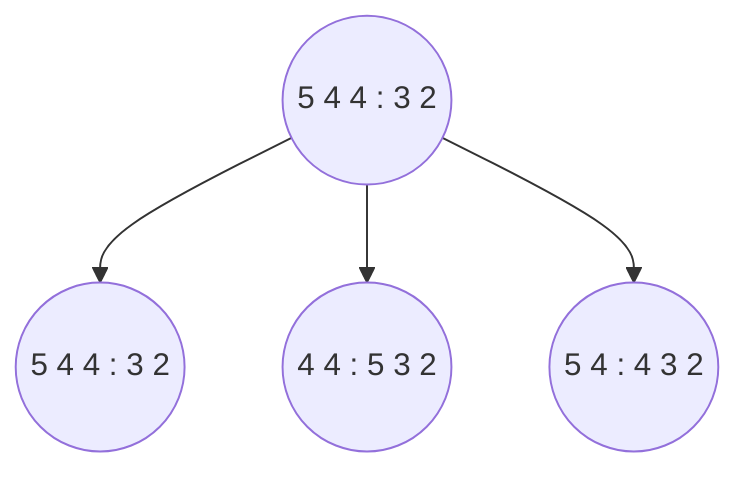

Problemi a miglioramento iterativo. Spesso ci manca proprio lo stato obbiettivo e non solo vogliamo trovarlo ma vogliamo trovare il migliore. 

# Algoritmi con miglioramenti iterativi
Qui si appiccica, per motivi storici, una funzione di utilità  e massimizziamo questa funzione ma non cambia nulla se avessimo bisogno di avere una funzione di costo e minimizzare di conseguenza. 
In molti problemi lo stato finale è soluzione senza tenere conto del cammino che risulterà quindi irrilevante. Quindi mantengo lo stato buono e ne cerco uno migliore.
#### Spazio degli stati
Insieme di configurazioni complete. Trova la soluzione **ottima** come nel caso del commesso viaggiatore; trova la soluzione che **soddisfa tutti i vincoli** come nel timetabling.

## Hill-climbing 
C'è un detto: "*è come scalare l'Everest in mezzo ad una fitta nebbia e soffrendo di amnesia*".
![[Iterative Improvement (Local) search - LocalMax_VS_GlobalMax.png|450]]
Questo algoritmo può rimanere bloccato in un massimo locale (come da immagine). Una volta sul cucuzzolo della collina tutte le mosse peggiorano e quindi non scendo più. 

<center style="font-style:italic">Pseudo codice del'algoritmo Hill-Climbing</center>

```lua
function Ricerca-Salita-Più-Ripida(problema) returns uno stato soluzione
  inputs: problema, un problema
  
  local variables: corrente, un nodo
                   prox, un nodo
  
  corrente ← Costruisci-Nodo(Stato-Iniziale[problema])
  loop do
    prox ← successore di corrente con valore max
    if Valore[prox] < Valore[corrente]
      then return corrente
    corrente ← prox
  end

```

Siccome rimango bloccato, potrei pensare di fare delle ripartenze dell'algoritmo in stati iniziali differenti per evitare il fenomeno di *get stuck* nel massimo locale. Questo concetto si chiama **random start**.
### [[https://en.wikipedia.org/wiki/Hill_climbing#Ridges_and_alleys|Ridges and alleys]]
- **Ridges (Creste)**: Questi sono i punti elevati della superficie di ricerca che rappresentano soluzioni di alta qualità secondo la funzione obiettivo. In termini di ottimizzazione, una cresta corrisponderebbe a un massimo locale, ovvero un punto in cui tutte le direzioni immediate portano a un decremento del valore della funzione obiettivo. Queste sono le zone che un algoritmo di ricerca a salita (hill-climbing) tenta di trovare e seguire.
    
- **Alleys (Valli)**: Al contrario, le valli sono punti bassi che corrispondono a minimi locali. In una ricerca di ottimizzazione, una valle è un punto dove un piccolo movimento in qualsiasi direzione porterà a un incremento del valore della funzione obiettivo. Queste sono le aree che un algoritmo di ricerca a salita cerca di evitare o uscire, poiché suggeriscono che ci sono soluzioni migliori altrove.
![[Iterative Improvement (Local) search - RidgeProblem.png|450]]
La ricerca a salita più ripida, o algoritmo del gradiente, cerca di spostarsi sempre "in salita" sulla superficie di ricerca, seguendo il gradiente positivo della funzione obiettivo. Tuttavia, questa strategia può avere difficoltà quando incontra creste, valli, o altri tipi di irregolarità (come piani inclinati, sella, ecc.) poiché l'algoritmo può rimanere bloccato in massimi locali senza trovare il massimo globale se la superficie di ricerca è complessa con molte creste e valli.
### Esempio: MMMS
**Minimal Makespan Machine Scheduling** ossia l'ordinamento l'ordinamento di job su macchine minimizzando il tempo di esecuzione:
+ Abbiamo $n$ macchine $\{M_1, ..., M_n\}$ e $m$ lavori $\{1, ..., m\}$
+ $N(i)$ set di lavori assegnati a $M_i$
+ Il tempo del lavoro $k$ è $d_k$
+ Tempo $M_i$ è: $T(i) = \sum_{j\in N(i)}{d_j}$
+ Il tempo totale $T_{tot} = max(T_i)$
+ Obbiettivo: Minimizzare $T$ assegnando opportunamente i lavori alle macchine

#### Applico Hill-Climbing a MMMS
Parto da uno stato a caso e i miei operatori sono:
+ spostamento
+ scambio
La valutazione dello stato è sempre $T$ e mi fermo se tutti gli stati successori sono peggiori di quello corrente. Nell'esempio sotto i due punti separano i lavori della macchina $M_1$ a sinistra da quelli della macchina $M_2$ a destra, i lavori allo stato iniziale sono messi a caso. Considerare un operatore ```spostamento``` che sposta un lavoro da una macchina ad un'altra. 


Lo stato di partenza è appunto un set random dei lavori e provando a sommare i tempi otterrei $T_1=13$ e $T_2=5$ con un evidente sbilanciamento; con il secondo nodo otterrei rispettivamente $8$ e $10$ . Col terzo nodo ottengo $T_1=9$ e $T_2=9$, che non solo è più bilanciato ma è soluzione ottima perché ho minimizzato $T$. L'algoritmo si ferma quando nessuna delle modifiche possibili dello stato fa ottenere uno stato migliore del precedente.  
Precedentemente è stato menzionato l'approccio **random start** alla fine del paragrafo [[1.4 Iterative Improvement (Local) search#Hill-climbing|Hill-Climbing]] ma esistono altri due approcci al problema dei massimi locali:
+ Stochastic Hill-Climbing $\rightarrow$ scelgo statisticamente il successore purché migliore del precedente
+ Simulated Annealing $\rightarrow$ porta pazienza lo vediamo fra pochissimo qui sotto 😁
**RICHIAMO: Normalizzazione a 1**
L'operazione di normalizzazione a 1 ci permette di poter lavorare con una distribuzione di prob. che deve avere valori nell'intervallo $[0,1]$. Si tratta di dividere il valore per il totale dei valori.

### Simulated Annealing - SA (Tempra Simulata)
Accettiamo l'idea di poter fare una **bad move (mossa cattiva)** ossia una mossa che mi porta da uno stato corrente migliore ad uno futuro peggiore. Questa cosa va fatta con due criteri:
1. La prob. della mossa deve essere inversamente proporzionale a quanto è cattiva la mossa
2. Ad inizio algoritmo permetto facilmente mosse cattive ma la frequenza di queste deve diminuire man mano che si avanza nella ricerca.
	1. Se l'algoritmo ha $p = 0$ di eseguire una bad move allora è un hill-climbing puro.
#### Probabilità di una mossa
Sia $\Delta \mathbb{E} = Value(S') - Value(S)$:
+ Se la mossa è cattiva allora $\Delta \mathbb{E} < 0$
+ $p = e^{\Delta\mathbb{E}}$
	+ Questa $p$ mi consente di avere una una probabilità tanto più piccola quanto più grande è il valore di $|\Delta \mathbb{E}|$ 
![[Iterative Improvement (Local) search - probabilità simulated annealing.png|350]]
Se $\Delta \mathbb{E} > 0$ faccio la mossa che mi porta in $S'$, altrimenti passo da $S$ a $S'$ con una probabilità $p$. In pratica genero un numero casuale $x$ e se questo valore è minore di $p$ allora eseguo la mossa. Per fare in modo che la frequenza delle mosse cattive diminuisca con l'avanzamento dell'algoritmo introduco un parametro $T$ che rappresenta la temperatura ed esattamente come la tempra la faccio partire da valori elevati che poi decrescono. Si chiama anche *scheduling di raffreddamento* La nuova funzione di prob è: $$p = e^{{\Delta \mathbb{E} \over T}}$$Quando $T = 0$ allora SA diventa hill-climbing; questa cosa è imposta siccome non si può dividere per zero!
```lua
function Simulated-Annealing(problema, ordine) returns uno stato soluzione
  inputs: problema, un problema
           ordine, relazione tra tempo e "temperatura"
  local variables: corrente, un nodo
                   prox, un nodo
                   T, "temperatura"
  
  corrente ← Costruisci-Nodo(Stato-Iniziale[problema])
  for t ← 1 to ∞ do
    T ← ordine[t]
    if T = 0 then return corrente
    prox ← successore di corrente selezionato a caso
    ΔE ← Valore[prox] - Valore[corrente]
    if ΔE > 0 then corrente ← prox
    else corrente ← prox con probabilità e^(ΔE / T)
  end

```

#### Proprietà Simulated Annealing (non importante)
Sostanzialmente è una tempra simulata, e fin lì... A temperatura fissata la probabilità segue la *distribuzione di Boltzman*: $$p(x)=\alpha e^{\frac{E(x)}{kT}}$$Se la decrescita di $T$ è abbastanza lenta allora si raggiunge sempre lo stato ottimo. 
## Local Beam Search 
### Intro (solo questo è importante)
Il Local Beam Search è una variante degli algoritmi di ricerca locale che opera con più di un "candidato" di stato contemporaneamente. A differenza della ricerca a salita più ripida che tiene traccia di un solo stato corrente e si muove sempre verso il miglior vicino, il Local Beam Search tiene traccia di $k$ stati contemporaneamente, dove $k$ è un parametro dell'algoritmo detto, appunto, *beam*. 

### Funzionamento
Ecco come funziona il Local Beam Search:

1. **Inizio**: Genera inizialmente $k$ stati casuali.
    
2. **Iterazioni**: Ad ogni iterazione, l'algoritmo esplora tutti i vicini di tutti $k$ stati correnti.
    
3. **Selezione**: Dopo aver esplorato i vicini, seleziona i $k$ migliori stati (secondo una funzione obiettivo o di valutazione) tra tutti quelli esaminati, inclusi i $k$ stati correnti e i loro vicini.
    
4. **Criterio di terminazione**: Questo processo continua fino a quando non si verifica una delle seguenti condizioni:
    
    - Non si trovano stati migliori rispetto agli attuali $k$ stati, indicando che l'algoritmo è bloccato in un massimo locale.
    - Si raggiunge un numero massimo di iterazioni.
    - Uno degli stati raggiunge un valore di valutazione considerato sufficientemente buono o si trova una soluzione accettabile.

La differenza principale tra la ricerca a salita più ripida e il Local Beam Search è che quest'ultimo è meno propenso a rimanere bloccato in un massimo locale, dato che tiene traccia di più stati e può quindi esplorare più ampiamente lo spazio di ricerca. Tuttavia, anche il Local Beam Search non è esente da problemi: può convergere su un insieme di stati simili che rappresentano lo stesso massimo locale, una situazione nota come "raggi convergenti".

Inoltre, una variante del Local Beam Search è lo "Stochastic Beam Search", che introduce elementi di casualità nella selezione degli stati da esplorare. Invece di scegliere sempre i $k$ migliori vicini, lo Stochastic Beam Search seleziona i vicini in base a una distribuzione di probabilità relativa alla loro qualità. Questo aiuta a diversificare l'insieme di stati e riduce il rischio di convergenza prematura.

# Algoritmi Genetici
La metafora qui è l'evoluzione Darwiniana ossia quella genetica. Segue il principio dello stochastic beam search solo che gli stati successori sono generati da coppie di stati. Gli stati sono stringhe o bit chiamati **geni** i cui valori sono detti **alleli**. Quindi uno stato è un insieme di geni ed è detto **individuo** e un insieme di individui è una **popolazione**. 
Lo scopo è far evolvere una popolazione iniziale tramite operazioni in modo da massimizzare la funzione di utilità detta **fitness function**. Le operazioni sono:
+ **crossover**: incrocio i geni definendo un punto di taglio casuale.
+ **selezione**: tipo la selezione naturale dove vince il più forte, i migliori in termini di fitness function
+ **mutazione**: in modo completamente casuale c'è una variazione di valore un po' come avviene con le mutazioni genetiche.
Lo stato soluzione del problema è quello che prende, tramite fitness function, l'individuo migliore nella nuova popolazione generata.
Nonostante non siano ottimali sono comunque molto utili in molti ambiti.
## Esempio 
![[Iterative Improvement (Local) search - Esempio_algoritmo_genetico.png]]
A sinistra (punto a) abbiamo la popolazione allo stato iniziale. La fitness function (punto b: numero intero a SX) viene trasformata in una prob. di selezione (punto b: le percentuali a DX) grazie ad una semplice normalizzazione a 1. Si decide di selezionare per 4 volte (punto c) gli individui della popolazione. L'operazione di selezione (punto c) scarta il quarto individuo e incrocia gli individui come indicato dalle frecce. Le coppie selezionate e scambiate di posizione verranno fatte evolvere con l'operazione di crossover  (punto d) definendo casualmente un punto di taglio, come rappresentato durante l'operazione di selezione (punto c). L'ultima fase è quella di mutazione (punto e) che prende la nuova generazione appena creata e in modo completamente randomico cambia il valore di un gene (a volte più geni, dipende da come si fa l'algoritmo in base alle esigenze). Attenzione, la prob. che un gene muti è bassissima, qualcosa tipo $10^{-6}$.
I numeri dell'esempio sopra rappresentano le regine del problema delle 8 regine.
![[Iterative Improvement (Local) search - 8_Regine_algoGenetico.png]]
