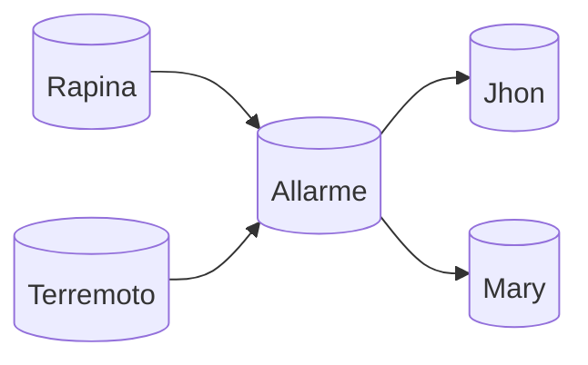

![[Reti Bayesiane - Rappresentazione nodi con arco di condizionamento.png|450]]
$H=\{\bar h, h\}$ sono le ipotesi mentre $E = \{\bar e, e\}$ è l'evento condizionante. $$\mathbb{P}(H=h | E=e)= {\mathbb{P}(h)\mathbb{P}(e|h)\over \mathbb{P}(h)}={\mathbb{P}(h)\mathbb{P}(e|h)\over \mathbb{P}(h)\mathbb{P}(e|h) + \mathbb{P}(\bar h)\mathbb{P}(e|\bar h)}$$
L'assunzione che ogni evidenza $E_i$ con $i=1,...,n$ sia indipendente dall'ipotesi ci permette la fattorizzazione. 
![[Reti Bayesiane - Grafo Bayes Naïve.png]]
Questa cosa ha messo le basi per poter pensare e formalizzare le reti bayesiane.

## Reti Bayesiane
Una rete bayesiana è una coppia $<G,P>$ dove:
- $G$ è una $DAG$ ossia un grafo diretto aciclico
	- I nodi rappresentano delle variabili casuali discrete
	- Un arco orientato dal nodo $X$ al nodo $Y$ lo scriviamo semplicemente così $X \rightarrow Y$ e indica una relazione di dipendenza dove $Y$ dipende da $X$. Si può anche dire che $X$ causa $Y$
- $P$ è una distribuzione di probabilità sulle variabili rappresentate dai nodi $X_1,...,X_n$ tale che $$\mathbb{P}(X_1,...,X_n)=\sum_{i=1}^n\mathbb{P}\big(X_i|Parent(X_i)\big)$$dove $Parent(X_i)$ indica il genitore del nodo $X_i$ nel grafo $G$ 
***Le reti bayesiane sono una notazione grafica semplice per rappresentare asserzioni di indipendenza condizionata, quindi per una specifica compatta di distribuzioni congiunte complete***. 

La topologia della rete codifica le asserzioni di indipendenza ![[Reti Bayesiane - grafo delle carie.png|450]]Le variabili ``Toothache`` e ``Catch`` sono indipendenti data la variabile ``Cavity``. La variabile ``Weather`` è indipendente dalle altre e quindi posso impostare ragionamenti su questa senza tenere conto delle altre e viceversa. Possiamo generalizzare le dipendenze.

### Indipendenza Condizionale
![[Reti Bayesiane - Dipendenza Condizionale.png]]

+ Nel rettangolo di sinistra si vedono due rappresentazioni differenti di come $C$ sia indipendente da $A$ dato $B$. Supponiamo che $A$ sia una rapina, $B$ l'allarme che suona e $C$ il mio vicino che mi chiami. Sapere che suona l'allarme è una motivazione totale sul fatto che il mio vicino di casa e sapere che c'è stata una rapina non cambia nulla sulla chiama del vicino. Che poi sia lineare o divergente rappresentano la stessa cosa.
+ Nel rettangolo di destra abbiamo un caso dove $A$ e $C$ sono indipendenti di base ma conoscendo $B$ diventano dipendenti. Ad esempio, $A$ avere la malaria e $C$ avere il raffreddore sono indipendenti ma se l'individuo sviluppa febbre, ossia $B$, allora ho della dipendenza. Devo fare qualcosa per escludere la dipendenza fra $C$ ed $A$ come ad esempio fare un test. Questa cosa è alla base della diagnosi differenziale che fanno i medici. 

## Graph Theoretic Independence
Dato un grafo diretto aciclico, per gli amici DAG, con vertici $V$ e $u,v \in V$ ed $E\subseteq V$ si dice che $u$ è *d-separato* da $v$ dato $E$ se ogni cammino diretto tra $u$ e $v$ è bloccato da $E$. Ossia:
- Esiste un nodo $z$ lineare o divergente appartenente ad $E$
- Esiste un nodo z convergente tale che né $z$ né un suo discendente appartenga ad $E$
Se il nodo $u$ è d-separato da $v$ dato $E$ allora si considera $u$ indipendente da $v$ dato $E$. 
Intuitivamente possiamo prendere il grafo qui sotto e osservare la relazione fra ``TravelSubway`` e fra ``Thermometer`` che risulta dipendente se il resto dei nodi è incerto. Ma se io considero il nodo ``Flu`` per dato allora la relazione di dipendenza si rompe e il termometro sarà indipendente dal viaggio in metropolitana. ![[Reti Bayesiane - Grafo esempio d-separation.png]]
In questo esempio la nostra $E$ è l'insieme di nodi che blocca il cammino (considerando un grafo non direzionato) fra ``TravelSubway`` e ``Thermometer``, precisamente qui sarà un insieme contenente il solo nodo ``Flu``. Attenzione che il nodo ``Flu``, ossia $z$, blocca il cammino solo se dato perché finché risulta incerto non blocca la dipendenza. 
Qui bisogna sottolineare che serve usare un po' di intuito perché formalizzare tutto potrebbe essere controproducente. Considerare ``Flu`` e ``Malaria`` mette in evidenza una relazione indipendente fintanto che non c'è febbre, quindi dato il nodo ``Fever`` alla fine ho una dipendenza; attenzione che se ``Thermometer`` viene messo nelle evidenze condiziona ``Fever`` e quindi anche se non considero ``Fever`` come dato alla fine è come se lo fosse. Al contrario ``Aches`` e ``Fever`` sono dipendenti fintanto che ``Flu`` non è noto. 
![[Reti Bayesiane - d-separation grafo formale.png]]

# Semantica Globale
Corrisponde alla regola del prodotto e la possiamo formalizzare così: $$\mathbb{P}(x_1,...,x_n)=\prod_{i=1}^n \mathbb{P}\big(x_i|parents(X_i)\big)$$
Ma vediamo subito un esempio pratico per capire

Ogni variabile aleatoria ha la sua distribuzione di probabilità che però potrebbe essere indipendente da tutto come nel caso di ``Rapina`` e di ``Terremoto`` e quindi posso dare una distribuzione a priori, oppure potrebbe essere dipendente come nel caso della variabile ``Allarme`` che dipende fortemente dai genitori. Si crea una CPT (Conditional Probability table) che è la combinazione di tutte le possibilità dei genitori. 

| $Rapina$ | $Terremoto$ | $\mathbb{P}(A\textbar B,E)$|
|-|-|--------------------|
|T|T|.95|
|T|F|.94|
|F|T|.29|
|F|F|.001|

In questo caso si mostra solo il caso in cui l'allarme suona che tanto quella dell'allarme che non suona è complementare a uno: $\mathbb{P}(\bar A|B,E)=1-\mathbb{P}(A|B,E)$. Da notare che non ho mai né il 100% né lo 0% poiché ho bisogno di rappresentare l'incertezza data dal fatto che possono esserci degli eventi che potrei non saper rappresentare o nemmeno conoscere.  Stesso ragionamento per la chiamata di Jhon e di Mary che è dipendente dal fatto che l'allarme suoni o meno. 

|$Allarme$|$\mathbb{P}(J\textbar A)$|$\mathbb{P}(M\textbar A)$|
|-|---------|-----|
|T|.90|.70|
|F|.05|.01|

Considerando $k$ genitori di $n$ variabili della rete, $d$ come possibili stati di una variabile della rete allora abbiamo che:
1. $O(d^kn)$ specificando le probabilità condizionate.
2. $O(d^n)$ se specificassimo direttamente tutte le probabilità congiunte.

Va sottolineato che il numero di nodi di una rete bayesiana reale è spesso abbastanza grande rispetto ai modelli "giocattolo" visti qui. 
![[Reti Bayesiane - esempio rete diagnosi auto.png]]
Tornando alla formula del prodotto qui sopra possiamo fare l'esempio con la rete dell'allarme:
$$\begin{align} &\quad \mathbb{P}(x_1,...,x_n)=\prod_{i=1}^n \mathbb{P}\big(x_i|parents(X_i)\big)=\\ &\quad \mathbb{P}(j,m,a,\lnot r,\lnot  t)=\mathbb{P}(j|a)\mathbb{P}(m|a)\mathbb{P}(a|\lnot b,\lnot e)\mathbb{P}(\lnot r)\mathbb{P}(\lnot t)=\\ &\quad = 0.9*0.7*0.001*0.999*0.998\approx 0.00063 \end{align}$$
## Semantica Locale
Ogni nodo è condizionatamente indipendente da suoi non discendenti, dati i suoi genitori. ![[Reti Bayesiane - semantica locale.png]]
Sostanzialmente se conosco $X$ e conosco i suoi genitori è come se avessi una sorta di fascia di indipendenza dove solo i figli di $X$ possono avere ancora qualche relazione di dipendenza. Quindi, qualunque variazione dei nodi $Z$ non influenza $X$. 
*Corrisponde anche a dire che il prodotto delle CPT è proprio la probabilità congiunta*.

### Coperta di Markov
Data la coperta di Markov, tutti i nodi della coperta sono indipendenti dal nodo centrale. In altre parole, ogni nodo è condizionatamente indipendente da ogni altro nodo data la sua coperta di Markov: genitori + figli + genitori dei figli (mate o compagni)
![[Reti Bayesiane - Coperta di Markov.png]]
