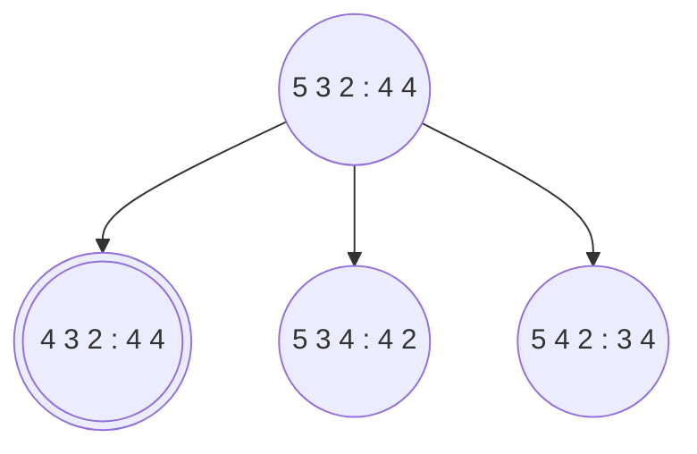

Problemi a miglioramento iterativo. Spesso ci manca proprio lo stato obbiettivo e non solo vogliamo trovarlo ma vogliamo trovare il migliore. 

# Algoritmi con miglioramenti iterativi
Qui si appiccica una funzione di utilità per motivi storici e massimizziamo questa funzione ma non cambia nulla se avessimo bisogno di avere una funzione di costo e minimizzare di conseguenza. 
In molti problemi lo stato finale è soluzione senza tenere conto del cammino che risulterà quindi irrilevante. Quindi mantengo lo stato buono e ne cerco uno migliore.
#### Spazio degli stati
Insieme di configurazioni complete. Trova la soluzione **ottima** come nel caso del commesso viaggiatore; trova la soluzione che **soddisfa tutti i vincoli** come nel timetabling.

## Hill-climbing 
C'è un detto: "*è come scalare l'Everest in mezzo ad una fitta nebbia e soffrendo di amnesia*".
![[Iterative Improvement (Local) search - LocalMax_VS_GlobalMax.png]]
Subito bisogna menzionare che questo algoritmo può rimanere bloccato in un massimo locale (come da immagine). Una volta sul cucuzzolo della collina tutte le mosse peggiorano e quindi non scendo più. Attenzione che massimo locale e massimo globale sono esattamente quelli visti in analisi matematica.
![[Iterative Improvement (Local) search - PseudoCodice_HillClimbing.png]]

Pseudo codice del'algoritmo Hill-Climbing

Siccome rimango bloccato, potrei pensare di fare delle ripartenze dell'algoritmo in stati iniziali differenti per evitare il fenomeno di *get stuck* nel massimo locale. Questo concetto si chiama **random start**.
### [[https://en.wikipedia.org/wiki/Hill_climbing#Ridges_and_alleys|Ridges and alleys]]
![[Iterative Improvement (Local) search - RidgeProblem.png]]

### Esempio: MMMS
**Minimal Makespan Machine Scheduling** ossia l'ordinamento l'ordinamento di job su macchine minimizzando il tempo di esecuzione:
+ Abbiamo $n$ macchine $\{M_1, ..., M_n\}$ e $m$ lavori $\{1, ..., m\}$
+ $N(i)$ set di lavori assegnati a $M_i$
+ Il tempo del lavoro $k$ è $d_k$
+ Tempo $M_i$ è: $T(i) = \sum_{j\in N(i)}{d_j}$
+ Il tempo totale $T_{tot} = max(T_i)$
+ Obbiettivo: Minimizzate il tempo

#### Applico Hill-Climbing a MMMS
Parto da uno stato a caso e i miei operatori sono:
+ spostamento
+ scambio
La valutazione dello stato è sempre $T$ e mi fermo se tutti gli stati successori sono peggiori di quello corrente. 

In questo esempio lo scambio del 5 con il 4 ottengo la soluzione ottima ma in generale non è detto.
Precedentemente è stato menzionato l'approccio **random start** alla fine del paragrafo [[Iterative Improvement (Local) search#Hill-climbing|Hill-Climbing]] ma esistono altri due approcci al problema dei massimi locali:
+ Stochastic Hill-Climbing
+ Simulated Annealing
**RICHIAMO: Normalizzazione a 1**
L'operazione di normalizzazione a 1 ci permette di poter lavorare con una distribuzione di prob. che deve avere valori nell'intervallo $[0,1]$. Si tratta di dividere il valore per il totale dei valori. Tutti i linguaggi di programmazione hanno questa cosa. 

## Simulated Annealing - SA (Tempra Simulata)
L'idea è di importare l'idea di **bad move (mossa cattiva)** ossia una mossa che mi porta da uno stato corrente migliore ad uno futuro peggiore. Questa cosa va fatta con due criteri:
1. La prob. della mossa deve essere inversamente proporzionale a quanto è cattiva la mossa
2. Ad inizio algoritmo permetto facilmente mosse cattive ma la frequenza di queste deve diminuire man mano che si avanza nella ricerca.
	1. Se l'algoritmo ha $p = 0$ di eseguire una bad move allora è un hill-climbing puro.
### Probabilità di una mossa
Sia $\Delta \mathbb{E} = Value(S') - Value(S)$:
+ Se la mossa è cattiva allora $\Delta \mathbb{E} < 0$
+ $p = e^{\Delta\mathbb{E}}$
	+ Questa $p$ mi consente di avere una una probabilità tanto più piccola quanto più grande è il valore di $|\Delta \mathbb{E}|$ 
![[Iterative Improvement (Local) search - probabilità simulated annealing.png]]
Se $\Delta \mathbb{E} > 0$ faccio la mossa, altrimenti passo ad $S'$ con una probabilità $p$. Per fare questo introduco un parametro $T$ che rappresenta la temperatura ed esattamente come la tempra la faccio partire da valori elevati che poi decresce. la nuova funzione di prob è: $$p = e^{{\Delta \mathbb{E} \over T}}$$
Quando $T = 0$ allora SA diventa hill-climbing. 
![[Iterative Improvement (Local) search - PseudoCodice_SA.png]]

### Local Beam Search
Si tengono ad ogni passo i $k$ stati migliori, il cosiddetto **beam**. 

# Algoritmi Genetici
La metafora qui è l'evoluzione Darwiniana ossia quella genetica. Qui gli stati successori sono generati da due strati precedenti. Gli stati sono stringhe o bit chiamati **geni** i cui valori sono detti **alleli**. Quindi uno stato è un insieme di geni ed è detto **individuo** e un insieme di individui è una **popolazione**. 
Lo scopo è far evolvere una popolazione iniziale tramite operazioni in modo da massimizzare la funzione di utilità detta **fitness function**. Le operazioni sono:
+ **crossover**: incrocio i geni definendo un punto di taglio casuale.
+ **selezione**: tipo la selezione naturale dove vince il più forte, i migliori in termini di fitness function
+ **mutazione**: in modo completamente casuale c'è una variazione di valore un po' come avviene con le mutazioni genetiche.
Lo stato soluzione del problema è quello che prende, tramite fitness function, l'individuo migliore nella nuova popolazione generata.
Nonostante non siano ottimali sono comunque molto utili in molti ambiti.
## Esempio 
![[Iterative Improvement (Local) search - Esempio_algoritmo_genetico.png]]
La fitness function (numero intero) viene trasformata in una prob. di selezione (le percentuali) grazie ad una semplice normalizzazione a 1. Si decide si selezionare per 4 volte (punto c) gli individui (dal punto a). Il punto c rappresenta i selezionati di conseguenza che sono i primi tre individui e posizionati come indicano le frecce a sinistra e il quarto individuo, con prob. bassa, è stato escluso. Le coppie generate le facciamo evolvere secondo l'operazione di crossover definendo casualmente un punto di taglio, accoppiando poi si prende una "fetta" di geni di un individuo della copia e la "fetta complementare" dall'altro individuo (punto d). Finalmente al punto e abbiamo la nuova generazione. Sempre nel punto è considero che ci possa essere della mutazione e in modo randomico cambio un gene. Attenzine, la prob. che un gene muti è bassissima, qualcosa tipo $10^{-6}$.
I numeri dell'immagine rappresentano le regine del problema delle 8 regine.
![[Iterative Improvement (Local) search - 8_Regine_algoGenetico.png]]
