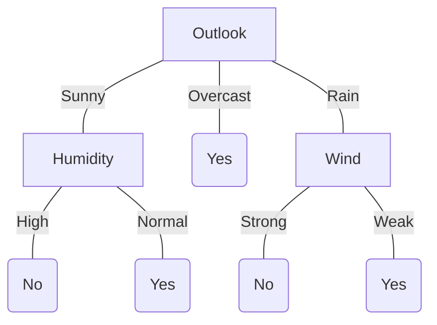

# Decision Tree
Questi alberi di decisione servono per classificazione o regressione, non sono come quelli visti in IA nella teoria delle decisioni che servivano per calcolare la expected utility di una decisione; purtroppo c'è omonimia. 
Gli alberi decisionali rappresentano una disgiunzione di congiunzioni dove i nodi sono test sulle features e le foglie indicizzano gli esempi permettendomi di decidere se l'esempio fa parte di una classe. Prendiamo in considerazione il caso del tennis ![[Machine Learning - Decision Tree - tabella tennis.png]]Abbiamo due classi che sono "play yes" e "play no". Da notare che sono tutti attributi nominali e quando ho necessità di modellare attributi numerici servono dei trucchi che vedremo più avanti. Ecco l'albero di decisione dal dataset del tennis:

L'espressione logica è: $$\begin{align}
&\quad(Outlook=Sunny\land Humidity=High)\lor\\
&\quad(Outlook=Sunny\land Humidity=Normal)\lor\\
&\quad(Outlook=Overcast)\lor\\
&\quad(Outlook=Rain\land Wind=Strong)\lor\\
&\quad(Outlook=Rain\land Wind=Weak)\\
\end{align}$$
