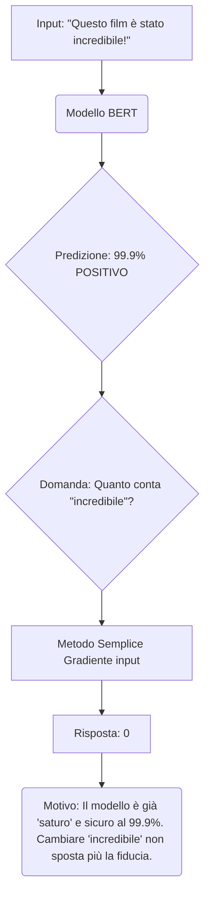
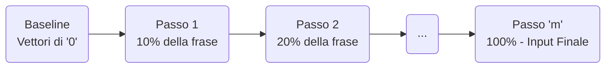
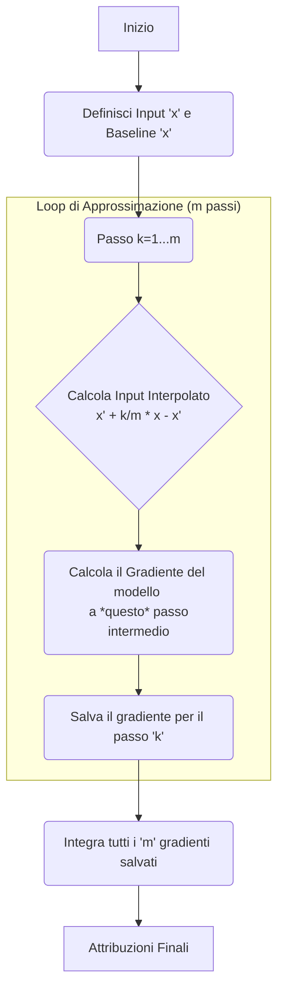

### Schema: Come Funziona Integrated Gradients (IG) sul Testo

L'obiettivo di IG è capire _quanto_ ogni singola parola (o token) in una frase abbia contribuito alla decisione finale di un modello (come BERT).

---
#### 1. Il Problema: Perché i gradienti semplici falliscono

Supponiamo di avere un modello che classifica le recensioni.

Snippet di codice

Questo risultato (un punteggio di 0) è chiaramente sbagliato. "Incredibile" è la parola chiave.

---

#### 2. La Soluzione IG: Il Percorso dalla "Frase Vuota"

IG risolve questo problema non guardando solo l'input finale, ma l'intero percorso da un input "vuoto" (la **baseline**) fino alla frase reale.

- **Input (x):** La tua frase (es. "Film incredibile").
    
- **Baseline (x'):** Un input "neutro" che per il modello non significa nulla. Per i modelli di testo, si usa il **vettore di embedding tutto a zero**. La fiducia del modello qui è 0%.
    

IG crea una "dissolvenza" (un percorso lineare) dalla Baseline all'Input.

Snippet di codice

---

#### 3. Il Processo: "Integrare" i Gradienti

Invece di calcolare il gradiente una sola volta, IG lo calcola in molti piccoli passi ($m$ passi, es. $m=200$) lungo quel percorso e poi **li somma (li integra)** 1111.

Snippet di codice

---

#### 4. Il Risultato: La Spiegazione

Il risultato è un punteggio per ogni parola, dove la somma di tutti i punteggi è uguale alla differenza di fiducia tra la frase reale (99%) e la frase vuota (0%).

- All'inizio del percorso (es. al 10% della dissolvenza), quando la parola "incredibile" "appare" per la prima volta, il modello non è saturo. Il suo gradiente sarà altissimo (la fiducia salta da 0% a 15%).
    
- IG cattura questo "momento A-ha!" iniziale.
    
- Sommando tutti i contributi, "incredibile" riceverà un punteggio di attribuzione molto alto, riflettendo correttamente la sua importanza.