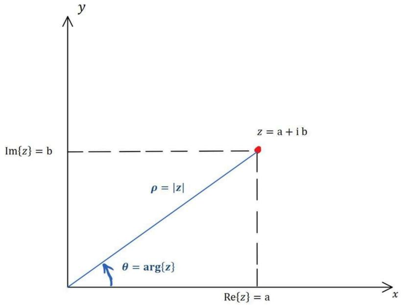
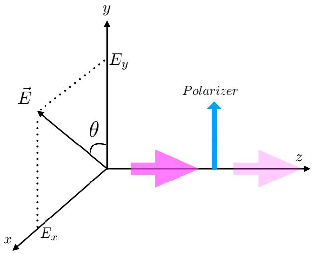
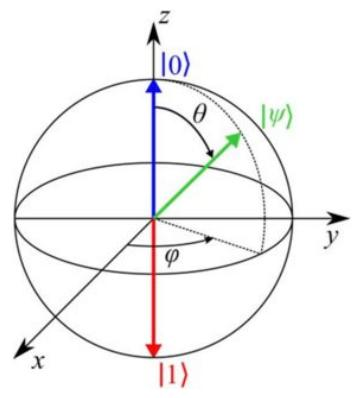
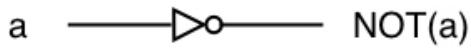
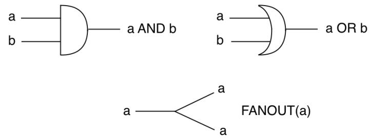
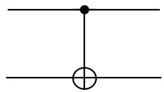
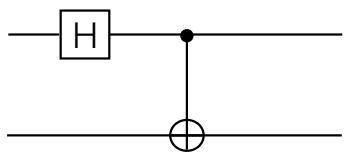
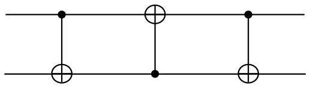
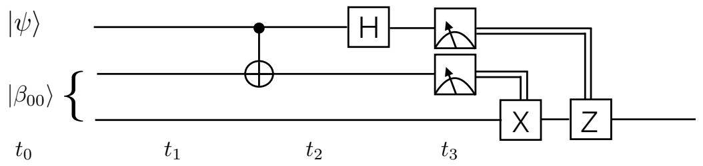

# NOTE DI COMPUTAZIONE QUANTISTICA

# Corso di Laurea in Informatica - Vercelli 2023-24

## Leonardo Castellani

Dipartimento di Scienze e Innovazione Tecnologica Universit\`a del Piemonte Orientale, viale T. Michel 11, 15121 Alessandria, Italia

INFN, Sezione di Torino, via P. Giuria 1, 10125 Torino, Italia

Regge Center for Algebra, Geometry and Theoretical Physics, via P. Giuria 1, 10125 Torino, Italia

## Abstract

Note delle lezioni di Computazione quantistica per il Corso di Laurea triennale in Informatica, a.a. 2023-24.

Aprile 2024

## Contents

## 1 Numeri complessi, formula di Taylor e formula di Eulero 1

1.1 Numeri complessi  
1.2 Rappresentazione geometrica dei numeri complessi . . 3  
1.3 Formula di Taylor . . 4  
1.4 Esercizi sui numeri complessi . . . 5  
1.5 Teorema fondamentale dell’ algebra . . 6

## 2 Matrici 7

## 3 Introduzione ai quantum bits 10

## 4 Qubits multipli 12

## 5 Quantum bits (qubits) with polarized photons 15

5.1 Polarized electromagnetic radiation: classical theory . . . 15  
5.2 Polarized photons as qubits 17  
5.3 Quantum bits, in general . . 18  
5.4 The Bloch sphere . . 19  
5.5 Single qubit gates: U (2) . . . 20

## 6 Multiple qubits 22

6.1 Tensor product 22  
6.2 Basis for tensor spaces 22  
6.3 Scalar product . . . 23  
6.4 Measurements by Alice and Bob . . 24  
6.5 Entangled states and correlations 24

## 7 Quantum gates and some applications 26

7.1 Classical and quantum computation . . . 26  
7.2 2-qubit gates: CNOT, Entangler, Exchanger . . 26  
7.3 No cloning theorem . . 27  
7.4 Non orthogonal states cannot be distinguished 28  
7.5 Quantum money 28  
7.6 Superdense coding (Bennet and Wiesner 1992) . . 28  
7.7 Teleportation (Bennet et al. 1993) . . . . 29

## A Spazi vettoriali 31

A.1 Spazi vettoriali complessi . . . 31  
A.2 Vettori linearmente indipendenti . . 31  
A.3 Base 31  
A.4 Operatori lineari 31  
A.5 Rappresentazione matriciale di un operatore lineare . . 32  
A.6 Somma e prodotto di operatori, commutatore 33

A.7 Operatore inverso 33

A.8 Cambio di base 34

A.9 Prodotto scalare . . 35

A.10 Base ortonormale 36

## B Approfondimenti 37

B.1 Operatore aggiunto . . 37

B.2 Operatore ket-bra . . 37

B.3 Relazione di completezza . . 38

B.4 Autovalori e autovettori di un operatore 38

B.5 Operatori hermitiani 39

B.6 Operatori unitari 40

B.7 Rappresentazione spettrale di un operatore normale . . . 40

B.8 Funzioni di operatori 40

B.9 Spazi vettoriali a infinite dimensioni . 41

## C Le regole della meccanica quantistica 42

C.1 Regola 1: STATO FISICO 42

C.2 Regola 2: OSSERVABILI E RISULTATI DI MISURA . . 42

C.3 Regola 3: MISURE E PROBABILITA’ 42

C.4 Regola 4: EVOLUZIONE DELLO STATO FISICO 42

## D Approfondimenti ed esempi 43

D.1 Approfondimento 1: normalizzazione del vettore di stato 43

D.2 Approfondimento 2: autovalori degeneri . . 44

D.3 Approfondimento 3: autovalori continui . . 45

D.4 Approfondimento 4: osservabili commutanti 45

# 1 Numeri complessi, formula di Taylor e formula di Eulero

## 1.1 Numeri complessi

Consideriamo l’ equazione lineare a coefficienti interi a, $b \in \mathbb { Z }$

$$
a x + b = 0 \tag {1.1}
$$

Questa equazione ha per soluzione $x = - b / a$ , soluzione che appartiene sempre a $\mathbb { Z }$ solo se $b / a \ \grave { \mathrm { e } }$ un numero intero, altrimenti appartiene a $\mathbb { Q }$ (numeri razionali).

Similmente possiamo considerare l’ equazione quadratica

$$
x ^ {2} = a \tag {1.2}
$$

con $a \in \mathbb { R } .$ , che ha come soluzioni $x = \pm { \sqrt { a } }$ . Questa soluzione \`e un numero reale solo se $a \geq 0$ , altrimenti l’ equazione non ha soluzioni reali. In particolare

$$
x ^ {2} = - 1 \tag {1.3}
$$

non ha soluzioni reali. Per\`o, cos\`ı come abbiamo dovuto ampliare i numeri da Z $\mathrm { ~ a ~ } \mathbb { Q }$ per descrivere le soluzioni dell’ equazione lineare, si pu\`o pensare a numeri pi\`u generali dei numeri reali, in cui esistono le soluzioni di equazioni quadratiche del tipo $x ^ { 2 } = - 1$ . Questi numeri sono i numeri complessi, e il loro insieme viene denotato col simbolo C.

Per costruire i numeri complessi, basta introdurre la quantit\`a chiamata unit\`a immaginaria, indicata col simbolo i. Questa \`e semplicemente la soluzione dell’ equazione $x ^ { 2 } = - 1$ , e cio\`e

$$
\boxed {i ^ {2} = - 1} \tag {1.4}
$$

Questa equazione pu\`o essere vista come la definizione di i. Basta questa definizione, e l’ uso delle solite regole per le quattro operazioni, per dedurre tutta la struttura dei numeri complessi.

Per esempio possiamo ora scrivere la soluzione di equazioni del tipo $x ^ { 2 } = - 4$ . La soluzione \`e data da $x = 2 i$ (infatti $( 2 i ) ^ { 2 } = 2 ^ { 2 } i ^ { 2 } = - 4 )$ . In genere possiamo scrivere la soluzione di qualsiasi equazione quadratica del tipo $a x ^ { 2 } + b x + c = 0$ , anche quando il discriminante $b ^ { 2 } - 4 a c$ \`e minore di 0. Infatti ora siamo capaci di trattare radici quadrate di numeri negativi, avendo a disposizione i, che \`e la radice quadrata di <sub>−</sub>1. In realt\`a possiamo fare anche di pi\`u, e trattare radici ennesime di un qualunque numero reale, anzi pi\`u in generale di un qualunque numero complesso.

Introduciamo ora formalmente i numeri complessi. L’ insieme C \`e dato da tutti gli elementi

$$
\boxed {z = x + i y} \tag {1.5}
$$

dove x e y sono numeri reali, chiamati rispettivamente parte reale e parte immaginaria del numero complesso z. Si usa la notazione

$$
x = R e (z), \quad y = I m (z) \tag {1.6}
$$

Quindi i numeri complessi sono individuati da una coppia ordinata di numeri reali $( x , y )$ . Dal punto di vista insiemistico si ha pertanto $\mathbb { C } = \mathbb { R } \times \mathbb { R }$ .

L’ insieme C pu\`o essere dotato delle operazioni di somma, moltiplicazione e divisione in modo del tutto naturale.

Addizione: se $z = a + i b \mathrm { ~ e ~ } z ^ { \prime } = a ^ { \prime } + i b ^ { \prime }$ , si ha $z + z ^ { \prime } = ( a + a ^ { \prime } ) + i ( b + b ^ { \prime } )$ , quindi la somma di due numeri complessi produce un numero complesso la cui parte reale \`e la somma delle parti reali e la parte immaginaria \`e la somma delle parti immaginarie di $z \textrm { e } z ^ { \prime }$ .

Moltiplicazione: $z z ^ { \prime } = ( a + i b ) ( a ^ { \prime } + i b ^ { \prime } ) = ( a a ^ { \prime } - b b ^ { \prime } ) + i ( a b ^ { \prime } + a ^ { \prime } b )$ . Nella moltiplicazione di due numeri complessi si ottiene quindi un numero complesso con parte reale e parte immaginaria date dalle combinazioni $a a ^ { \prime } - b b ^ { \prime } \mathrm { ~ e ~ } a b ^ { \prime } + a ^ { \prime } b$ delle parti reali e immaginarie di $z \textrm { e } z ^ { \prime }$ . Nota: si dimostra immediatamente che $z z ^ { \prime } = z ^ { \prime } z$ , cio\`e che la moltiplicazione tra numeri complessi \`e commutativa.

Prima di passare alla divisione, introduciamo l’ operazione di coniugazione di un numero complesso, indicata da un asterisco, e definita da

$$
z = x + i y \rightarrow z ^ {*} = x - i y \tag {1.7}
$$

cio\`e per coniugare un numero complesso basta cambiare il segno della sua parte immaginaria. O altrimenti detto, basta cambiare i in <sub>−</sub>i, mentre $x \textrm { e y }$ rimangono invariati. Se moltiplichiamo z per il suo complesso coniugato $z ^ { * }$ otteniamo

$$
z z ^ {*} = (x + i y) (x - i y) = x ^ {2} + y ^ {2} \tag {1.8}
$$

cio\`e otteniamo una quantit\`a reale $\ge ~ 0 . ~ ( z z ^ { * }$ non ha parte immaginaria, la i \`e scomparsa). Se prendiamo la radice quadrata di $z z ^ { \ast }$ , si ottiene il modulo del numero complesso z, indicato come segue

$$
| z | \equiv \sqrt {z z ^ {*}} = \sqrt {x ^ {2} + y ^ {2}} \tag {1.9}
$$

Divisione: dati i numeri complessi $z = a + i b \mathrm { ~ e ~ } z ^ { \prime } = a ^ { \prime } + i b ^ { \prime }$ , se $a _ { \mathrm { ~ \scriptsize ~ e ~ } } ^ { \prime } b _ { \mathrm { ~ \scriptsize ~ } } ^ { \prime }$ non sono entrambi nulli, si pu\`o eseguire la divisione:

$$
\frac {z}{z ^ {\prime}} = \frac {a + i b}{a ^ {\prime} + i b ^ {\prime}} \tag {1.10}
$$

Per scrivere il risultato nella forma $z ^ { \prime \prime } = a ^ { \prime \prime } + i b ^ { \prime \prime }$ \`e sufficiente moltiplicare denominatore e numeratore per il complesso coniugato del denominatore:

$$
\frac {z}{z ^ {\prime}} = \frac {(a + i b)}{(a ^ {\prime} + i b ^ {\prime})} \frac {(a ^ {\prime} - i b ^ {\prime})}{(a ^ {\prime} - i b ^ {\prime})} = \frac {a a ^ {\prime} + b b ^ {\prime}}{a ^ {\prime 2} + b ^ {\prime 2}} + i \frac {b a ^ {\prime} - a b ^ {\prime}}{a ^ {\prime 2} + b ^ {\prime 2}} \tag {1.11}
$$

## 1.2 Rappresentazione geometrica dei numeri complessi

Ogni numero complesso $z = a + i b { \dot { \mathrm { ~ e ~ } } }$ univocamente individuato dai due numeri reali $a , b .$ . Questi possono immaginarsi come le coordinate di un punto nel piano $\mathbb { R } \times \mathbb { R } .$ . Si ha quindi una corrispondenza biunivoca tra i punti del piano e i numeri complessi, e possiamo “visualizzare” i numeri complessi come punti del piano. Questo piano prende il nome di piano di Gauss.

Possiamo individuare i punti nel piano con le coordinate cartesiane $a , b ,$ oppure con altre coordinate, per esempio le coordinate polari $\rho , \varphi$ , dove $\rho  { \mathrm { ~ \grave { \mathrm { ~ e ~ } } ~ } }$ la lunghezza del segmento che congiunge il punto con l’ origine, $\textrm { e } \theta \mid ^ { \ }$ angolo (orientato) che questo segmento forma con l’ asse delle ascisse.

Dalle definizioni di seno e coseno si ha immediatamente

$$
x = R e (z) = \rho \cos \theta , \quad y = I m (z) = \rho \sin \theta \tag {1.12}
$$

e il numero complesso $z = x + i y$ pu\`o scriversi nella sua rappresentazione trigonometrica:

$$
\boxed {z = \rho (\cos \theta + i \sin \theta)} \tag {1.13}
$$



<details>
<summary>text_image</summary>

y
Im{z} = b
z = a + i b
ρ = |z|
θ = arg{z}
Re{z} = a
x
</details>

Fig. 2.1 Rappresentazione geometrica dei numeri complessi.

Dal teorema di Pitagora risulta che $\textstyle \rho = { \sqrt { a ^ { 2 } + b ^ { 2 } } }$ , cio\`e $\rho = | z | \ \mathrm { \dot { e } }$ il modulo del numero complesso. $\mathrm { L } '$ angolo θ si chiama anche argomento del numero complesso, e si indica con $a r g ( z )$ .

Riassumendo, un numero complesso $z$ individuato da due numeri reali :

- le sue coordinate cartesiane $( a , b )$ , ovvero la sua parte reale e parte immaginaria  
- oppure dal suo modulo $\rho \textup { e }$ dal suo argomento $a r g ( z )$

E’ conveniente esprimere il prodotto $z z ^ { \prime }$ nella rappresentazione trigonometrica. $\mathrm { S e }$ $z \textrm { e } z ^ { \prime }$ sono dati da

$$
z = \rho (\cos \theta + i \sin \theta), \quad z ^ {\prime} = \rho^ {\prime} (\cos \theta^ {\prime} + i \sin \theta^ {\prime}) \tag {1.14}
$$

il loro prodotto si scrive

$$
\begin{array}{l} z z ^ {\prime} = \rho \rho^ {\prime} (\cos \theta + i \sin \theta) (\cos \theta^ {\prime} + i \sin \theta^ {\prime}) = \\ \rho \rho^ {\prime} [ (\cos \theta \cos \theta^ {\prime} - \sin \theta \sin \theta^ {\prime}) + i (\cos \theta \sin \theta^ {\prime} + \sin \theta \cos \theta^ {\prime}) ] = \\ \rho \rho^ {\prime} [ \cos (\theta + \theta^ {\prime}) + i \sin (\theta + \theta^ {\prime}) ] \tag {1.15} \\ \end{array}
$$

da cui si ricava l’ utile regola: il prodotto di due numeri complessi ha per modulo il prodotto dei moduli e per argomento la somma degli argomenti.

Applicando questa regola ripetutamente si arriva alla formula di De Moivre per la potenza n-esima di un numero complesso $z = \rho ( \cos \theta + i \sin \theta )$

$$
z ^ {n} = \rho^ {n} (\cos n \theta + i \sin n \theta) \tag {1.16}
$$

## 1.3 Formula di Taylor

La formula di Taylor per una funzione $f ( x )$ permette di calcolare approssimativamente $f ( a + x )$ conoscendo $f ( a )$ e le prime n derivate di $f ( x )$ valutate in a, che indichiamo con $f ^ { ( n ) } ( a )$ :

$$
\boxed {f (a + x) = f (a) + \frac {d f}{d x} (a) x + f ^ {(2)} (a) \frac {x ^ {2}}{2 !} + \dots + f ^ {(n)} (a) \frac {x ^ {n}}{n !}} \tag {1.17}
$$

L’ errore che si fa rispetto al vero valore di $f ( a + x )$ usando questa formula \`e in genere dell’ ordine di $x ^ { n + 1 }$ , e per x molto minore di 1 ci si pu\`o fermare a valori bassi di n. Per esempio, se ci limitiamo sino al termine con la derivata terza, e se $x = 0 . 1$ , l’errore che facciamo $\mathrm { e } '$ di ordine $( 0 . 1 ) ^ { 4 } \ : = \ : 0 . 0 0 0 1$ . Sotto certe ipotesi possiamo prendere il limite per $n \to \infty$ di questa espressione e trovare una rappresentazione esatta, detta sviluppo in serie di Taylor, della funzione $f ( a + x )$ . Scegliendo $a = 0$ (se esistono le derivate successive $f ^ { ( n ) } ( 0 ) )$ si ha una formula per $f ( x )$ .

## Esempi:

$$
\sin (x) = x - \frac {x ^ {3}}{3 !} + \frac {x ^ {5}}{5 !} - \frac {x ^ {7}}{7 !} + \dots \tag {1.18}
$$

$$
\cos (x) = 1 - \frac {x ^ {2}}{2 !} + \frac {x ^ {4}}{4 !} - \frac {x ^ {6}}{6 !} + \dots \tag {1.19}
$$

$$
e ^ {x} = 1 + x + \frac {x ^ {2}}{2 !} + \frac {x ^ {3}}{3 !} + \frac {x ^ {4}}{4 !} + \dots \tag {1.20}
$$

$$
\frac {1}{1 - x} = 1 + x + x ^ {2} + x ^ {3} + x ^ {4} + \dots \tag {1.21}
$$

dove si sono usate le derivate

$$
\frac {d}{d x} \sin (x) = \cos (x), \frac {d}{d x} \cos (x) = - \sin (x), \frac {d}{d x} e ^ {x} = e ^ {x}. \tag {1.22}
$$

Nota 1: le prime tre serie convergono per qualunque valore di x, mentre la quarta converge (e quindi ha senso considerarla valida) solo per $| x | < 1$ . Usando la terza formula si pu\`o calcolare, con l’ approssimazione desiderata, il valore della costante di Eulero: $e ^ { 1 } = 1 + 1 + { \textstyle \frac { 1 } { 2 ! } } + { \textstyle \frac { 1 } { 3 ! } } + \cdot \cdot \cdot = 2 . 7 1 8 2 . .$ ...

Se scegliamo per x un valore immaginario $x = i \theta .$ la formula di Taylor per $e ^ { i \theta }$ diventa

$$
e ^ {i \theta} = 1 + i \theta + \frac {(i \theta) ^ {2}}{2 !} + \frac {(i \theta) ^ {3}}{3 !} + \frac {(i \theta) ^ {4}}{4 !} + \dots \tag {1.23}
$$

e ricordando l’ espansione in serie di Taylor di seno e coseno si arriva alla formula di Eulero:

$$
\boxed {e ^ {i \theta} = \cos \theta + i \sin \theta} \tag {1.24}
$$

Nota 2: Scegliendo $\theta = \pi$ si arriva alla “formula pi\`u bella della matematica”:

$$
e ^ {i \pi} + 1 = 0 \tag {1.25}
$$

Nota 3: la formula di Eulero ci permette di scrivere la rappresentazione trigonometrica di un numero complesso di modulo $\rho \textup { e }$ argomento θ come

$$
z = \rho e ^ {i \theta} \tag {1.26}
$$

## 1.4 Esercizi sui numeri complessi

Esercizio 1: trovare modulo, argomento e rappresentazione trigonometrica di $z =$ $1 - i , { \mathrm { e ~ d i ~ } } 1 - i { \sqrt { 3 } }$

Esercizio 2: dimostrare che se $z z ^ { \prime } = 0$ allora almeno uno dei due numeri complessi $z , z ^ { \prime }$ \`e nullo.

Esercizio 3: disegnare nel piano di Gauss l’ insieme dei numeri z tali che

i) $| z | \le 1$  
ii) $| z - 1 | \leq 1$

Esercizio 4: se $z = \rho ( \cos \theta + i \sin \theta )$ , trovare la rappresentazione trigonometrica di $- z , 1 / z , i z , z ^ { * }$ .

Esercizio 5: dimostrare che

i) $( z ^ { * } ) ^ { * } = z$  
ii) $( z + z ^ { \prime } ) ^ { * } = z ^ { * } + z ^ { \prime * }$  
iii) $( z z ^ { \prime } ) ^ { * } = z ^ { * } z ^ { \prime * }$  
${ \mathrm { i v } } ) ~ z + z ^ { * } = 2 ~ R e ( z ) , ~ z - z ^ { * } = 2 i ~ I m ( z )$

## 1.5 Teorema fondamentale dell’ algebra

L’ equazione algebrica a coefficienti reali

$$
a _ {n} z ^ {n} + a _ {n - 1} z ^ {n - 1} + \dots + a _ {1} z + a _ {0} = 0 \tag {1.27}
$$

ammette n soluzioni complesse. $\mathrm { S e } ~ z ~ \mathrm { \grave { e } }$ soluzione, lo \`e anche $z ^ { * }$ (dimostrarlo usando l’ Esercizio 5 di sopra).

Esempio : le soluzioni di

$$
a z ^ {2} + b z + c = 0 \tag {1.28}
$$

con $a , b , c \in \mathbb { R }$ , sono date dalla nota formula

$$
z = \frac {- b \pm \sqrt {b ^ {2} - 4 a c}}{2 a} \tag {1.29}
$$

Sono soluzioni reali se $b ^ { 2 } - 4 a c \geq 0$ , altrimenti sono complesse. In tal caso si possono scrivere come

$$
z = \frac {- b \pm i \sqrt {4 a c - b ^ {2}}}{2 a} \tag {1.30}
$$

## 2 Matrici

Nella Sezione precedente, abbiamo introdotto i numeri complessi $z \in \mathbb { C }$ , caratterizzati da una coppia di numeri reali, e definito addizione, moltiplicazione e divisione in C. Possiamo proseguire in questo tipo di generalizzazione, e introdurre tabelle di numeri reali, o anche complessi, che possono sommarsi e moltiplicarsi con opportune regole. Queste tabelle si chiamano matrici, e vengono organizzate in un certo numero di righe e di colonne. Per esempio la matrice

$$
A = \left( \begin{array}{c c c c c} A _ {1 1} & A _ {1 2} & A _ {1 3} & ... & A _ {1 n} \\ A _ {2 1} & A _ {2 2} & A _ {2 3} & ... & A _ {2 n} \\ A _ {3 1} & A _ {3 2} & A _ {3 3} & ... & A _ {3 n} \\ \vdots & \vdots & \vdots & \vdots & \vdots \\ A _ {m 1} & A _ {m 2} & A _ {m 3} & ... & A _ {m n} \end{array} \right) \tag {2.1}
$$

ha m righe e n colonne. $\mathrm { L } '$ elemento della matrice corrispondente alla i-esima riga e j-esima colonna viene denotato con la coppia di indici $i j$ . Per esempio l’ elemento della matrice che si trova sulla seconda riga e sulla terza colonna viene indicato con $A _ { 2 3 }$ . Per indicare che la matrice A ha m righe e n colonne si usa la notazione $A _ { m \times n } ,$ e si dice che A \`e una matrice $m \times n$ . Se $n = m$ la matrice si dice quadrata.

Tra due matrici $A _ { m \times n } \mathrm { ~ e ~ } B _ { m \times n }$ (quindi che abbiano lo stesso numero di righe e lo stesso numero di colonne) viene definita l’ addizione come segue:

Addizione: $( A + B ) _ { i j } = A _ { i j } + B _ { i j }$ , cio\`e gli elementi $i j$ della matrice somma (gli elementi che stanno sulla i-esima riga e j-esima colonna) si ottengono sommando tra loro $\mathrm { g l i }$ elementi $i j$ delle due matrici. Esempio:

$$
\left( \begin{array}{c c c} A _ {1 1} & A _ {1 2} & A _ {1 3} \\ A _ {2 1} & A _ {2 2} & A _ {2 3} \end{array} \right) + \left( \begin{array}{c c c} B _ {1 1} & B _ {1 2} & B _ {1 3} \\ B _ {2 1} & B _ {2 2} & B _ {2 3} \end{array} \right) = \left( \begin{array}{c c c} A _ {1 1} + B _ {1 1} & A _ {1 2} + B _ {1 2} & A _ {1 3} + B _ {1 3} \\ A _ {2 1} + B _ {2 1} & A _ {2 2} + B _ {2 2} & A _ {2 3} + B _ {2 3} \end{array} \right) \tag {2.2}
$$

E’ immediato verificare che l’ addizione tra matrici \`e commutativa, $A + B = B + A$ e associativa, $( A + B ) + C = A + ( B + C )$ . La matrice zero 0 ha tutti gli elementi uguali a $0 , \mathrm { ~ e ~ } A + 0 = 0$ per ogni matrice A.

Moltiplicazione: Tra matrici $A _ { m \times n } \mathrm { ~ e ~ } B _ { n \times r }$ (quindi il numero di colonne di A deve essere uguale al numero di righe di B), si definisce una moltiplicazione AB come segue:

$$
(A B) _ {i j} = \sum_ {k} A _ {i k} B _ {k j} \tag {2.3}
$$

Questa regola di moltiplicazione matriciale viene anche detta “prodotto righe per colonne”. Il risultato \`e una matrice $m \times r$ . Per esempio:

$$
\left( \begin{array}{c c c} A _ {1 1} & A _ {1 2} & A _ {1 3} \\ A _ {2 1} & A _ {2 2} & A _ {2 3} \end{array} \right) \left( \begin{array}{c c} B _ {1 1} & B _ {1 2} \\ B _ {2 1} & B _ {2 2} \\ B _ {3 1} & B _ {3 2} \end{array} \right) =
$$

$$
= \left( \begin{array}{l l} A _ {1 1} B _ {1 1} + A _ {1 2} B _ {2 1} + A _ {1 3} B _ {3 1} & A _ {1 1} B _ {1 2} + A _ {1 2} B _ {2 2} + A _ {1 3} B _ {3 2} \\ A _ {2 1} B _ {1 1} + A _ {2 2} B _ {2 1} + A _ {2 3} B _ {3 1} & A _ {2 1} B _ {1 2} + A _ {2 2} B _ {2 2} + A _ {2 3} B _ {3 2} \end{array} \right) \tag {2.4}
$$

Con tre matrici $A _ { m \times n } , \ B _ { n \times r } , \ C _ { r \times s } .$ la moltiplicazione \`e associativa: $( A B ) C ~ =$ $A ( B C )$ . Per due matrici $A _ { m \times n } , B _ { n \times m }$ possiamo considerare entrambi i prodotti AB e BA. Se $n \neq m$ \`e ovvio che $A B \ne B A$ , poich\`e i due prodotti sono matrici di dimensioni diverse (AB \`e una matrice $m \times n$ mentre $B A \ { \dot { \mathrm { e } } }$ una matrice $n \times m )$ . Se $m = n$ , cio\`e se $A \mathrm { ~ e ~ } B$ sono matrici quadrate, la moltiplicazione in genere non \`e commutativa. Per esempio

$$
\left( \begin{array}{c c} 1 & 0 \\ 0 & - 1 \end{array} \right) \left( \begin{array}{c c} 0 & 1 \\ 1 & 0 \end{array} \right) \neq \left( \begin{array}{c c} 0 & 1 \\ 1 & 0 \end{array} \right) \left( \begin{array}{c c} 1 & 0 \\ 0 & - 1 \end{array} \right) \tag {2.5}
$$

Se A \`e una matrice quadrata $n \times n ,$ la matrice unit\`a $I _ { n \times n }$ \`e una matrice quadrata tale che $A I = I A = A$ . I suoi elementi ij sono nulli se $i \neq j \mathrm { ~ e ~ }$ uguali a 1 se $i = j$ . In altre parole I \`e una matrice diagonale, con tutti gli elementi sulla diagonale uguali a 1. Gli elementi di I vengono anche indicati col simbolo di Kronecker: $\delta _ { i j }$ , che vale 1 se $i = j \mathrm { ~ e ~ } 0$ altrimenti. E’ anche detto “delta di Kronecker”.

Moltiplicazione per un numero: se λ \`e un numero reale (o complesso) e A una matrice, si definisce il prodotto λA semplicemente moltiplicando ogni elemento di A per il numero λ. Per esempio

$$
\lambda \left( \begin{array}{c c c} A _ {1 1} & A _ {1 2} & A _ {1 3} \\ A _ {2 1} & A _ {2 2} & A _ {2 3} \end{array} \right) = \left( \begin{array}{c c c} \lambda A _ {1 1} & \lambda A _ {1 2} & \lambda A _ {1 3} \\ \lambda A _ {2 1} & \lambda A _ {2 2} & \lambda A _ {2 3} \end{array} \right) \tag {2.6}
$$

Nota: Aλ \`e definito uguale a $\lambda A$ .

Trasposizione: definita tramite scambio di righe e colonne. Gli elementi della matrice trasposta di A, indicata con $A ^ { T }$ , sono definiti da

$$
(A ^ {T}) _ {i j} = A _ {j i} \tag {2.7}
$$

La trasposta di una matrice $m \times n \mathrm { ~ \textdot { ~ e ~ } ~ }$ una matrice $n \times m$ . Esempio:

$$
\left( \begin{array}{c c c} A _ {1 1} & A _ {1 2} & A _ {1 3} \\ A _ {2 1} & A _ {2 2} & A _ {2 3} \end{array} \right) ^ {T} = \left( \begin{array}{c c} A _ {1 1} & A _ {2 1} \\ A _ {1 2} & A _ {2 2} \\ A _ {1 3} & A _ {2 3} \end{array} \right)
$$

Una matrice quadrata tale che $A ^ { T } = A$ si dice simmetrica.

Matrice inversa: per una matrice quadrata A, l’ inversa $A ^ { - 1 }$ \`e definita da

$$
A ^ {- 1} A = A A ^ {- 1} = I \tag {2.8}
$$

Esempio: se A \`e una generica matrice $2 \times 2$ :

$$
A = \left( \begin{array}{c c} a & b \\ c & d \end{array} \right) \tag {2.9}
$$

la sua inversa $A ^ { - 1 } \textup { \ r { e } }$ data dalla matrice

$$
A ^ {- 1} = \frac {1}{(a d - b c)} \left( \begin{array}{c c} d & - b \\ - c & a \end{array} \right) \tag {2.10}
$$

come si pu\`o facilmente verificare eseguendo le moltiplicazioni $A ^ { - 1 } A , A A ^ { - 1 }$ . Nota: l’ inversa di A esiste solo se $a d - b c \neq 0$ .

Esercizio: dimostrare che $( A ^ { - 1 } ) ^ { - 1 } = A .$

Esercizi: dimostrare le seguenti propriet\`a, con $A , B , C$ matrici e $\lambda , \mu$ numeri

1) $A ( B + C ) = A B + B C$ (propriet\`a distributiva)  
2) $( A B ) C = A ( B C )$ (propriet\`a associativa del prodotto)  
3) $\lambda ( \mu A ) = ( \lambda \mu ) A$  
4) $( \lambda + \mu ) A = \lambda A + \mu A$  
5) $\lambda ( A + B ) = \lambda A + \lambda B$  
6) $( \lambda A ) B = \lambda ( A B ) = A ( \lambda B )$

## 3 Introduzione ai quantum bits

<sub>•</sub> Un BIT (binary unit) ha per supporto un sistema fisico che pu\`o stare in due possibili stati, descritti convenzionalmente dai simboli $_ { 0 \mathrm { ~ e ~ l ~ } }$ . Per esempio stati di magnetizzazione su un disco rigido, o micro-fori su un CD, etc. L’ informazione contenuta in un bit viene recuperata tramite la misura di una certa grandezza fisica, per esempio la magnetizzazione (dipende dal modo con cui \`e codificata l’ informazione). Se lo stato del sistema \`e lo stato 0 (1), la misura d\`a un risultato che convenzionalmente indichiamo con 0 (1). NOTA: se il risultato della misura \`e 0 (1), questo implica che il bit si trovava, prima della misura, nello stato 0 (1).

Un QUBIT (o quantum bit) \`e un sistema fisico microscopico, sul quale misure di una grandezza fisica $Q$ (per esempio polarizzazione, energia, spin etc) possono dare solo due risultati, anche in questo caso indicati con $0 \textrm { e 1 }$ . Fin qui non sembra esserci differenza con un bit classico. Essendo per\`o un sistema fisico microscopico, obbedisce alle regole della meccanica quantistica. In particolare vale il principio di sovrapposizione degli stati. Se il sistema microscopico pu\`o stare in due stati, che denoteremo con i simboli $\left| 0 \right. \textrm { e } \left| 1 \right.$ , nei quali la misura della grandezza $Q$ d\`a per risultati rispettivamente 0 e 1, questo stesso sistema pu\`o stare anche in infiniti stati “intermedi” tra $\left| 0 \right. \mathrm { ~ e ~ } \left| 1 \right.$ . Questo si esprime matematicamente con la seguente espressione per un generico stato <sub>|</sub>ψ<sub>i</sub> del sistema:

$$
| \psi \rangle = \alpha | 0 \rangle + \beta | 1 \rangle \tag {3.1}
$$

dove gli stati $\left| 0 \right. \mathrm { ~ e ~ } \left| 1 \right.$ vengono considerati vettori di base ortogonali in uno spazio vettoriale complesso a due dimensioni, e α e $\beta$ sono numeri complessi. Quindi gli stati fisici di un qubit sono descritti da una combinazione lineare a coefficienti complessi dei due stati di base. I vettori di stato in meccanica quantistica vengono anche detti kets.

Ma cosa succede se misuriamo la grandezza fisica $Q$ su un qubit che si trova nello stato $| \psi \rangle ~ ?$ Sappiamo che se $\alpha = 1 , \beta = 0$ , cio\`e se $| \psi \rangle = | 0 \rangle$ , allora la misura di $Q$ dar\`a senz’ altro 0 come risultato. Analogamente se $\alpha = 0 , \beta = 1$ , cio\`e se $| \psi \rangle = | 1 \rangle$ , la misura di $Q$ dar\`a senz’ altro 1 come risultato. Per tutti gli altri casi il risultato della misura non $\mathrm { { \dot { e } } }$ certo, ma \`e probabilistico. Vale la seguente regola, detta anche regola di Born:

Le probabilit\`a $p ( 0 )$ e p(1) di ottenere rispettivamente i risultati 0 e 1 in una misura di $Q$ sullo stato fisico $| \psi \rangle = \alpha | 0 \rangle + \beta | 1 \rangle$ sono date dai moduli quadri dei coefficienti della combinazione lineare:

$$
p (0) = | \alpha | ^ {2}, \quad p (1) = | \beta | ^ {2} \tag {3.2}
$$

La somma delle probabilit\`a deve essere 1, e quindi si deve avere

$$
\left| \alpha \right| ^ {2} + \left| \beta \right| ^ {2} = 1 \tag {3.3}
$$

come condizione sui coefficienti della combinazione lineare (3.1). Matematicamente questa condizione pu\`o scriversi usando il prodotto scalare tra vettori, definito come segue per due qubits generici $\vert \psi \rangle = \alpha \vert 0 \rangle + \beta \vert 1 \rangle \mathrm { ~ e ~ } \vert \phi \rangle = \gamma \vert 0 \rangle + \delta \vert 1 \rangle$ :

$$
(| \psi \rangle , | \phi \rangle) = (\alpha | 0 \rangle + \beta | 1 \rangle , \gamma | 0 \rangle + \delta | 1 \rangle) = \alpha^ {*} \gamma + \beta^ {*} \delta \tag {3.4}
$$

Per economia grafica si usa spesso la notazione di Dirac $\langle \psi | \phi \rangle$ . Il prodotto scalare in campo complesso \`e <sub>∗</sub>-commutativo:

$$
\langle \psi | \phi \rangle = \langle \phi | \psi \rangle^ {*} \tag {3.5}
$$

e soddisfa alle propriet\`a di linearit\`a nel fattore destro e antilinearit\`a nel fattore sinistro:

$$
(a | \psi \rangle + b | \phi \rangle , c | \chi \rangle + b | \eta \rangle) = a ^ {*} c \langle \psi | \chi \rangle + a ^ {*} d \langle \psi | \eta \rangle + b ^ {*} c \langle \phi | \chi \rangle + b ^ {*} d \langle \phi | \eta \rangle \tag {3.6}
$$

La norma (o lunghezza) di un vettore v \`e data da $\sqrt { \langle v | v \rangle }$ . Due vettori si dicono ortogonali se il loro prodotto scalare \`e nullo. Un insieme di vettori si dice ortonormale se sono tutti di norma = 1 e ortogonali tra loro. Ad esempio la base computazionale <sub>{|</sub>0<sub>i</sub>, <sub>|</sub>1<sub>i}</sub> \`e ortonormale. Dalle propriet\`a di sopra, e dall’ ortonormalit\`a della base computazionale, si ricava immediatamente la formula (3.4). Si ha allora per uno stato fisico di qubit <sub>|</sub>ψ<sub>i</sub>:

$$
\langle \psi | \psi \rangle = (\alpha | 0 \rangle + \beta | 1 \rangle , \alpha | 0 \rangle + \beta | 1 \rangle) = | \alpha | ^ {2} + | \beta | ^ {2} = 1 \tag {3.7}
$$

Si deve quindi sempre richiedere che il vettore corrispondente a uno stato fisico <sub>|</sub>ψ<sub>i</sub> sia normalizzato, cio\`e abbia norma = 1.

<sub>•</sub> Un qubit nello stato generico (3.1) \`e allora descritto da un vettore in uno spazio vettoriale complesso a due dimensioni. Rispetto alla base <sub>|</sub>0<sub>i</sub>, <sub>|</sub>1<sub>i</sub>, le componenti di questo vettore sono α e β. Si pu\`o allora rappresentare <sub>|</sub>ψ<sub>i</sub> su questa base con la colonna:

$$
\left| \psi \right\rangle \longrightarrow \binom{\alpha}{\beta} \tag {3.8}
$$

Osservazione: a differenza del caso classico, se in una misura sullo stato generico <sub>|</sub>ψ<sub>i</sub> si ottiene il risultato 0, questo non implica che lo stato prima della misura fosse <sub>|</sub><sup>0</sup><sub>i</sub><sup>.</sup>

<sub>•</sub> Immediatamente dopo la misura in cui si ottiene 0 (1), lo stato fisico diventa <sub>|</sub>0<sub>i</sub> (<sub>|</sub>1<sub>i</sub>). Questa regola prende il nome di collasso del vettore di stato dovuto alla misura.

Abbiamo cos\`ı introdotto tre regole fondamentali della meccanica quantistica, alla base del comportamento dei quantum bits:

1) gli stati fisici dei qubits sono descritti da vettori in uno spazio vettoriale complesso

2) i risultati delle misure sono probabilistici, con probabilit\`a date dalla regola di Born  
3) dopo la misura lo stato collassa nel corrispondente vettore di base: se si ottiene 0 lo stato <sub>|</sub>ψ<sub>i</sub> diventa <sub>|</sub>0<sub>i</sub>, se si ottiene 1 lo stato <sub>|</sub>ψ<sub>i</sub> diventa <sub>|</sub>1<sub>i</sub>.

## 4 Qubits multipli

Si possono considerare sistemi formati da N qubits. Prendiamo il caso $N = 2$ . Se si eseguono misure su due qubits, si hanno 4 possibili risultati: 00, 01, 10, 11 (cio\`e 0 sul primo qubit e 0 sul secondo, 0 sul primo e 1 sul secondo etc.). Abbiamo visto che per un qubit si hanno 2 “stati certi”, cio\`e gli stati $\left| 0 \right. \mathrm { ~ e ~ } \left| 1 \right.$ in cui il risultato di una misura \`e certo, e questi sono gli stati di base. Per due qubits abbiamo invece 4 stati certi, che denotiamo con

$$
| 0 \rangle | 0 \rangle , \quad | 0 \rangle | 1 \rangle , \quad | 1 \rangle | 0 \rangle , \quad | 1 \rangle | 1 \rangle \tag {4.1}
$$

che corrispondono al primo qubit nello stato <sub>|</sub>0<sub>i</sub> e secondo qubit nello stato <sub>|</sub>0<sub>i</sub> etc. Per economia di scrittura si usano anche le notazioni 00 , 01 , 10 , 11 . In questi 4 stati i risultati delle misure congiunte sui due qubits danno con certezza i risultati 00, 01, 10, 11. Con la stessa logica del caso $N = 1$ , questi 4 stati certi sono i vettori di base (ortogonali) di uno spazio vettoriale a 4 dimensioni, e lo stato fisico del sistema complessivo dei due qubits \`e descritto da un vettore <sub>|</sub>Ψ<sub>i</sub> in questo spazio:

$$
\left| \Psi \right\rangle = c _ {0 0} | 0 0 \rangle + c _ {0 1} | 0 1 \rangle + c _ {1 0} | 1 0 \rangle + c _ {1 1} | 1 1 \rangle \tag {4.2}
$$

dove il modulo quadro dei coefficienti complessi $c _ { 0 0 } , c _ { 0 1 } , c _ { 1 0 } , c _ { 1 1 }$ d\`a la probabilit\`a di ottenere rispettivamente 00, 01, 10, 11 nella misura di entrambi i qubits. Di nuovo la somma di questi moduli quadri deve essere uguale a 1, e questa richiesta, come nel caso $N = 1$ , pu\`o scriversi come

$$
\langle \Psi | \Psi \rangle = 1 \tag {4.3}
$$

Il collasso dovuto alla misura avviene secondo le stesse modalit\`a del caso $N = 1$ , e cio\`e <sub>|</sub>Ψ<sub>i</sub> diventa <sub>|</sub>00<sub>i</sub> se il risultato delle misure su entrambi i qubits \`e stato 00, etc. Supponendo che Alice faccia misure sul primo qubit, e Bob sul secondo, possiamo chiederci cosa succede se solamente Alice esegue misure, cio\`e se solo il primo qubit viene misurato. La regola in questo caso \`e molto semplice: la probabilit\`a che Alice misuri 0 \`e la somma delle probabilit\`a che in una misura congiunta su entrambi i qubits si ottenga 0 sul primo qubit, e cio\`e $| c _ { 0 0 } | ^ { 2 } + | c _ { 0 1 } | ^ { 2 }$ . Analogamente la probabilit\`a che Alice misuri 1 sul suo qubit \`e $| c _ { 1 0 } | ^ { 2 } + | c _ { 1 1 } | ^ { 2 }$ . Un ragionamento simile vale per misure di Bob sul suo qubit.

Se Alice ottiene 0, il collasso del vettore di stato avviene con la regola della proiezione:

$$
| \Psi \rangle \longrightarrow | \Psi^ {\prime} \rangle = \frac {c _ {0 0} | 0 0 \rangle + c _ {0 1} | 0 1 \rangle}{| c _ {0 0} | ^ {2} + | c _ {0 1} | ^ {2}}, \tag {4.4}
$$

cio\`e <sub>|</sub>Ψ<sub>i</sub> viene proiettato lungo le componenti relative al risultato 0 sul primo qubit. Il denominatore $| c _ { 0 0 } | ^ { 2 } + | c _ { 0 1 } | ^ { 2 }$ \`e necessario per la normalizzazione di $\left| \Psi ^ { \prime } \right.$ , i.e. $\left. \Psi ^ { \prime } | \Psi ^ { \prime } \right. = 1$ . Analogamente, se Alice ottiene 1, si ha il collasso

$$
\left| \Psi \right\rangle \longrightarrow \left| \Psi^ {\prime} \right\rangle = \frac {c _ {1 0} | 1 0 \rangle + c _ {1 1} | 1 1 \rangle}{\left| c _ {1 0} \right| ^ {2} + \left| c _ {1 1} \right| ^ {2}}, \tag {4.5}
$$

Simili regole valgono per una misura di Bob sul secondo qubit.

Questa discussione si generalizza facilmente a un numero arbitrario N di qubits, il cui vettore di stato fisico conterr\`a allora $2 ^ { N }$ componenti.

<sub>•</sub> Supponiamo ora che un qubit A si trovi nello stato sovrapposto $| \psi _ { A } \rangle = \alpha | 0 \rangle + \beta | 1 \rangle$ , e un secondo qubit B nello stato sovrapposto $| \psi _ { B } \rangle = \gamma | 0 \rangle + \delta | 1 \rangle$ . Qual \`e lo stato $| \Psi _ { A B } \rangle$ del sistema complessivo AB dei due qubits ? Deve essere tale da riprodurre correttamente le probabilit\`a dei risultati di misure su $\mathrm { ~ A ~ e ~ }$ su B. Per esempio, la probabilit\`a di ottenere 0 sul qubit A \`e uguale a $| \alpha | ^ { 2 }$ , e la probabilit\`a di ottenerte 0 su $\mathrm { ~ B ~ } \dot { \mathrm { ~ e ~ } } | \gamma | ^ { 2 }$ . Quindi la probabilit\`a di ottenere 00 su AB \`e il prodotto di queste due probabilit\`a, cio\`e $| \alpha | ^ { 2 } | \gamma | ^ { 2 }$ . Un ragionamento simile vale per le probabilit\`a di ottenere i risultati 01, 10, 11, e pertanto lo stato del sistema AB deve essere:

$$
| \Psi_ {A B} \rangle = \alpha \gamma | 0 \rangle | 0 \rangle + \alpha \delta | 0 \rangle | 1 \rangle + \beta \gamma | 1 \rangle | 0 \rangle + \beta \delta | 1 \rangle | 1 \rangle \tag {4.6}
$$

Per questo stato le regole della meccanica quantistica forniscono le corrette probabilit\`a per misure congiunte sui due qubits.

Notiamo che lo stato (6.2) pu\`o scriversi come un prodotto dei due vettori di stato individuali:

$$
| \Psi_ {A B} \rangle = | \psi_ {A} \rangle | \psi_ {B} \rangle = (\alpha | 0 \rangle + \beta | 1 \rangle) (\gamma | 0 \rangle + \delta | 1 \rangle) \tag {4.7}
$$

se questo prodotto soddisfa alle usuali propriet\`a distributive di moltiplicazione e addizione. Queste regole sono le stesse di un particolare prodotto tra vettori, chiamato in matematica prodotto tensoriale. E’ ovviamente diverso dal prodotto scalare, che d\`a come risultato un numero complesso. Il prodotto tensoriale tra due kets d\`a invece come risultato un vettore ket appartenente a uno spazio vettoriale di dimensione maggiore. Per esempio per due qubits il vettore $| 0 \rangle | 0 \rangle$ appartiene a uno spazio vettoriale di dimensione 4. In generale, i vettori di stato di un sistema di N qubits appartengono a uno spazio vettoriale di dimensione $2 ^ { N }$ , con vettori di base dati dai prodotti tensoriali dei vettori di base dei singoli qubits:

$$
\left| 0 0 \dots 0 0 \right\rangle , \left| 0 0 \dots 0 1 \right\rangle , \left| 0 0 \dots 1 0 \right\rangle , \left| 0 0 \dots 1 1 \right\rangle , \dots \left| 1 1 \dots 1 1 \right\rangle \tag {4.8}
$$

I vettori di base di un sistema a N qubits sono quindi individuati da tutte le stringhe binarie di lunghezza N, e il loro numero \`e uguale a $2 ^ { N }$ .

<sub>•</sub> Se due qubits $\mathrm { ~ A ~ e ~ }$ B stanno rispettivamente negli stati individuali $\left| \psi _ { A } \right. \mathrm { ~ e ~ } \left| \psi _ { B } \right.$ , abbiamo visto che lo stato complessivo del sistema $\dot { \mathrm { ~ e ~ } } | \Psi _ { A B } \rangle \ : = \ : | \psi _ { A } \rangle | \psi _ { B } \rangle$ , cio\`e il prodotto (tensoriale) degli stati di singolo qubit. In questo caso si dice che lo stato complessivo \`e uno stato separabile o anche stato prodotto. Esistono per\`o stati del sistema AB che non si possono scrivere come prodotti $| \psi _ { A } \rangle | \psi _ { B } \rangle$ . Per esempio lo stato

$$
\left| \Psi_ {A B} \right\rangle = \frac {\left| 0 \right\rangle \left| 0 \right\rangle + \left| 1 \right\rangle \left| 1 \right\rangle}{\sqrt {2}} \tag {4.9}
$$

non pu\`o scriversi come prodotto (Esercizio: dimostrarlo). Si dice allora che il sistema AB \`e in uno stato intrecciato o intricato (entangled in inglese). Come discusso nella Sezione 6.5, le misure di Alice e Bob su stati prodotto danno risultati scorrelati, mentre su stati intrecciati danno risultati correlati. Queste correlazioni, come vedremo, sono alla base di importanti protocolli di computazione quantistica.

## 5 Quantum bits (qubits) with polarized photons

## 5.1 Polarized electromagnetic radiation: classical theory

Classical electrodynamics is governed by Maxwell equations (1865), a set of linear equations for the electric field $\vec { E } ( x , y , z , t )$ and magnetic field $\vec { B } ( x , y , z , t )$ in presence of charges and currents. Together with the expression of the Lorentz force on a charged particle, they describe all classical electromagnetic phenomena, implying for example the existence of electromagnetic waves. Note that, due to the linearity of Maxwell equations, the sum of two solutions is still a solution. This is called the superposition principle, and plays a crucial role also in the quantum version of the theory.

A particular solution of Maxwell equations in vacuum is given by plane waves. The classical description of a plane wave is given by varying electric $\vec { E }$ and magnetic $\vec { B }$ fields, orthogonal to each other, in the plane perpendicular to the propagation of the wave. The direction of $\vec { E }$ defines the polarization. If $\vec { E }$ makes an angle $\theta$ with a conventional direction (for example the $y$ direction) we say that the polarization is $\theta .$ The electric field, for linearly polarized radiation, can be written as

$$
\vec {E} = \sin \theta E e ^ {i (k z - \omega t)} \hat {x} + \cos \theta E e ^ {i (k z - \omega t)} \hat {y} \tag {5.1}
$$

where $E$ is the modulus of ${ \vec { E } } ,$ the exponential exp $\left[ i ( k z - \omega t ) \right]$ corresponds to a plane wave propagating in the $z$ direction with frequency ω and velocity $\omega / k$ , and ${ \hat { x } } .$ , $\hat { y }$ are unit vectors in the x and $y$ directions, cf. Fig. 1.3. Note the complex notation for the electric field, a convenient technique that simplifies computations. The real electric field can be recovered by taking the real part of (5.1). The radiation described by (5.1) is linearly polarized since the direction of $\vec { E }$ does not change in time. The (real) components of $\vec { E }$ are given by:

$$
E _ {x} (t) = E \sin \theta \cos (\omega t), \quad E _ {y} (t) = E \cos \theta \cos (\omega t) \tag {5.2}
$$

where we have taken the field in the origin $z = 0$ . The two components oscillate in phase and the resultant field oscillates along the fixed direction $\theta .$ .



<details>
<summary>text_image</summary>

y
Ey
θ
Polarizer
z
E⃗
Ex
x
</details>

Fig. 1.3 Polarized radiation

The intensity of the radiation in (5.1) is proportional to $| \vec { E } | ^ { 2 } = \vec { E } ^ { * } \cdot \vec { E } = E ^ { 2 }$ . Suppose that a polarizer, oriented vertically, is placed in the path of the radiation. By definition, the vertical polarizer kills the horizontal x-component of the radiation in (5.1), and the emergent intensity is therefore reduced by a factor $\cos ^ { 2 } \theta$ . This is the Malus law for linearly polarized radiation.

The electric field for a horizontally polarized radiation is $\vec { E } = E e ^ { i ( k z - \omega t ) } \hat { x }$ and for a vertically polarized radiation is $\bar { E } = E e ^ { i ( k z - \omega t ) } \hat { y }$ . The superposition of these two functions (both are solutions of Maxwell equations), with weights sin θ and cos $\theta$ respectively, yields the total electric field.

We can consider also superpositions with complex coefficients, and we obtain solutions in which the direction of the electric field can vary over time, describing for example a circle in the xy plane. Consider the electric field

$$
\vec {E} = \frac {1}{\sqrt {2}} E e ^ {i (k z - \omega t)} \hat {x} + \frac {i}{\sqrt {2}} E e ^ {i (k z - \omega t)} \hat {y} \tag {5.3}
$$

The $\textit { i } = e ^ { \frac { i \pi } { 2 } }$ factor in front of the second term produces a phase shift in the $y -$ component of $\vec { E }$ , and we find:

$$
E _ {x} = \frac {E}{\sqrt {2}} \cos \omega t, \quad E _ {y} = \frac {E}{\sqrt {2}} \cos (\omega t - \frac {\pi}{2}) = \frac {E}{\sqrt {2}} \sin \omega t \tag {5.4}
$$

describing an electric field rotating in the $x y$ plane, clockwise (left rotation), with angular velocity $\omega .$ . Similarly we obtain an anticlockwise (right) rotation when i multiplies the second term. The corresponding radiation is said to be circularly (left or right) polarized.

## 5.2 Polarized photons as qubits

Quantum mechanical effects arise when the intensity of the radiation source in Fig. 1.3 gets drastically reduced. Then radiation reveals its corpuscular nature: placing a screen after the polarizer, single impacts are detected. Thus radiation is carried by elementary particles called photons: they are undivisible elementary quanta of the electromagnetic field. The intensity of radiation is then proportional to the number of photons per unit volume. In other words the square modulus of the electric field $\vec { E } ( x , y , z , t )$ can be interpreted as a measure of the probability of finding a photon at point $x , y , z$ at time t. In Quantum Mechanics the physical state of a particle is characterized by a “wave function”, a complex function of space and time, whose square modulus is proportional to the probability of finding the particle at that point in space and time. Thus we can consider the electric field as the “wavefunction of the photon”. When the intensity $E ^ { 2 }$ increases, radiation recovers its classical “continuous” character.

Still, we have to reconcile the indivisibility of the photon with the fact that the intensity of $\theta$ polarized light is reduced according to Malus law when emerging from a vertical polarizer. A single photon cannot be reduced to a $\cos ^ { 2 } \theta$ fraction of itself after passing the polarizer, since it is an elementary undivisible particle. We must find another explanation for the Malus’ law, and the explanation can only be statistical: a photon $\theta$ polarized has a probability $\cos ^ { 2 } \theta$ of passing the vertical polarizer. Thus when the number N of photons becomes very high, approximately $N \cos ^ { 2 } \theta$ of them pass the polarizer, thus reproducing Malus’ law. This explanation is already contained in the statistical interpretation of the electric field as wave function of the photon: indeed the radiation that emerges from the polarizer has an electric field $\vec { E } = \cos \theta E e ^ { i ( k z - \omega t ) } \hat { y }$ , whose square modulus is $\cos ^ { 2 } \theta E ^ { 2 }$ , so that the probability of finding the photon after the polarizer is a fraction $\cos ^ { 2 } \theta$ of the probability of finding it before the polarizer.

The example of polarized radiation contains most of the basic ingredients of quantum mechanics: wave functions and their statistical interpretation, and the superposition principle according to which (complex) linear combinations of wave functions still describe physical states. This last fact leads us to consider wave functions as vectors in appropriate complex vector spaces: indeed (complex) vectors can be summed and multiplied by complex numbers. Vectors representing wave funtions $\psi ( x , y , z , t )$ are indicated with a special symbol in quantum mechanics: the “ket” symbol $| \psi \rangle$ introduced by Dirac.

For example we can assign a ket vector <sub>|</sub>0<sub>i</sub> to the horizontally polarized photon with wavefunction $\psi _ { x } = E e ^ { i ( k z - \omega t ) } \hat { x }$ and a ket vector <sub>|</sub>1<sub>i</sub> to the vertically polarized photon with wavefunction $\psi _ { y } = E e ^ { i ( k z - \omega t ) } \hat { y }$ . Then the photon linearly polarized in the $\theta$ direction has wavefunction $\psi = \sin \theta \psi _ { x } + \cos \theta \psi _ { y }$ . Calling $| \theta \rangle$ the ket corresponding to $\psi$ (photon θ-polarized) we have:

$$
| \theta \rangle = \sin \theta | 0 \rangle + \cos \theta | 1 \rangle \tag {5.5}
$$

Thus the polarization states of the photons are described quantum mechanically by kets living in a two dimensional vector space, with a basis given by <sub>|</sub>0<sub>i</sub> (horizontal polarization) and <sub>|</sub>1<sub>i</sub> (vertical polarization). Similarly, circularly (left and right) polarized photons are described by the ket vectors:

$$
| L \rangle = \frac {1}{\sqrt {2}} | 0 \rangle + \frac {i}{\sqrt {2}} | 1 \rangle , \quad | R \rangle = \frac {1}{\sqrt {2}} | 0 \rangle - \frac {i}{\sqrt {2}} | 1 \rangle \tag {5.6}
$$

## 5.3 Quantum bits, in general

<sub>•</sub> Quantum bits, or qubits, are quantum systems with a 2-dimensional vector space of physical states. Choosing an orthonormal basis <sub>|</sub>0<sub>i</sub>, <sub>|</sub>1<sub>i</sub>, the generic state of a qubit is:

$$
| \psi \rangle = \alpha | 0 \rangle + \beta | 1 \rangle \tag {5.7}
$$

The basis vectors <sub>|</sub>0<sub>i</sub> and <sub>|</sub>1<sub>i</sub> can be thought of as states corresponding to definite values for a physical quantity. According to the basic rules of quantum mechanics, a measurement of this quantity yields the result $^ { 6 6 } 0 ^ { 9 }$ (i.e. the value corresponding to the vector <sub>|</sub>0<sub>i</sub>) with probability $p ( 0 ) = | \alpha | ^ { 2 }$ , and the result $^ { 6 6 } 1 ^ { \mathfrak { n } }$ with probability $p ( 1 ) = | \beta | ^ { 2 }$ . The state after the measurement collapses into one of the basis states <sub>|</sub>0<sub>i</sub> or <sub>|</sub>1<sub>i</sub> , depending on the result “0” or $^ { 6 6 } 1 ^ { , 9 }$ .

Qubits encode information in the complex constants α and $\beta$ . Note however that we cannot extract this information by a single measurement on $| \psi \rangle$ . For this purpose, it will be necessary to have many copies of the same qubit.

<sub>•</sub> The basis vectors $| 0 \rangle , | 1 \rangle$ are orthonormal, i.e. their scalar products are given by $\langle 0 | 0 \rangle = \langle 1 | 1 \rangle = 1 , \langle 0 | 1 \rangle = 0$ . This basis is called the computational basis. Infinitely many other orthonormal basis exist. For example

$$
| + \rangle = \frac {1}{\sqrt {2}} (| 0 \rangle + | 1 \rangle), \quad | - \rangle = \frac {1}{\sqrt {2}} (| 0 \rangle - | 1 \rangle) \tag {5.8}
$$

## 5.4 The Bloch sphere



<details>
<summary>text_image</summary>

|0⟩
θ
ψ
φ
y
x
|1⟩
z
</details>

Fig. 1.3 Bloch sphere

<sub>•</sub> The Bloch sphere provides a geometrical representation of a qubit

$$
| \psi \rangle = \alpha | 0 \rangle + \beta | 1 \rangle , \quad | \alpha | ^ {2} + | \beta | ^ {2} = 1 \tag {5.9}
$$

Writing the complex numbers α and $\beta$ in the exponential form

$$
\alpha = \rho_ {\alpha} e ^ {i \varphi_ {\alpha}}, \quad \beta = \rho_ {\beta} e ^ {i \varphi_ {\beta}} \tag {5.10}
$$

we have

$$
\rho_ {\alpha} ^ {2} + \rho_ {\beta} ^ {2} = 1, \quad \rho_ {\alpha} \geq 0, \quad \rho_ {\beta} \geq 0 \tag {5.11}
$$

so that the moduli $\rho _ { \alpha }$ and $\rho _ { \beta }$ can be parametrized by an angle $\chi \colon$

$$
\rho_ {\alpha} = \cos \chi , \quad \rho_ {\beta} = \sin \chi , \quad 0 \leq \chi \leq \frac {\pi}{2} \tag {5.12}
$$

Then the qubit (5.9) takes the form

$$
| \psi \rangle = \rho_ {\alpha} e ^ {i \varphi_ {\alpha}} | 0 \rangle + \rho_ {\beta} e ^ {i \varphi_ {\beta}} | 1 \rangle = e ^ {i \varphi_ {\alpha}} (\cos \chi | 0 \rangle + e ^ {i (\varphi_ {\beta} - \varphi_ {\alpha})} \sin \chi | 1 \rangle) (5. 1 3)
$$

We can neglect the overall phase $e ^ { i \varphi _ { \alpha } }$ (since quantum states are defined up to an overall phase), define $\varphi \equiv \varphi _ { \beta } - \varphi _ { \alpha }$ and $\theta \equiv 2 \chi$ (so that θ varies from 0 to π). Then the qubit

$$
\left| \psi \right\rangle = \cos \frac {\theta}{2} \left| 0 \right\rangle + e ^ {i \varphi} \sin \frac {\theta}{2} \left| 1 \right\rangle \tag {5.14}
$$

can be represented faithfully on the Bloch sphere, in the sense that there is a 1-1 mapping between qubits and points on the surface of the sphere, labelled by their latitude θ and longitude $\varphi .$ .

## 5.5 Single qubit gates: U(2)

<sub>•</sub> To use classical or quantum bits for computation, we must be able to transform them. This we can do by acting with classical or quantum logical gates. For example the classical NOT gate negates the bit it acts on, transforming 0 into 1 and viceversa. It is representaed by the symbol

  
Fig. 1.4 Classical NOT gate

Thus $N O T ( 0 ) = 1 , N O T ( 1 ) = 0 .$

The quantum analogue is the (linear) operator X, defined by its action on the basis vectors:

$$
X | 0 \rangle = | 1 \rangle , \quad X | 1 \rangle = | 0 \rangle \tag {5.15}
$$

By linearity, its action on a generic superposition $| \psi \rangle = \alpha | 0 \rangle + \beta | 1 \rangle$ is given by

$$
X (\alpha | 0 \rangle + \beta | 1 \rangle) = \alpha | 1 \rangle + \beta | 0 \rangle \tag {5.16}
$$

Any quantum gate U must transform a physical state ψ in another physical state $| \psi ^ { \prime } \rangle$ . Thus the transformed qubit $| \psi ^ { \prime } \rangle = U | \psi \rangle$ must have the same unit norm as the original <sub>|</sub>ψ<sub>i</sub>:

$$
\langle \psi^ {\prime} | \psi^ {\prime} \rangle = \langle \psi | U ^ {\dagger} U | \psi \rangle = \langle \psi | \psi \rangle = 1 \tag {5.17}
$$

and this requires

$$
U ^ {\dagger} U = I \tag {5.18}
$$

As we know from linear algebra (for a summary of linear algebra tools and notations see Lecture 6), this condition defines unitary operators. After choosing a basis, unitary operators acting on qubits can be represented by unitary $2 \times 2$ matrices.

<sub>•</sub> Examples of single qubit gates are the unitary operators $X , Y , Z , H$ , represented (on the computational basis <sub>|</sub>0<sub>i</sub>, <sub>|</sub>1<sub>i</sub>) by the matrices:

$$
X = \left( \begin{array}{c c} 0 & 1 \\ 1 & 0 \end{array} \right), Y = \left( \begin{array}{c c} 0 & - i \\ i & 0 \end{array} \right), Z = \left( \begin{array}{c c} 1 & 0 \\ 0 & - 1 \end{array} \right), H = \frac {1}{\sqrt {2}} \left( \begin{array}{c c} 1 & 1 \\ 1 & - 1 \end{array} \right) \tag {5.19}
$$

Recalling that the adjoint of a matrix is its transpose complex-conjugated, it is immediate to verify that these matrices are indeed unitary.

<sub>•</sub> Unitary $N \times N$ matrices form a group, denoted by $U ( N )$ . A group is defined as a set satisfying three properties:

i) existence of a composition law <sub>◦</sub> that associates to two elements a, b of the set another element c of the set: $a \circ b = c$  
ii) existence of an identity element I such that $a \circ I = I \circ a = a$ for any a.

iii) existence of an inverse $a ^ { - 1 }$ for every element $^ { a , }$ such that $\scriptstyle { { \lambda } ^ { - 1 } } a = a a ^ { - 1 } = I$

and it is straightforward to check that $U ( N )$ is a group with composition law given by matrix multiplication. An important subgroup of $U ( N )$ is $S U ( N )$ , the subset of $U ( N )$ with determinant $= 1$ , satisfying by itself the group properties (hence a subgroup).

$\bullet U ( 2 )$ matrices depend on 4 real parameters, since the unitarity condition $U ^ { \dagger } U = I$ eliminates 4 of the 8 independent real quantities of a $2 \times 2$ complex matrix. A convenient parametrization of $U ( 2 )$ matrices is

$$
U = e ^ {i \alpha} \left( \begin{array}{c c} e ^ {- i \frac {\beta}{2}} & 0 \\ 0 & e ^ {i \frac {\beta}{2}} \end{array} \right) \left( \begin{array}{c c} \cos \frac {\gamma}{2} & - \sin \frac {\gamma}{2} \\ \sin \frac {\gamma}{2} & \cos \frac {\gamma}{2} \end{array} \right) \left( \begin{array}{c c} e ^ {- i \frac {\delta}{2}} & 0 \\ 0 & e ^ {i \frac {\delta}{2}} \end{array} \right) \tag {5.20}
$$

Exercise: find the $\alpha , \beta , \gamma , \delta$ parametrization of $X , Y , Z , H .$ .

## 6 Multiple qubits

## 6.1 Tensor product

Composite systems are described by tensor products of states of the individual systems, when the individual systems are not interacting. We will denote by A and B the individual subsystems, and by AB the total system. Let us briefly justify the use of the tensor product.

Consider two qubits A and B, in the respective individual states

$$
| \psi_ {A} \rangle = \alpha | 0 \rangle + \beta | 1 \rangle , \quad | \psi_ {B} \rangle = \gamma | 0 \rangle + \delta | 1 \rangle \tag {6.1}
$$

What is the state of the total system ? It must be such that the rules of quantum mechanics correctly predict the outcomes of measurements on the system. Here the probability to obtain result 0 on the first qubit and result 0 on the second qubit is clearly the product of the probabilities $| \alpha | ^ { 2 }$ and $| \gamma | ^ { 2 }$ , since the two qubits are not interacting. A similar reasoning holds for the probabilities of obtaining the results (0,1), (1,0) and (1,1), and therefore the state of the total system must be

$$
| \Psi_ {A B} \rangle = \alpha \gamma | 0 \rangle | 0 \rangle + \alpha \delta | 0 \rangle | 1 \rangle + \beta \gamma | 1 \rangle | 0 \rangle + \beta \delta | 1 \rangle | 1 \rangle \tag {6.2}
$$

where <sub>|</sub>0<sub>i|</sub>0<sub>i</sub> is the AB state when both qubits are in state $| 0 \rangle , | 0 \rangle | 1 \rangle$ is the AB state when qubit A is in state <sub>|</sub>0<sub>i</sub> and qubit B is in state <sub>|</sub>1<sub>i</sub> etc. Then the rules of QM give the correct probabilities for joint measurements on both qubits in the computational basis<sup>1</sup>.

Note that the state (6.2) can be written as a product of two individual states:

$$
| \Psi_ {A B} \rangle = | \psi_ {A} \rangle | \psi_ {B} \rangle = (\alpha | 0 \rangle + \beta | 1 \rangle) (\gamma | 0 \rangle + \delta | 1 \rangle) \tag {6.3}
$$

if this product satisfies the usual distributive properties with respect to the addition (or in other words if the product is linear in both factors). These are the properties of the tensor product of vectors, usually indicated by the symbol <sub>⊗</sub>. The symbol will be often omitted between ket vectors (as in the above discussion) for simplicity of notations. In fact the notation <sub>|</sub>0<sub>i|</sub>0<sub>i</sub> can be further simplified, by writing <sub>|</sub>00<sub>i</sub>.

## 6.2 Basis for tensor spaces

A basis for the states of system AB is provided by all the tensor products of elements of the A basis with elements of the B basis:

$$
\left| 0 \right\rangle \left| 0 \right\rangle , \quad \left| 0 \right\rangle \left| 1 \right\rangle , \quad \left| 1 \right\rangle \left| 0 \right\rangle , \quad \left| 1 \right\rangle \left| 1 \right\rangle \tag {6.4}
$$

and in general a state of the AB system is expressible as a linear combination:

$$
| \Psi \rangle = c _ {0 0} | 0 \rangle | 0 \rangle + c _ {0 1} | 0 \rangle | 1 \rangle + c _ {1 0} | 1 \rangle | 0 \rangle + c _ {1 1} | 1 \rangle | 1 \rangle \tag {6.5}
$$

where $\mathit { c } _ { 0 0 } , . . .$ . are 4 complex numbers satisfying the condition

$$
| c _ {0 0} | ^ {2} + | c _ {0 1} | ^ {2} + | c _ {1 0} | ^ {2} + | c _ {1 1} | ^ {2} = 1 \tag {6.6}
$$

The discussion can be easily extended to N-qubit spaces: the state of a system of N qubits is specified by $2 ^ { N }$ complex amplitudes subject to a normalization condition as in (6.6). We see here why qubits can potentially encode information in an exponentially more efficient way than classical bits. These latter can only take one precise binary value (or string of binary values for N bits), while N qubits can “contain” in the same state $2 ^ { N }$ values.

In general, if $V ^ { A }$ and $V ^ { B }$ are the vector spaces for the subsystems A and B, the vector space for the composite system AB is called the tensor product of the vector spaces $V ^ { A }$ and $V ^ { B }$ , denoted by $V ^ { A } \otimes V ^ { B }$ . A basis for $V ^ { A } \otimes V ^ { B }$ is given by the set $\left\{ \left| u _ { i } \right. \otimes \left| v _ { j } \right. \right\}$ , where $\{ | u _ { i } \rangle \}$ is a basis for $V ^ { A }$ and $\{ \vert v _ { j } \rangle \}$ is a basis for $V ^ { B }$ , and therefore

$$
\dim (V ^ {A} \otimes V ^ {B}) = (\dim V ^ {A}) (\dim V ^ {B}) \tag {6.7}
$$

## 6.3 Scalar product

The scalar product between elements of tensor spaces is defined as

$$
(| \psi \rangle | \phi \rangle , | \xi \rangle | \chi \rangle) \equiv \langle \psi | \xi \rangle \langle \phi | \chi \rangle \tag {6.8}
$$

and satisfies all the properties of a scalar product in complex vector spaces.

Exercise: verify this.

With this definition, the four states <sub>|</sub>00<sub>i</sub>, <sub>|</sub>01<sub>i</sub>, <sub>|</sub>10<sub>i</sub>, <sub>|</sub>11<sub>i</sub> form an orthonormal basis for a 2-qubit system, and in general the tensor product of N computational bases yields an orthonormal basis for a system of N qubits.

## 6.4 Measurements by Alice and Bob

Consider the general two-qubit state (6.5), and suppose that Alice can make measurements on the first qubit and Bob on the second. What is the probability that in a joint measurement, Alice finds the result 0 and Bob finds the result 0 ? The answer is given by the standard Born rule:

$$
p (0 _ {A}, 0 _ {B}) = | c _ {0 0} | ^ {2} \tag {6.9}
$$

and similarly for the other three joint results 01, 10, 11. But suppose now that only Alice makes a measurement on her qubit. Then the probability for her to obtain 0 is:

$$
p (0 _ {A}) = | c _ {0 0} | ^ {2} + | c _ {0 1} | ^ {2} \tag {6.10}
$$

i.e. the sum of the probabilities of Alice obtaining 0 and Bob obtaining 0, and Alice obtaining 0 and Bob obtaining 1. Similarly the probability for Alice of obtaining 1 is

$$
p (1 _ {A}) = | c _ {1 0} | ^ {2} + | c _ {1 1} | ^ {2} \tag {6.11}
$$

Analogous formulae hold for measurements performed by Bob.

The collapse after the measurement follows the projection rule: the original state is projected onto the components corresponding to the measurement result. For example, if Alice obtains 0, the two-qubit state (6.5) collapses into

$$
| \Psi \rangle \longrightarrow | \Psi^ {\prime} \rangle = \frac {c _ {0 0} | 0 \rangle | 0 \rangle + c _ {0 1} | 0 \rangle | 1 \rangle}{\sqrt {| c _ {0 0} | ^ {2} + | c _ {0 1} | ^ {2}}} \tag {6.12}
$$

Note: the denominator $\sqrt { | c _ { 0 0 } | ^ { 2 } + | c _ { 0 1 } | ^ { 2 } }$ is necessary for $\left| \Psi ^ { \prime } \right.$ to be a physical state satisfying $\langle \Psi ^ { \prime } | \Psi ^ { \prime } \rangle = 1$ .

## 6.5 Entangled states and correlations

A state of a composite system is said to be a separable or product state if it can be written as a tensor product:

$$
\left| \Psi \right\rangle = \left| \phi \right\rangle \left| \xi \right\rangle \tag {6.13}
$$

A state of a composite system is entangled if it is not separable. For example

$$
\frac {1}{\sqrt {2}} (| 0 0 \rangle + | 1 0 \rangle) \tag {6.14}
$$

is separable, since it can be written as

$$
\frac {1}{\sqrt {2}} (| 0 \rangle + | 1 \rangle) | 0 \rangle \tag {6.15}
$$

On the other hand the state

$$
\frac {1}{\sqrt {2}} (| 0 0 \rangle + | 1 1 \rangle) \tag {6.16}
$$

is entangled, since it cannot be written as a product.

<sub>•</sub> Exercise: verify this. Hint: use (6.3).

Suppose that Alice and Bob measure their qubits when the composite system is in the state (6.14). If Alice makes the first measurement, she will find 0 or 1 with probability $1 / 2 .$ , and the global state collapses into <sub>|</sub>00<sub>i</sub> or <sub>|</sub>10<sub>i</sub> according to the result. In both cases a successive measurement by Bob will certainly yield the outcome 0, without further collapse. If Bob makes the first measurement, he will certainly obtain 0, the global state remains the same, and a successive measurement by Alice has $1 / 2$ probabilities of obtaing 0 or 1. Thus the statistics for Alice and Bob are uncorrelated, i.e. they do not depend on the order of the measurements, or in other words the results of Alice do not depend on the results of Bob and viceversa.

The situation changes drastically if the initial state is entangled. Then the individual qubits are not in definite states: only the global state of the system is given. If Alice makes the first measurement on her qubit when the system is in the entangled state (6.16), she finds 0 or 1 with probability $1 / 2 .$ But a successive measurement by Bob will have an outcome that depends on the result of Alice. Indeed, if Alice obtains 0, the global state collapses into <sub>|</sub>00<sub>i</sub>, and a successive measurement by Bob yields 0. If Alice obtains 1, the global state collapses into 11 , and a successive measurement by Bob yields 1. In this case the results of measurements by Alice and Bob are correlated. The same happens if Bob makes the first measurement.

The entangled qubits could be spatially separated, still remaining in an entangled global state. Could Alice send a message to a distant Bob exploiting the correlations and the collapse of the global state ? After all, if her measuring or not measuring could be detected by Bob instantaneously, Alice could communicate with superluminal velocity with Bob, contradicting a fundamental result of special relativity. Consider the entangled state (6.16): if Alice does not measure her qubit, the statistics for Bob measurements will be $1 / 2$ probability to obtain 0 and $1 / 2$ probability to obtain 1. On the other hand if Alice does measure her qubit, she will produce a collapse of the global state into <sub>|</sub>00<sub>i</sub> with probability $1 / 2 .$ , and to <sub>|</sub>11<sub>i</sub> with probability $1 / 2$ . Then if Bob measures his qubit, he will still find 0 with $1 / 2$ probability and 1 with $1 / 2$ probability, exactly the same statistics as before. Thus the act of measurement by Alice cannot be detected by Bob, and special relativity is safe.

Exercise: prove that

$$
\frac {| 0 0 \rangle + | 1 1 \rangle}{\sqrt {2}} = \frac {| + + \rangle + | - - \rangle}{\sqrt {2}} \tag {6.17}
$$

$$
\frac {| 0 1 \rangle - | 1 0 \rangle}{\sqrt {2}} = - \frac {| + - \rangle - | - + \rangle}{\sqrt {2}} \tag {6.18}
$$

## 7 Quantum gates and some applications

## 7.1 Classical and quantum computation

Classical circuits are made out of wires and logical gates (AND, OR, NOT etc..), and are read from left to right:



<details>
<summary>text_image</summary>

a
b
a AND b
a OR b
a
FANOUT(a)
a
a
</details>

Fig. 3.1 Classical gates

The same conventions hold for quantum circuits, with classical gates replaced by quantum gates, effecting unitary operations on N-qubit states (and therefore represented by $2 ^ { N } \times 2 ^ { N }$ matrices). An important difference with respect to classical gates is their reversibility, since unitary operations are invertible. This implies that N-qubit gates transform N-qubit states into N-qubit states, whereas classical gates can transform N bits into M bits, with N not necessarily equal to M (for example the AND gate transforms 2 bits into 1 bit).

## 7.2 2-qubit gates: CNOT, Entangler, Exchanger

  
Fig. 3.2 CNOT gate

$$
\mathrm{CNOT} | 0 0 \rangle = | 0 0 \rangle , \mathrm{CNOT} | 0 1 \rangle = | 0 1 \rangle , \mathrm{CNOT} | 1 0 \rangle = | 1 1 \rangle , \mathrm{CNOT} | 1 1 \rangle = | 1 0 \rangle .
$$



<details>
<summary>natural_image</summary>

Pure electrical circuit lines without any symbols
</details>

Fig. 3.3 Entangler gate, produces the Bell states

$$
\text {Entangler} | 0 0 \rangle = \frac {1}{\sqrt {2}} (| 0 0 \rangle + | 1 1 \rangle) \equiv | \beta_ {0 0} \rangle \tag {7.1}
$$

$$
\text {Entangler} | 0 1 \rangle = \frac {1}{\sqrt {2}} (| 0 1 \rangle + | 1 0 \rangle) \equiv | \beta_ {0 1} \rangle \tag {7.2}
$$

$$
\text {Entangler} | 1 0 \rangle = \frac {1}{\sqrt {2}} (| 0 0 \rangle - | 1 1 \rangle) \equiv | \beta_ {1 0} \rangle \tag {7.3}
$$

$$
\text {Entangler} | 1 1 \rangle = \frac {1}{\sqrt {2}} (| 0 1 \rangle - | 1 0 \rangle) \equiv | \beta_ {1 1} \rangle \tag {7.4}
$$

The states $| \beta _ { i j } \rangle$ are entangled, and form an orthonormal basis (the Bell basis) for 2 qubit states.



<details>
<summary>natural_image</summary>

Pure electrical circuit lines without any symbols
</details>

Fig. 3.4 Exchanger gate: exchanges the two qubits

Exercise: show that

$$
E x c h a n g e r | \psi \rangle | \chi \rangle = | \chi \rangle | \psi \rangle \tag {7.5}
$$

for any two qubits $| \psi \rangle = \alpha | 0 \rangle + \beta | 1 \rangle , | \chi \rangle = \gamma | 0 \rangle + \delta | 1 \rangle$ .

<sub>•</sub> Exercise: find the matrix representation of CNOT, Entangler and Exchanger.

## 7.3 No cloning theorem

The classical FANOUT gate yields two copies of the same bit. On the quantum side, however, no unitary operation can clone an unknown qubit. Indeed suppose a cloning machine U existed, transforming any qubit <sub>|</sub>ψ<sub>i</sub> tensored with a service qubit $| s \rangle$ into $| \psi \rangle | \psi \rangle$ . The service qubit, a part of the cloning machine, is necessary since U is unitary, so that if the output is a 2-qubit state also the input must be a 2-qubit state. Then

$$
U | \psi \rangle | s \rangle = | \psi \rangle | \psi \rangle \tag {7.6}
$$

$$
U | \phi \rangle | s \rangle = | \phi \rangle | \phi \rangle \tag {7.7}
$$

for two different qubits $| \psi \rangle , | \phi \rangle$ . The scalar product of the left hand sides:

$$
(U | \psi \rangle | s \rangle , U | \phi \rangle | s \rangle) = (| \psi \rangle | s \rangle , | \phi \rangle | s \rangle) = \langle \psi | \phi \rangle \langle s | s \rangle = \langle \psi | \phi \rangle \tag {7.8}
$$

must be equal to the scalar product of the right hand sides:

$$
(| \psi \rangle | \psi \rangle , | \phi \rangle | \phi \rangle) = \langle \psi | \phi \rangle \langle \psi | \phi \rangle = \langle \psi | \phi \rangle^ {2} \tag {7.9}
$$

Thus the machine U can clone qubits satisfying

$$
\langle \psi | \phi \rangle = \langle \psi | \phi \rangle^ {2} \tag {7.10}
$$

with the only solution $\langle \psi | \phi \rangle = 0$ , i.e. only for orthogonal qbits. (another solution would be $\langle \psi | \phi \rangle = 1$ , excluded since $| \psi \rangle \neq | \phi \rangle$ , cf. Schwarz inequality).

## 7.4 Non orthogonal states cannot be distinguished

If two quantum states are orthogonal, a measurement in the basis that includes these states will distinguish them. For example the 1-qubit states <sub>|</sub>0<sub>i</sub> and <sub>|</sub>1<sub>i</sub> can be distinguished by a measurement in the computational basis. On the contrary, if the quantum states are not orthogonal, it is impossible to distinguish them with any measurement: consider the non orthogonal qubit states

$$
| 0 \rangle , \quad \frac {| 0 \rangle + | 1 \rangle}{\sqrt {2}} \tag {7.11}
$$

A measurement in the computational basis cannot distinguish them (the result 0 can be obtained for both states), and it is easy to prove that this holds in any basis.

Exercise: prove that the existence of a cloning machine would allow to distinguish non-orthogonal states (and viceversa).  
Exercise : prove that a cloning machine (or equivalently a machine that distinguishes non orthogonal states) could be used for superluminal communication using the entangled 2-qubit state $\begin{array} { r } { \frac { | \dot { 0 0 } \rangle + | 1 1 \rangle } { \sqrt { 2 } } = \frac { | + + \rangle + | -- \rangle } { \sqrt { 2 } } } \end{array}$

## 7.5 Quantum money

This limitation can become a resource, and solve, at least in principle, the problem of printing banknotes that cannot be counterfeited. It is sufficient to “print” on every banknote a string of qubits in the states (7.11), each banknote having a different string, associated to a serial number appearing on the banknote. Since non-orthogonal states cannot be cloned, the banknote cannot be duplicated, and its authenticity can be checked by contacting the bank, where the list of correspondences (qubit string  serial number) is kept secure. The bank then directs a sequence of measurements (depending on the serial number) in the appropriate computational or oblique basis, adapted to the sequence of states, so that all measurements must have results 0 or + only if the banknote is the original one. Failure to obtain the correct results, above a threshold due to experimental errors, signals that the banknote is false.

## 7.6 Superdense coding (Bennet and Wiesner 1992)

Suppose that Alice and Bob share an entangled pair of qubits in the state (6.16). Then Alice can communicate 2 classical bits of information to Bob, by sending him just one qubit, the qubit in her possession. Before sending it to Bob, Alice performs on her qubit one of four operations:

nothing - if she wants to communicate the message 00  
apply X - if she wants to communicate the message 01  
apply Z - if she wants to communicate the message 10  
apply iY - if she wants to communicate the message 11

By so doing, Alice is transforming the original entangled state $| \beta _ { 0 0 } \rangle$ in one of the four Bell states $| \beta _ { i j } \rangle$ . When Bob receives the qubit of Alice, he can make measurements on the 2-qubit system in the (orthonormal) Bell basis, thus recognizing the particular Bell state that corresponds to the message of Alice.

This protocol is called superdense coding, and exemplifies the possibility of “squeezing” classical information into qubits, using less qubits than the bits necessary for the classical message.

## 7.7 Teleportation (Bennet et al. 1993)

The teleportation protocol allows Alice to “send” an unknown qubit ψ to Bob without using a quantum channel, i.e. without physically sending the qubit, but using only a classical channel, as for example a phone communication. To achieve this, Alice and Bob share a pair of qubits in the entangled state $\begin{array} { r } { | \beta _ { 0 0 } \rangle = \frac { | 0 0 \rangle + | 1 1 \rangle } { \sqrt { 2 } } } \end{array}$ . Alice entangles her qubit with the unknown qubit $| \psi \rangle = \alpha | 0 \rangle + \beta | 1 \rangle$ she wants to teleport, using a CNOT gate. She then applies the Hadamard gate to the first qubit (the qubit that originally was in the state $| \psi \rangle )$ and measures the two qubits. After this, Alice telephones the result of her meaurements to Bob. According to the result 00, 01, 10, 11 communicated by Alice, Bob effects one of four operations on his qubit , respectively I, Z, X, ZX, and by so doing transforms the state of his qubit exactly in the state $| \psi \rangle$ of the qubit originally owned by Alice.

The corresponding quantum circuit is



<details>
<summary>flowchart</summary>

```mermaid
graph LR
  t3 -->|X_Z["X\nZ"]| t3
  t3 -->|X_Z| t3
  t3 -->|X_Z| t3
  t3 -->|X_Z| t3
```
</details>

Fig. 4.1 Teleportation circuit

a 3-qubit circuit where the upper two qubits belong to Alice and the lower qubit belongs to Bob. By following the evolution of the initial 3-qubit state $( \alpha | 0 \rangle +$ β<sub>|</sub>1<sub>i</sub>) <sup>|00i+|11i</sup>√ $\beta | 1 \rangle ) \frac { | 0 0 \rangle + | 1 1 \rangle } { \sqrt { 2 } }$ 2 across the CNOT and H gates, one finds that the 3-qubit state before Alice measurements is

$$
\frac {1}{2} \left[ | 0 0 \rangle (\alpha | 0 \rangle + \beta | 1 \rangle) + | 0 1 \rangle (\alpha | 1 \rangle + \beta | 0 \rangle) + | 1 0 \rangle (\alpha | 0 \rangle - \beta | 1 \rangle) + | 1 1 \rangle (\alpha | 1 \rangle - \beta | 0 \rangle) \right] \tag {7.12}
$$

A measurement by Alice produces a collapse into one of the four states contained in this superposition. For example if Alice measures 01 the state (7.12) collapses into

$$
\left| 0 1 \right\rangle (\alpha | 1 \rangle + \beta | 0 \rangle) \tag {7.13}
$$

This state is a product state, with Bob’s qubit in the state

$$
\alpha | 1 \rangle + \beta | 0 \rangle \tag {7.14}
$$

Alice phones her result 01 to Bob, so that Bob learns that his qubit is in the state (7.14). He therefore applies to it the gate X and reconstructs the original $| \psi \rangle = \alpha | 0 \rangle + \beta | 1 \rangle$ state.

## Observations:

i) the state <sub>|</sub>ψ<sub>i</sub> is teleported at a speed always $\leq c ,$ since it is limited by the speed of the classical communication.  
ii) the original state <sub>|</sub>ψ<sub>i</sub> owned by Alice gets destroyed (by measurement), so that there is no violation of the no cloning theorem.  
iii) teleportation is not vulnerable to noise, since it does not use a physical carrier. (The classical part of the protocol, i.e. communication of Alice’ results to Bob, could be disturbed by classical causes).

## A Spazi vettoriali

In questa Lezione si richiamano le definizioni e le principali propriet\`a degli spazi vettoriali complessi con prodotto scalare, e degli operatori lineari che agiscono in questi spazi.

## A.1 Spazi vettoriali complessi

I vettori, denotati col simbolo  (notazione di Dirac), si sommano tra loro e si moltiplicano per numeri (complessi) con le usuali propriet\`a distributive. Per esempio $c ( | \psi _ { 1 } \rangle + | \psi _ { 2 } \rangle ) = c | \psi _ { 1 } \rangle + c | \psi _ { 2 } \rangle$ , con $c \in \mathbb { C }$ . Il vettore nullo \`e definito da $| \psi \rangle + | n u l l o \rangle = | \psi \rangle$ per ogni <sub>|</sub>ψ<sub>i</sub> appartenente allo spazio vettoriale. In seguito indicheremo il vettore nullo semplicemente con il simbolo 0. Si dice combinazione lineare dei vettori ${ | u _ { 1 } \rangle , | u _ { 2 } \rangle , . . . \ | u _ { n } \rangle }$ un’ espressione del tipo $c _ { 1 } | u _ { 1 } \rangle + c _ { 2 } | u _ { 2 } \rangle + \cdot \cdot \cdot c _ { n } | u _ { n } \rangle$ .

## A.2 Vettori linearmente indipendenti

I vettori ${ | u _ { 1 } \rangle , | u _ { 2 } \rangle , . . . | u _ { n } \rangle }$ si dicono linearmente indipendenti se nessuno di questi pu\`o essere espresso come combinazione lineare degli altri. Il numero massimo di vettori linearmente indipendenti in un dato spazio vettoriale V \`e la dimensione di V .

## A.3 Base

Se la dimensione di V \`e N, una collezione di N vettori linearmente indipendenti ${ | u _ { 1 } \rangle } , ~ { | u _ { 2 } \rangle } , ~ . . . ~ { | u _ { N } \rangle }$ individua una base per V . Ogni vettore <sub>|</sub>v<sub>i</sub> di V pu\`o allora esprimersi in un unico modo come combinazione lineare dei vettori di base

$$
| v \rangle = v _ {1} | u _ {1} \rangle + v _ {2} | u _ {2} \rangle + \dots + v _ {N} | u _ {N} \rangle \tag {A.1}
$$

Esercizio 2.1: dimostrarlo.

I numeri (complessi) $v _ { 1 } , . . . v _ { N }$ sono le componenti del vettore <sub>|</sub>v<sub>i</sub> sulla base $\{ | u _ { i } \rangle \}$ Il vettore <sub>|</sub>v<sub>i</sub> pu\`o allora essere rappresentato dalla colonna (matrice $N \times 1 )$ :

$$
| v \rangle \longrightarrow \left( \begin{array}{c} v _ {1} \\ v _ {2} \\ \vdots \\ v _ {N} \end{array} \right) \tag {A.2}
$$

Il vettore nullo \`e rappresentato da una colonna di zeri.

## A.4 Operatori lineari

Un operatore A su V trasforma un vettore in un altro vettore:

$$
A | v \rangle = | w \rangle \tag {A.3}
$$

Un operatore lineare trasforma una combinazione lineare di vettori nella stessa combinazione lineare dei vettori trasformati:

$$
A (\alpha | v \rangle + \beta | z \rangle) = \alpha A | v \rangle + \beta A | z \rangle \tag {A.4}
$$

L’ azione di un operatore lineare su un qualunque $| v \rangle \mathrm { ~ \dot { e } ~ }$ determinata dalla sua azione sui vettori di base. Infatti:

$$
A | v \rangle = A (v _ {1} | u _ {1} \rangle + \dots + v _ {N} | u _ {N} \rangle) = v _ {1} A | u _ {1} \rangle + \dots + v _ {N} A | u _ {N} \rangle \tag {A.5}
$$

Quindi basta conoscere $\mathrm { g l i } \ A | u _ { j } \rangle$ per determinare $A | v \rangle$ .

## A.5 Rappresentazione matriciale di un operatore lineare

Anche il vettore $A | u _ { j } \rangle$ pu\`o essere espanso come combinazione lineare dei vettori della base:

$$
A | u _ {j} \rangle = A _ {1 j} | u _ {1} \rangle + \dots A _ {N j} | u _ {N} \rangle = \sum_ {i} A _ {i j} | u _ {i} \rangle \tag {A.6}
$$

I coefficienti di questa espansione individuano una matrice quadrata $A _ { i j }$ , che rappresenta l’ operatore lineare A sulla base $\{ | u _ { i } \rangle \}$ . La regola per costruire questa matrice \`e semplice: le sue colonne sono formate dalle componenti dei vettori $A | u _ { j } \rangle$ .

Esempio: in uno spazio vettoriale a 3 dimensioni, con vettori di base $| u _ { 1 } \rangle , | u _ { 2 } \rangle$ , $| u _ { 3 } \rangle$ , definiamo l’ azione di un operatore lineare A tramite la sua azione sui vettori di base come segue:

$$
A | u _ {1} \rangle = | u _ {1} \rangle + 2 | u _ {3} \rangle \tag {A.7}
$$

$$
A | u _ {2} \rangle = 4 | u _ {1} \rangle + 3 i | u _ {2} \rangle - 5 | u _ {3} \rangle \tag {A.8}
$$

$$
A | u _ {3} \rangle = (1 + 2 i) | u _ {1} \rangle + 7 | u _ {2} \rangle \tag {A.9}
$$

La sua matrice rappresentativa \`e

$$
\left( \begin{array}{c c c} 1 & 4 & 1 + 2 i \\ 0 & 3 i & 7 \\ 2 & - 5 & 0 \end{array} \right) \tag {A.10}
$$

Esercizio 2.2 : Dimostrare che le componenti del vettore $| w \rangle = A | v \rangle$ possono ottenersi applicando la matrice che rappresenta A al vettore colonna che rappresenta <sub>|</sub>v<sub>i</sub>, cio\`e:

$$
w _ {i} = \sum_ {j = 1} ^ {N} A _ {i j} v _ {j} \tag {A.11}
$$

## A.6 Somma e prodotto di operatori, commutatore

Dati due operatori A e B, la loro somma $A + B { \mathrm { ~ \dot { e } ~ } }$ definita da:

$$
(A + B) | v \rangle = A | v \rangle + B | v \rangle \tag {A.12}
$$

La sua rappresentazione matriciale \`e la somma delle matrici che rappresentano A e B. L’ operatore nullo 0 \`e tale che ${ \bf 0 } | v \rangle = 0$ per ogni <sub>|</sub>v<sub>i</sub>.

Dati due operatori $A \mathrm { ~ e ~ } B$ , il loro prodotto AB \`e definito come segue

$$
A B | v \rangle \equiv A (B | v \rangle) \tag {A.13}
$$

cio\`e si applica prima $B \textrm { a } | v \rangle$ e al vettore risultante si applica A. L’ operatore identit\`a I \`e definito da $I | v \rangle = | v \rangle$ per ogni <sub>|</sub>v<sub>i</sub>, e soddisfa $A I = I A = A$ .

Esercizio 2.3 : La matrice che rappresenta I \`e la matrice diagonale con elementi sulla diagonale tutti uguali a 1.

Esercizio 2.4 : La matrice che rappresenta AB viene ottenuta moltiplicando (prodotto righe per colonne) la matrice che rappresenta A per la matrice che rappresenta B.

Due operatori A e B sono uguali se la loro azione su tutti i vettori \`e uguale (o equivalentemente se la loro differenza \`e l’ operatore nullo).

In genere gli operatori non commutano, cio\`e $A B \ne B A$ , come si pu\`o capire bene considerando la loro rappresentazione matriciale (il prodotto di matrici in genere non commuta). La differenza tra AB e BA viene chiamata commutatore e indicata come segue:

$$
[ A, B ] \equiv A B - B A \tag {A.14}
$$

Nota: dalla definizione di sopra seguono immediatamente le propriet\`a:

$$
[ A, B ] = - [ B, A ] \quad \text {antisimmetria} \tag {A.15}
$$

$$
[ A, B C ] = [ A, B ] C + B [ A, C ] \quad \text {derivazione} \tag {A.16}
$$

$$
[ A B, C ] = A [ B, C ] + [ A, C ] B \quad \text {derivazione} \tag {A.17}
$$

$$
[ A, [ B, C ] ] + [ B, [ C, A ] ] + [ C, [ A, B ] ] = 0 \quad \text {identita} ^ {\prime} \text {di Jacobi} \tag {A.18}
$$

La seconda propriet\`a si chiama propriet\`a di derivazione perch\`e A agisce come la derivata su un prodotto, e analogamente per la terza propriet\`a.

## A.7 Operatore inverso

L’ operatore inverso $A ^ { - 1 }$ \`e definito da

$$
A ^ {- 1} A = A A ^ {- 1} = I \tag {A.19}
$$

La matrice che lo rappresenta \`e quindi l’ inversa della matrice che rappresenta A. Questa esiste solo se il suo determinante \`e diverso da zero, e si ha:

$$
A _ {i j} ^ {- 1} = \frac {\operatorname{Cof} (A) _ {j i}}{\det (A)} \tag {A.20}
$$

dove $C o f ( A ) _ { i j } \ \dot { \mathrm { ~  ~ \kappa ~ } }$ il determinante della sottomatrice di A ottenuta togliendo la $i -$ esima riga e la j-esima colonna, moltiplicato per $( - 1 ) ^ { i + j }$ . La matrice $C o f ( A )$ viene anche detta matrice dei cofattori di A.

## A.8 Cambio di base

La rappresentazione matriciale di vettori e operatori dipende dalla scelta della base. Un vettore $| v \rangle$ ha componenti $v _ { i }$ rispetto a una base $\{ | u _ { i } \rangle \}$ , e componenti $\boldsymbol { v } _ { i } ^ { \prime }$ rispetto a un’ altra base $\{ | u _ { i } ^ { \prime } \rangle \}$ :

$$
\left| v \right\rangle = \sum_ {i} v _ {i} \left| u _ {i} \right\rangle = \sum_ {i} v _ {i} ^ {\prime} \left| u _ {i} ^ {\prime} \right\rangle \tag {A.21}
$$

Che relazione intercorre tra $v _ { i }$ e $v _ { i } ^ { \prime } \stackrel { \gamma } { . }$ Questa \`e determinata dalla relazione tra le basi $\{ | u _ { i } \rangle \} \mathrm { ~ e ~ } \{ | u _ { i } ^ { \prime } \rangle \}$ . La base $\{ | u _ { i } \rangle \}$ pu\`o sempre esprimersi in termini di combinazioni lineari di elementi della base $\{ | u _ { i } ^ { \prime } \rangle \}$ , e queste combinazioni definiscono un operatore (o matrice) di cambiamento di base $S$ tale che

$$
\left| u _ {i} \right\rangle = \sum_ {k} S _ {k i} \left| u _ {k} ^ {\prime} \right\rangle = S \left| u _ {i} ^ {\prime} \right\rangle \tag {A.22}
$$

$$
\Longrightarrow | u _ {i} ^ {\prime} \rangle = \sum_ {k} S _ {k i} ^ {- 1} | u _ {k} \rangle = S ^ {- 1} | u _ {i} \rangle \tag {A.23}
$$

Sostituendo questa espressione per $\left| u _ { i } \right.$ in (A.21) si trova

$$
\left| v \right\rangle = \sum_ {i} v _ {i} \sum_ {k} S _ {k i} \left| u _ {k} ^ {\prime} \right\rangle = \sum_ {k} \sum_ {i} S _ {k i} v _ {i} \left| u _ {k} ^ {\prime} \right\rangle \quad \Longrightarrow \quad v _ {k} ^ {\prime} = \sum_ {i} S _ {k i} v _ {i} \tag {A.24}
$$

Analogamente possiamo chiederci come cambia la matrice che rappresenta un operatore lineare A se si cambia la base. Usando (A.23) , $\left( \mathrm { A . 6 } \right) \mathrm { e } \left( \mathrm { A . 2 2 } \right)$ si trova

$$
A | u _ {j} ^ {\prime} \rangle = \sum_ {k} S _ {k j} ^ {- 1} A | u _ {k} \rangle = \sum_ {k} \sum_ {l} S _ {k j} ^ {- 1} A _ {l k} | u _ {l} \rangle = \sum_ {k} \sum_ {l} \sum_ {i} S _ {k j} ^ {- 1} A _ {l k} S _ {i l} | u _ {i} ^ {\prime} \rangle \tag {A.25}
$$

e quindi sulla nuova base $\{ | u _ { k } ^ { \prime } \rangle \}$ l’ operatore A \`e rappresentato dalla matrice

$$
A _ {i j} ^ {\prime} = \sum_ {k} \sum_ {l} S _ {k j} ^ {- 1} A _ {l k} S _ {i l} \quad \Longrightarrow \tag {A.26}
$$

che pu\`o riscriversi sotto forma matriciale come

$$
A ^ {\prime} = S A S ^ {- 1} \tag {A.27}
$$

Quindi la matrice A<sup>0</sup> che rappresenta l’ operatore lineare A nella base $| u _ { i } ^ { \prime } \rangle$ \`e ottenuto con una trasformazione di similitudine S sulla matrice che rappresenta A nella base $| u _ { i } \rangle$ , dove S \`e la matrice di cambiamento di base, definita in (A.22).

Nota : le propriet\`a di una matrice che sono indipendenti dalla scelta della base sono propriet\`a intrinseche, cio\`e propriet\`a $\mathit { d e l l } ^ { \prime }$ operatore rappresentato da A. Per esempio il determinante e la traccia di una matrice non cambiano sotto cambio di base: si pu\`o allora parlare di determinante e traccia di un operatore. Ricordiamo che $d e t ( A B ) = d e t ( A ) d e t ( B ) \mathrm { ~ e ~ } T r ( A B ) = T r ( B A )$ , che implica anche $T r ( A B C ) =$ $T r ( B C A ) = T r ( C A B )$ .

Esercizio : dimostrare che il determinante e la traccia di una matrice non dipendono dalla base scelta.

Ricordiamo che la traccia di una matrice A \`e definita da $\textstyle \sum _ { i } A _ { i i }$ .

## A.9 Prodotto scalare

Nello spazio vettoriale complesso della meccanica quantistica si definisce un prodotto scalare tra due vettori $\vert \psi \rangle \mathrm { ~ e ~ } \vert \phi \rangle$ :

$$
(| \psi \rangle , | \phi \rangle) \in C \tag {A.28}
$$

che soddisfa alle seguenti propriet\`a:

$$
(| \psi \rangle , | \phi \rangle) = (| \phi \rangle , | \psi \rangle) ^ {*} \tag {A.29}
$$

$$
(| \psi \rangle , c _ {1} | \phi_ {1} \rangle + c _ {2} | \phi_ {2} \rangle) = c _ {1} (| \psi \rangle , | \phi_ {1} \rangle) + c _ {2} (| \psi \rangle , | \phi_ {2} \rangle) \tag {A.30}
$$

$$
(c _ {1} | \psi_ {1} \rangle + c _ {2} | \psi_ {2} \rangle , | \phi \rangle) = c _ {1} ^ {*} (| \psi_ {1} \rangle , | \phi \rangle) + c _ {2} ^ {*} (| \psi_ {2} \rangle , | \phi \rangle) \tag {A.31}
$$

$$
(| \psi \rangle , | \psi \rangle) \geq 0 \quad (= 0 \text {se e solo se} | \psi \rangle = 0) \tag {A.32}
$$

La prima generalizza la commutativit\`a dell’ usuale prodotto scalare in spazi vettoriali reali alla <sub>∗</sub>-commutativit\`a (lo scambio dei vettori produce una coniugazione) in spazi vettoriali complessi. La seconda esprime la linearit\`a del prodotto scalare nel suo secondo argomento, e usando la prima propriet\`a si dimostra la terza ( <sub>∗</sub>-linearit\`a del prodotto scalare nel primo argomento). Dalla prima propriet\`a si deduce che il prodotto scalare di un vettore con se stesso, $( | v \rangle , | v \rangle )$ , \`e reale, e anche $\geq 0$ per la quarta propriet\`a. La norma $| | v | |$ del vettore <sub>|</sub>v<sub>i</sub> \`e definita da:

$$
\| v \| \equiv \sqrt {(| v \rangle , | v \rangle)} \tag {A.33}
$$

e generalizza la nozione di “lunghezza” ai vettori complessi. In particolare la norma \`e nulla solo per il vettore nullo. Due vettori si dicono ortogonali se il loro prodotto scalare \`e nullo.

Nelle notazioni dei fisici il prodotto scalare tra $\vert \psi \rangle \mathrm { ~ e ~ } \vert \phi \rangle$ viene usualmente indicato con

$$
\langle \psi | \phi \rangle \tag {A.34}
$$

(notazione “bra-ket” di Dirac). Nel seguito useremo entrambe le notazioni $( \mathbf { \epsilon } , \mathbf { \epsilon } )$ e $\langle \quad | \quad \rangle$ , a seconda della convenienza grafica.

Possiamo definire una applicazione lineare dai vettori ai numeri complessi, associata a un vettore $| \psi \rangle$ , e che denotiamo con il simbolo

$$
\langle \psi | \tag {A.35}
$$

Questo simbolo prende il nome di bra, ed \`e un’ applicazione che agisce su ogni vettore $| \phi \rangle$ semplicemente dando come risultato il numero complesso $\langle \psi | \phi \rangle$ . Quindi possiamo considerare il simbolo $\langle \psi | \phi \rangle$ sia come prodotto scalare tra due vettori ket $( | \psi \rangle , | \phi \rangle )$ , sia come azione del bra $\langle \psi |$ sul vettore <sub>|</sub>φ<sub>i</sub>. Le applicazioni che portano vettori in numeri si chiamano anche funzionali. Possono sommarsi e moltiplicarsi per numeri complessi e quindi possono considerarsi vettori, di uno spazio vettoriale chiamato spazio duale.

## A.10 Base ortonormale

Il prodotto scalare permette di costruire basi ortonormali $\{ | u _ { i } \rangle \}$ , i cui elementi siano tutti di norma = 1 e ortogonali tra loro:

$$
\langle u _ {i} | u _ {j} \rangle = \delta_ {i j} \tag {A.36}
$$

con $\delta _ { i j } = 0$ per $i \neq j \mathrm { ~ e ~ } \delta _ { i j } = 1$ per $i = j$ .

Usando una base ortonormale $\{ | u _ { i } \rangle \}$ , la componente $v _ { i }$ del vettore $| v \rangle$ pu\`o ottenersi dal prodotto scalare:

$$
v _ {i} = \langle u _ {i} | v \rangle \tag {A.37}
$$

e la matrice rappresentativa di un operatore lineare A diventa uguale a :

$$
\boxed {A _ {i j} = \left(\left| u _ {i} \right\rangle , A \mid u _ {j} \right\rangle) = \left\langle u _ {i} \mid A \mid u _ {j} \right\rangle} \tag {A.38}
$$

Inoltre il prodotto scalare di due vettori pu\`o esprimersi in termini delle loro componenti:

$$
\langle v | w \rangle = \sum_ {i} v _ {i} ^ {*} w _ {i} \tag {A.39}
$$

come si dimostra facilmente sostituendo nel prodotto scalare le espressioni $| v \rangle =$ $\begin{array} { r } { \sum _ { j } v _ { j } | u _ { j } \rangle \textrm { e } | w \rangle = \sum _ { k } w _ { k } | u _ { k } \rangle } \end{array}$ e usando le relazioni di ortonormalit\`a (A.36) degli elementi di base $| u _ { i } \rangle$ . Notiamo che l’ equazione di sopra pu\`o anche scriversi come:

$$
\langle v | w \rangle = \sum_ {i} \langle v | u _ {i} \rangle \langle u _ {i} | v \rangle \tag {A.40}
$$

## B Approfondimenti

## B.1 Operatore aggiunto

Dato un operatore A, si definisce il suo aggiunto $A ^ { \dagger }$ come segue:

$$
(| \psi \rangle , A | \phi \rangle) \equiv (A ^ {\dagger} | \psi \rangle , | \phi \rangle) \tag {B.1}
$$

$\forall | \psi \rangle , | \phi \rangle$ . Su una base ortonormale la sua matrice rappresentativa soddisfa:

$$
A _ {i j} ^ {\dagger} = A _ {j i} ^ {*} \tag {B.2}
$$

ed \`e quindi la trasposta coniugata. Infatti

$$
A _ {i j} ^ {\dagger} = \left( \right.\left| \right. u _ {i} \left. \right\rangle , A ^ {\dagger} \mid u _ {j} \left. \right\rangle) = \left( \right.A \mid u _ {i} \left. \right\rangle , \left| \right. u _ {j} \left. \right\rangle\left. \right) = \left( \right.\left| \right. u _ {j} \left. \right\rangle , A \mid u _ {i} \left. \right\rangle) ^ {*} = A _ {j i} ^ {*} \tag {B.3}
$$

Osservazione 1: dalla definizione di operatore aggiunto segue che $( i A ) ^ { \dagger } = - i A ^ { \dagger }$ .

Osservazione $\begin{array} { r l } { { 2 } \colon } & { { } ( A ^ { \dagger } ) ^ { \dagger } = A } \end{array}$ , cio\`e l’ aggiunto dell’ aggiunto di A coincide con A.

Osservazione 3: qual \`e il bra corrispondente al vettore $A | \psi \rangle ~ ?$ Per definizione di bra, la sua azione su qualsiasi vettore ket $| \phi \rangle$ \`e uguale al prodotto scalare $( A | \psi \rangle , | \phi \rangle ) = ( | \psi \rangle , A ^ { \dagger } | \phi \rangle ) = \langle \psi | A ^ { \dagger } | \phi \rangle$ . Si pu\`o allora usare la notazione

$$
\langle \psi | A ^ {\dagger} \tag {B.4}
$$

per indicare il bra corrispondente a $A | \psi \rangle$ .

Esercizio: dimostrare che l’ aggiunto di un prodotto \`e uguale al prodotto degli aggiunti in ordine inverso:

$$
(A B) ^ {\dagger} = B ^ {\dagger} A ^ {\dagger} \tag {B.5}
$$

## B.2 Operatore ket-bra

Particolari operatori lineari sono gli operatori di tipo ket-bra

$$
\left| \psi \right\rangle \langle \phi \mid \tag {B.6}
$$

che sono definiti dalla loro azione su un qualunque vettore $| \chi \rangle$ :

$$
(| \psi \rangle \langle \phi |) | \chi \rangle \equiv | \psi \rangle \langle \phi | | \chi \rangle \tag {B.7}
$$

Trasformano quindi il vettore $| \chi \rangle$ nel vettore $| \psi \rangle$ moltiplicato per il numero $\langle \phi | | \chi \rangle$ . Sono operatori lineari perch\`e il prodotto scalare \`e lineare nel suo secondo argomento.

Tra gli operatori ket-bra ci sono i proiettori , definiti da

$$
P _ {\psi} \equiv | \psi \rangle \langle \psi | \tag {B.8}
$$

con $\langle \psi | \psi \rangle = 1$ . Proiettano un qualsiasi vettore $| \chi \rangle$ sul vettore $| \psi \rangle$ . Sono idempotenti, cio\`e $P _ { \psi } ^ { 2 } = P _ { \psi }$ .

Esercizio: dimostrare che

$$
(| \psi \rangle \langle \phi |) ^ {\dagger} = | \phi \rangle \langle \psi | \tag {B.9}
$$

## B.3 Relazione di completezza

Consideriamo l’ espansione di un vettore <sub>|</sub>v<sub>i</sub> sugli elementi di una base ortonormale $\{ | u _ { i } \rangle \}$ :

$$
| v \rangle = \sum_ {i} v _ {i} | u _ {i} \rangle \tag {B.10}
$$

Ricordando che $v _ { i } = \langle u _ { i } | v \rangle$ possiamo scrivere

$$
| v \rangle = \sum_ {i} | u _ {i} \rangle \langle u _ {i} | v \rangle \tag {B.11}
$$

equazione che deve valere per ogni v . Ma il termine di destra pu\`o considerarsi il risultato dell’ applicazione dell’ operatore $\left( \sum _ { i } | u _ { i } \rangle \langle u _ { i } | \right)$ sul vettore <sub>|</sub>v<sub>i</sub>. Ne consegue che questo operatore, che consiste nella somma dei proiettori sugli elementi di base, deve essere l’ identit\`a:

$$
\sum_ {i} | u _ {i} \rangle \langle u _ {i} | = I \tag {B.12}
$$

Questa importante relazione prende il nome di relazione di completezza.

## B.4 Autovalori e autovettori di un operatore

Un vettore <sub>|</sub>a<sub>i</sub> \`e un autovettore di un operatore A, corrispondente all’ autovalore a, se soddisfa all’ equazione (equazione agli autovalori per l’ operatore A):

$$
A | a \rangle = a | a \rangle \tag {B.13}
$$

Si esclude il caso banale $| a \rangle = 0$ . Gli autovettori di A vengono trasformati da A in vettori ad essi proporzionali, e la costante di proporzionalit\`a prende il nome di autovalore. Per semplicit\`a si usa indicare l’ autovettore corrispondente a un autovalore a con la notazione <sub>|</sub>a<sub>i</sub>. Il problema di trovare tutti gli autovalori e autovettori di un operatore \`e detto problema spettrale <sup>2</sup> . In genere \`e un problema difficile. Gli autovalori si trovano risolvendo per a l’ equazione<sup>3</sup>

$$
\det (A - a I) = 0 \tag {B.14}
$$

e una volta trovate le soluzioni a di questa equazione (di grado uguale alla dimensione dello spazio vettoriale) si sostituiscono nell’ equazione $A | a \rangle = a | a \rangle$ . Per ogni autovalore a, questa diventa un sistema lineare per le componenti dell’ autovettore incognito <sub>|</sub>a<sub>i</sub> corrispondente, di facile risoluzione. La parte difficile del procedimento \`e la prima, cio\`e trovare gli autovalori.

A un particolare autovalore a possono corrispondere pi\`u autovettori linearmente indipendenti. Il numero g di questi autovettori si dice degenerazione dell’ autovalore $^ { a , }$ e gli autovettori vengono denotati da:

$$
| a, \alpha \rangle , \quad \alpha = 1, \dots g \tag {B.15}
$$

Un importante teorema stabilisce che se A \`e un operatore normale (definito come un operatore che commuta col suo aggiunto, $[ A , A ^ { \dagger } ] = 0 )$ , A ammette N autovettori ortonormali $\left| a _ { i } \right.$ , con N = dimensione dello spazio vettoriale. Quindi questi autovettori formano una base ortonormale $\{ | a _ { i } \rangle \}$ <sub>}</sub>. Inoltre la degenerazione di $a _ { i }$ \`e data dalla molteplicit\`a della radice $a _ { i }$ del polinomio caratteristico $d e t ( A - a I )$ .

Se si rappresenta l’ operatore su questa base, si ottiene una matrice diagonale, con elementi della diagonale uguali agli autovalori $a _ { i } \mathbf { \cdot }$

$$
A _ {i j} = \langle a _ {i} | A | a _ {j} \rangle = \langle a _ {i} | a _ {j} | a _ {j} \rangle = a _ {j} \langle a _ {i} | a _ {j} \rangle = a _ {j} \delta_ {i j} \tag {B.16}
$$

Una matrice A corrispondente ad un operatore normale (si chiama allora matrice normale) pu\`o quindi essere diagonalizzata, nel senso che si pu\`o sempre trovare una matrice S di cambiamento di base, che collega la base di partenza alla nuova base formata dagli autovettori della matrice, tale che $A ^ { \prime } = S A S ^ { - 1 }$ sia diagonale, cf. (A.26).

## B.5 Operatori hermitiani

Gli operatori hermitiani sono definiti da

$$
A ^ {\dagger} = A \tag {B.17}
$$

In questo caso la matrice rappresentativa di A (chiamata anch’essa matrice hermitiana) coincide con la sua trasposta complessa coniugata, cf. (B.2). Gli operatori hermitiani sono anche normali (ogni operatore commuta con se stesso), e quindi possono essere rappresentati sulla base dei loro autovettori con matrici diagonali che soddisfano $A ^ { \dagger } = A$ , il che implica che tutti gli autovalori (elementi della diagonale) sono reali. Pertanto abbiamo dimostrato che gli operatori hermitiani hanno tutti gli autovalori reali, e per questa importante propriet\`a giocano un ruolo fondamentale nel formalismo della meccanica quantistica. Dalla definizione di operatore aggiunto e dalla propriet\`a di <sub>∗</sub>-commutazione del prodotto scalare, segue che un operatore A \`e hermitiano se e solo se

$$
(| v \rangle , A | w \rangle) = (| w \rangle , A | v \rangle) ^ {*} \quad \forall | v \rangle , | w \rangle \tag {B.18}
$$

Gli operatori antihermitiani sono definiti da $A ^ { \dagger } = - A$ . Se A \`e hermitiano, iA \`e antihermitiano e viceversa.

Nota : se A e B sono hermitiani, il loro commutatore $[ A , B ]$ \`e antihermitiano.

## B.6 Operatori unitari

Gli operatori unitari sono definiti da

$$
A ^ {\dagger} = A ^ {- 1} \tag {B.19}
$$

Anche questi operatori sono normali, e quindi ammettono N autovettori ortonormali.

Esercizio : dimostrare che gli autovalori degli operatori unitari sono tutti numeri complessi di modulo 1.

Se operiamo con un operatore unitario U su tutti i vettori dello spazio, i prodotti scalari tra vettori rimangono invariati. Infatti, se $| v ^ { \prime } \rangle = U | v \rangle , ~ | w ^ { \prime } \rangle = U | w \rangle$ ,

$$
(| v ^ {\prime} \rangle , | w ^ {\prime} \rangle) = (U | v \rangle , U | w \rangle) = (U ^ {\dagger} U | v \rangle , | w \rangle) = (| v \rangle , | w \rangle) \tag {B.20}
$$

In meccanica quantistica tutte le predizioni della teoria vengono espresse tramite prodotti scalari, e si capisce allora l’ importanza degli operatori unitari nella formulazione delle simmetrie dei sistemi fisici.

Osservazione: due basi ortonormali diverse $\{ | u _ { i } \rangle \} \mathrm { ~ e ~ } \{ | u _ { i } ^ { \prime } \rangle \}$ sono collegate da una trasformazione S, cf. eq. (A.22), che deve essere unitaria, cos\`ı che $\langle u _ { i } | u _ { j } \rangle =$ $\langle u _ { i } ^ { \prime } | u _ { j } ^ { \prime } \rangle = \delta _ { i j }$ .

## B.7 Rappresentazione spettrale di un operatore normale

Se A \`e normale, i suoi autovettori $\left| a _ { i } \right.$ formano una base ortonormale dello spazio vettoriale. Si puo’ allora esprimere A tramite la somma dei proiettori su questi autovettori pesata con i corrispondenti autovalori $a _ { i } { \cdot }$

$$
A = \sum_ {i} a _ {i} | a _ {i} \rangle \langle a _ {i} | \tag {B.21}
$$

Dimostrazione: basta applicare $\textstyle \sum _ { i } a _ { i } | a _ { i } \rangle \langle a _ { i } |$ a un qualunque vettore di base $| a _ { j } \rangle$ e verificare che si ottiene $A | a _ { j } \rangle$ .

## B.8 Funzioni di operatori

La potenza n<sub>−</sub> esima $A ^ { n }$ di un operatore A \`e semplicemente l’ operatore applicato n volte. In generale se una funzione f \`e espandibile in serie di potenze:

$$
f (x) = \sum_ {n = 0} ^ {\infty} c _ {n} x ^ {n} \tag {B.22}
$$

si definisce la funzione f dell’ operatore $A { : }$

$$
f (A) \equiv \sum_ {n = 0} ^ {\infty} c _ {n} A ^ {n} \tag {B.23}
$$

Per esempio

$$
e ^ {A} = \sum_ {n = 0} ^ {\infty} \frac {1}{n !} A ^ {n} \tag {B.24}
$$

Se l’ operatore A \`e normale, la funzione f(A) pu\`o definirsi anche usando la sua rappresentazione spettrale:

$$
f (A) \equiv \sum_ {i} f (a _ {i}) | a _ {i} \rangle \langle a _ {i} | \tag {B.25}
$$

che \`e un’ espressione ben definita se \`e ben definita la funzione $f ( a _ { i } )$ per tutti gli autovalori $a _ { i }$ . Per esempio se A \`e hermitiano, la funzione $( I - A ) ^ { - 1 }$ definita da

$$
(I - A) ^ {- 1} = \sum_ {i} \frac {1}{1 - a _ {i}} | a _ {i} \rangle \langle a _ {i} | \tag {B.26}
$$

esiste se e solo se nessuno degli autovalori di A \`e uguale a 1.

## B.9 Spazi vettoriali a infinite dimensioni

In generale lo spazio vettoriale delle funzioni d’ onda per un sistema fisico quantistico ha infinite dimensioni. A seconda del sistema, questa infinit\`a pu\`o essere discreta (come ad esempio per l’ oscillatore armonico e per l’ atomo di idrogeno), o continua (come per una particella libera).

Le somme nei prodotti scalari diventano allora somme su un numero infinito di termini (o integrali), e sar\`a necessario assicurarsi della loro convergenza.

## C Le regole della meccanica quantistica

## C.1 Regola 1: STATO FISICO

Lo stato fisico di un sistema quantistico \`e completamente descritto da un vettore <sub>|</sub>ψ<sub>i</sub> in uno spazio vettoriale con prodotto scalare.

## C.2 Regola 2: OSSERVABILI E RISULTATI DI MISURA

Le grandezze fisiche sono descritte da osservabili, definiti come operatori hermitiani con autovettori che formano una base dello spazio vettoriale.

## C.3 Regola 3: MISURE E PROBABILITA’

i) I possibili risultati di una misura di una grandezza fisica sono gli autovalori dell’ operatore osservabile corrispondente. Questi sono numeri reali poich\`e gli operatori osservabili sono hermitiani.

ii) La probabilit\`a $p ( a _ { i } )$ di ottenere l’i-esimo autovalore $a _ { i }$ di un osservabile A come risultato di una misura di A, in un sistema fisico che si trovi dello stato ψ , \`e data da

$$
p (a _ {i}) = | \langle a _ {i} | \psi \rangle | ^ {2} \tag {C.1}
$$

dove $| a _ { i } \rangle$ \`e l’ autovettore corrispondente all’ autovalore $a _ { i }$ .

iii) lo stato <sub>|</sub>ψ<sub>i</sub>, dopo una misura che ha dato per risultato $a _ { i }$ , diventa $| a _ { i } \rangle ~ $ collasso del vettore di stato dovuto alla misura)

## C.4 Regola 4: EVOLUZIONE DELLO STATO FISICO

Lo stato fisico soddisfa all’ equazione di Schr¨odinger :

$$
i \hbar \frac {d}{d t} | \psi (t) \rangle = H | \psi (t) \rangle \tag {C.2}
$$

dove H \`e l’ operatore Hamiltoniano, osservabile corrispondente all’ energia del sistema fisico. I suoi autovalori sono i possibili risultati di una misura di energia.

Dato lo stato $| \psi ( 0 ) \rangle$ a tempo t = 0, l’ equazione di Schr¨odinger, un’ equazione differenziale al primo ordine nella derivata temporale, permette di determinare lo stato <sub>|</sub>ψ(t)<sub>i</sub> per ogni t.

NOTA: la derivata di un vettore \`e definita nel modo usuale:

$$
\frac {d}{d t} | \psi (t) \rangle \equiv \lim _ {\Delta t \to 0} \frac {| \psi (t + \Delta t) \rangle - | \psi (t) \rangle}{\Delta t} \tag {C.3}
$$

E’ immediato verificare che con questa definizione la derivata di un vettore ha per componenti le derivate delle componenti del vettore.

## D Approfondimenti ed esempi

## D.1 Approfondimento 1: normalizzazione del vettore di stato

Se espandiamo <sub>|</sub>ψ<sub>i</sub> su una base di autovettori di A:

$$
\left| \psi \right\rangle = c _ {1} \left| a _ {1} \right\rangle + c _ {2} \left| a _ {2} \right\rangle + \dots \tag {D.1}
$$

dalla Regola 3 si trova

$$
p (a _ {1}) = | c _ {1} | ^ {2}, \quad p (a _ {2}) = | c _ {2} | ^ {2}, \quad \dots \tag {D.2}
$$

i moduli quadri dei coefficienti dell’ espansione forniscono le probabilit\`a di ottenere gli autovalori corrispondenti in una misura di A. Notiamo che tutte queste probabilit\`a devono sommarsi a 1, e questa somma \`e anche data dal quadrato della norma del vettore $| \psi \rangle$ :

$$
\langle \psi | \psi \rangle = | c _ {1} | ^ {2} + | c _ {2} | ^ {2} + \dots = 1 \tag {D.3}
$$

Quindi l’ interpretazione probabilistica dei coefficienti $c _ { i }$ (le componenti del vettore di stato $| \psi \rangle$ sulla base $\{ | a _ { i } \rangle \} )$ richiede la normalizzazione dei vettori di stato

$$
\langle \psi | \psi \rangle = 1 \tag {D.4}
$$

In termini della funzione d’onda $\psi ( x , y , z , t )$ associata al vettore $| \psi \rangle$ la condizione di normalizzazione prende la forma:

$$
\langle \psi | \psi \rangle = \int | \psi (x, y, z, t) | ^ {2} d x d y d z = 1 \tag {D.5}
$$

Nota 1 : se il sistema si trova in un autostato $\left| a _ { i } \right.$ di $A ,$ una misura di A d\`a per risultato $a _ { i }$ con probabilit\`a 1. Solo in questo caso vi \`e certezza nel risultato della misura di A.

Nota 2 : Dato uno stato qualsiasi $| \phi \rangle$ (non normalizzato) , si ottiene uno stato $| \phi ^ { \prime } \rangle$ normalizzato dividendo $| \phi \rangle$ per la sua norma:

$$
| \phi^ {\prime} \rangle \equiv \frac {| \phi \rangle}{\sqrt {\langle \phi | \phi \rangle}} \Longrightarrow \langle \phi^ {\prime} | \phi^ {\prime} \rangle = 1 \tag {D.6}
$$

Nota 3 : uno stato fisico $| \psi \rangle$ \`e sempre definito a meno di un fattore di fase $e ^ { i \theta }$ . E’ facile verificare che tutte le probabilit\`a calcolate con $| \psi \rangle$ coincidono con quelle calcolate con $e ^ { i \theta } | \psi \rangle$ .

## D.2 Approfondimento 2: autovalori degeneri

Allo stesso autovalore $a _ { i }$ possono in genere corrispondere pi\`u autovettori $| a _ { i } , \alpha \rangle$ indipendenti, numerati da un indice addizionale $\alpha = 1 , . . . g$ , dove $g \textrm { \textmu }$ il numero di autovettori indipendenti (detto degenerazione dell’ autovalore $a _ { i } )$ . Questi autovettori generano un sottospazio vettoriale. Infatti loro combinazioni lineari sono ancora autovettori con lo stesso autovalore $a _ { i }$ . Si possono allora trovare g autovettori $| a _ { i } , \alpha \rangle$ ortonormali corrispondenti all’ autovalore $a _ { i } .$ , e in seguito gli $| a _ { i } , \alpha \rangle$ saranno sempre considerati ortonormali.

1) Quale di questi autovettori va usato nella Regola 3 ? La risposta $\mathrm { { \dot { e } } }$ : tutti gli autovettori $| a _ { i } , \alpha \rangle$ corrispondenti a $a _ { i }$ entrano in gioco in modo democratico:

$$
p (a _ {i}) = | \langle \psi | a _ {i}, 1 \rangle | ^ {2} + | \langle \psi | a _ {i}, 2 \rangle | ^ {2} + \dots + | \langle \psi | a _ {i}, g \rangle | ^ {2} \tag {D.7}
$$

2) In quale stato collassa $| \psi \rangle$ dopo una misura in cui si ottiene l’ autovalore degenere $a _ { i } \ ?$ Anche qui la risposta coinvolge tutti gli autovettori $| a _ { i } , \alpha \rangle$ :

$$
| \psi \rangle \longrightarrow \langle a _ {i}, 1 | \psi \rangle | a _ {i}, 1 \rangle + \langle a _ {i}, 2 | \psi \rangle | a _ {i}, 2 \rangle + \dots + \langle a _ {i}, g | \psi \rangle | a _ {i}, g \rangle \tag {D.8}
$$

Questa operazione corrisponde a proiettare il vettore $| \psi \rangle$ sul sottospazio vettoriale sotteso dagli autovettori $| a _ { i } , \alpha \rangle$ . Il vettore risultante non risulta per\`o normalizzato, e quindi va diviso per la sua norma.

Esempio : Se il sistema si trova nello stato

$$
| \psi \rangle = c _ {1} | a _ {1} \rangle + c _ {2, 1} | a _ {2}, 1 \rangle + c _ {2, 2} | a _ {2}, 2 \rangle \tag {D.9}
$$

dove $a _ { 1 }$ \`e autovalore nondegenere mentre $a _ { 2 }$ \`e degenere, per la regola di sopra le probabilit\`a di ottenere $a _ { i }$ come risultati di una misura dell’ osservabile A sono:

$$
p (a _ {1}) = | c _ {1} | ^ {2}, \quad p (a _ {2}) = | c _ {2, 1} | ^ {2} + | c _ {2, 2} | ^ {2} \tag {D.10}
$$

Se si ottiene $a _ { 1 }$ , lo stato fisico collassa in $\left| a _ { 1 } \right.$ , se si ottiene $a _ { 2 }$ , lo stato diventa invece:

$$
\left| \psi \right\rangle \longrightarrow \frac {c _ {2 , 1} \left| a _ {2} , 1 \right\rangle + c _ {2 , 2} \left| a _ {2} , 2 \right\rangle}{\sqrt {\left| c _ {2 , 1} \right| ^ {2} + \left| c _ {2 , 2} \right| ^ {2}}} \tag {D.11}
$$

cio\`e $| \psi \rangle$ viene proiettato sul sottospazio generato da $\left| a _ { 2 } , 1 \right. \mathrm { ~ e ~ } \left| a _ { 2 } , 2 \right.$ . Il denominatore serve a normalizzare lo stato.

Nota: Il proiettore sul sottospazio generato dai vettori ortonormali $| a _ { i } , \alpha \rangle$ \`e dato da:

$$
P _ {a _ {i}} = \sum_ {\alpha} | a _ {i}, \alpha \rangle \langle a _ {i}, \alpha | \tag {D.12}
$$

Usando questo proiettore, si pu\`o esprimere la probabilit\`a $p ( a _ { i } ) \textrm { e }$ il collasso dello stato dopo la misura:

$$
p (a _ {i}) = \langle \psi | P _ {a _ {i}} | \psi \rangle , \quad | \psi \rangle \longrightarrow \frac {P _ {a _ {i}} | \psi \rangle}{\sqrt {\langle \psi | P _ {a _ {i}} | \psi \rangle}} \tag {D.13}
$$

Questa \`e la formula generale per la Regola 3, che vale in tutti i casi (autovalore nondegenere o degenere).

## D.3 Approfondimento 3: autovalori continui

Non tutte le osservabili hanno autovalori $a _ { i }$ numerati da un indice discreto. Per esempio (vedi la prossima sezione) le osservabili di posizione e quantit\`a di moto hanno autovalori continui. Per un’ osservabile A con autovalori continui, la Regola 3 , ii) si modifica come segue:

In un sistema fisico che si trovi dello stato <sub>|</sub>ψ<sub>i</sub>, la probabilit\`a di ottenere, in una misura di A, un autovalore compreso nell’ intervallo $[ a , a + d a ]$ \`e data da

$$
p (a) d a = | \langle a | \psi \rangle | ^ {2} d a \tag {D.14}
$$

dove $| a \rangle \ : \dot { \mathrm { ~ e ~ l ~ } } ^ { \rangle }$ autovettore corrispondente all’ autovalore a. La quantit\`a $p ( a )$ \`e chiamata densit\`a di probabilit\`a. La somma di tutte le probabilit\`a diventa un integrale che deve essere uguale a 1:

$$
\int p (a) d a = \int | \langle a | \psi \rangle | ^ {2} d a = 1 \tag {D.15}
$$

## D.4 Approfondimento 4: osservabili commutanti

Se due osservabili A, B commutano $( [ A , B ] = 0 )$ , si dimostra che esiste una base di autovettori comuni a A e B,

$$
A | a _ {i}, b _ {j} \rangle = a _ {i} | a _ {i}, b _ {j} \rangle \tag {D.16}
$$

$$
B | a _ {i}, b _ {j} \rangle = b _ {j} | a _ {i}, b _ {j} \rangle \tag {D.17}
$$

corrispondenti agli autovalori $a _ { i }$ e $b _ { j }$ di A e B rispettivamente. In questo caso gli operatori A e B si dicono anche simultaneamente diagonalizzabili: infatti sulla base $\{ | a _ { i } , b _ { j } \rangle \}$ sono entrambi diagonali. E’ chiaro che vale anche il viceversa: se sono simultaneamente diagonalizzabili, A e B commutano, poich\`e matrici diagonali commutano.

Quando due osservabili A, B commutano, si chiamano anche osservabili compatibili. In questo caso la probabilit\`a congiunta di ottenere $a _ { i }$ e $b _ { j }$ come risultati di una misura di A e di B, e lo stato finale dopo le due misure, non dipendono dall’ ordine con cui si eseguono le misure.

Dimostrazione: lo stato <sub>|</sub>ψ<sub>i</sub> su cui si eseguono le misure di A e di B pu\`o espandersi su una base di loro autovettori comuni:

$$
| \psi \rangle = \sum_ {i, j} c _ {i j} | a _ {i}, b _ {j} \rangle \tag {D.18}
$$

La probabilit\`a di ottenere $a _ { i }$ in una misura di A \`e

$$
p (a _ {i}) = \langle \psi | P _ {a _ {i}} | \psi \rangle = \sum_ {j} | c _ {i j} | ^ {2} \tag {D.19}
$$

Ricordiamo che il proiettore sul sottospazio generato dagli autovettori con autovalore $a _ { i }$ \`e

$$
P _ {a _ {i}} = \sum_ {j} | a _ {i}, b _ {j} \rangle \langle a _ {i}, b _ {j} | \tag {D.20}
$$

dove $b _ { j }$ gioca il ruolo dell’ indice di degenerazione α della (D.12). Ottenuto il risultato $a _ { i }$ , lo stato $| \psi \rangle$ collassa in

$$
\left| \psi \right\rangle \longrightarrow \left| \psi^ {\prime} \right\rangle = \frac {P _ {a _ {i}} \left| \psi \right\rangle}{\sqrt {\langle \psi | P _ {a _ {i}} | \psi \rangle}} = \frac {\sum_ {j} c _ {i j} \left| a _ {i} , b _ {j} \right\rangle}{\sqrt {\sum_ {j} \left| c _ {i j} \right| ^ {2}}} \tag {D.21}
$$

Procediamo ora a misurare B (subito dopo la misura di A, in modo che il sistema fisico non abbia tempo di evolvere e si trovi ancora nello stato $| \psi ^ { \prime } \rangle$ al momento della misura di B). La probabilit\`a di ottenere il risultato $b _ { j }$ \`e

$$
p (b _ {j}) = \langle \psi^ {\prime} | P _ {b _ {j}} | \psi^ {\prime} \rangle = \frac {| c _ {i j} | ^ {2}}{\sum_ {j} | c _ {i j} | ^ {2}} \tag {D.22}
$$

e lo stato dopo la misura di B diventa:

$$
| \psi^ {\prime} \rangle \longrightarrow | \psi^ {\prime \prime} \rangle = \frac {P _ {b _ {j}} | \psi^ {\prime} \rangle}{\sqrt {\langle \psi^ {\prime} | P _ {b _ {j}} | \psi^ {\prime} \rangle}} = \frac {c _ {i j} | a _ {i} , b _ {j} \rangle}{| c _ {i j} |} = e ^ {i \varphi} | a _ {i}, b _ {j} \rangle \tag {D.23}
$$

dove $e ^ { i \varphi } = c _ { i j } / | c _ { i j } | ~ $ \`e un numero complesso di modulo 1: lo stato finale risulta quindi equivalente allo stato $| a _ { i } , b _ { j } \rangle$ <sub>i</sub>. La probabilit\`a congiunta di ottenere $a _ { i } \textrm { e } b _ { j }$ \`e data dal prodotto delle probabilit\`a

$$
p (a _ {i}, b _ {j}) = p (a _ {i}) p (b _ {j}) = | c _ {i j} | ^ {2} \tag {D.24}
$$

Il ragionamento pu\`o ripetersi invertendo l’ ordine delle misure di $A \mathrm { ~ e ~ } B ,$ ed \`e facile verificare che la probabilit\`a congiunta $p ( b _ { j } , a _ { i } )$ coincide con $p ( a _ { i } , b _ { j } )$ data in (D.24), e che lo stato finale coincide con (D.23). Quindi la probabilit\`a di ottenere la coppia di risutati $( a _ { i } , b _ { j } )$ non dipende dall’ ordine delle misure, e lo stato finale \`e sempre l’ autovettore comune di A e di B corrispondente agli autovalori $a _ { i } \mathrm { ~ e ~ } b _ { j }$ . Ulteriori misure di A e di B sullo stato finale daranno sempre per risultati $a _ { i } \mathrm { ~ e ~ } b _ { j }$ , senza pi\`u modificare lo stato fisico.

Questo non succede se A e B non commutano: in tal caso le probabilit\`a $p ( a _ { i } , b _ { j } )$ e $p ( b _ { j } , a _ { i } )$ sono differenti, cos\`ı come gli stati finali. Le osservabili si dicono allora incompatibili, e la misura di una di esse distrugge l’ informazione ottenuta da una misura dell’ altra.

## References

[1] M.A. Nielsen, I.L. Chuang, “Quantum computation and quantum information”, CUP (2000).  
[2] J. Preskill, Lecture Notes for Phys. 229: Quantum Information and Computation, http://theory.caltech.edu/<sub>∼</sub>preskill/ph219/  
[3] V. Vedral, M. B. Plenio, “Basics of Quantum Computation”, arXiv:quantph/9802065  
[4] W. Scherer, Mathematics of Quantum Computing, Springer 2019  
[5] S. Lang, “Algebra lineare”, Boringhieri 1970.