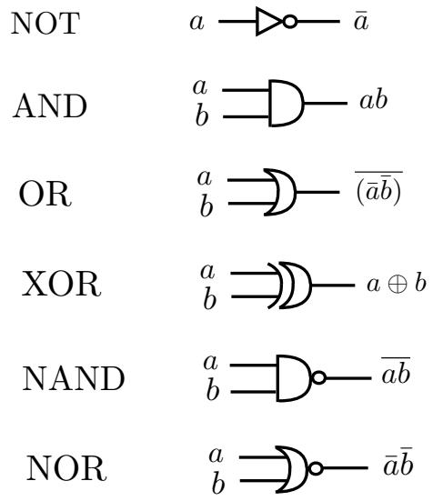
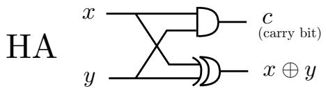
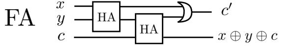
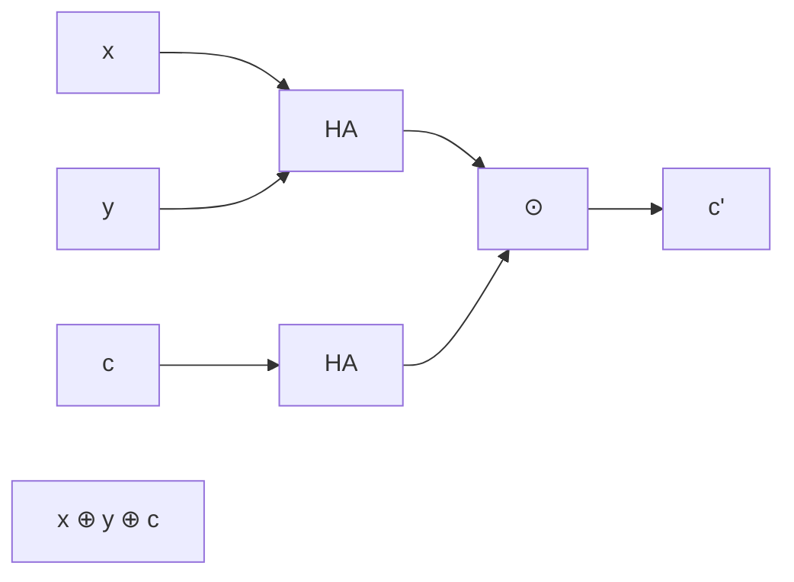
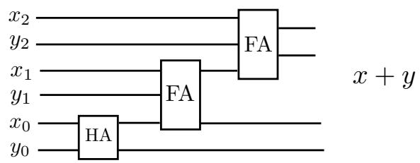
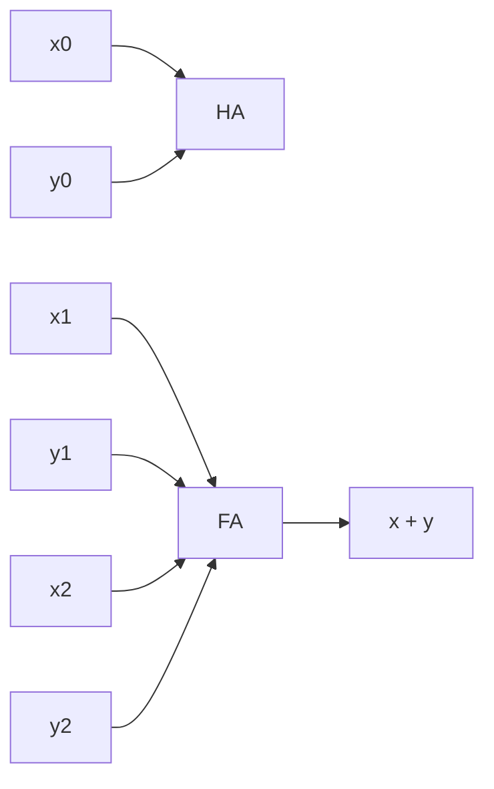
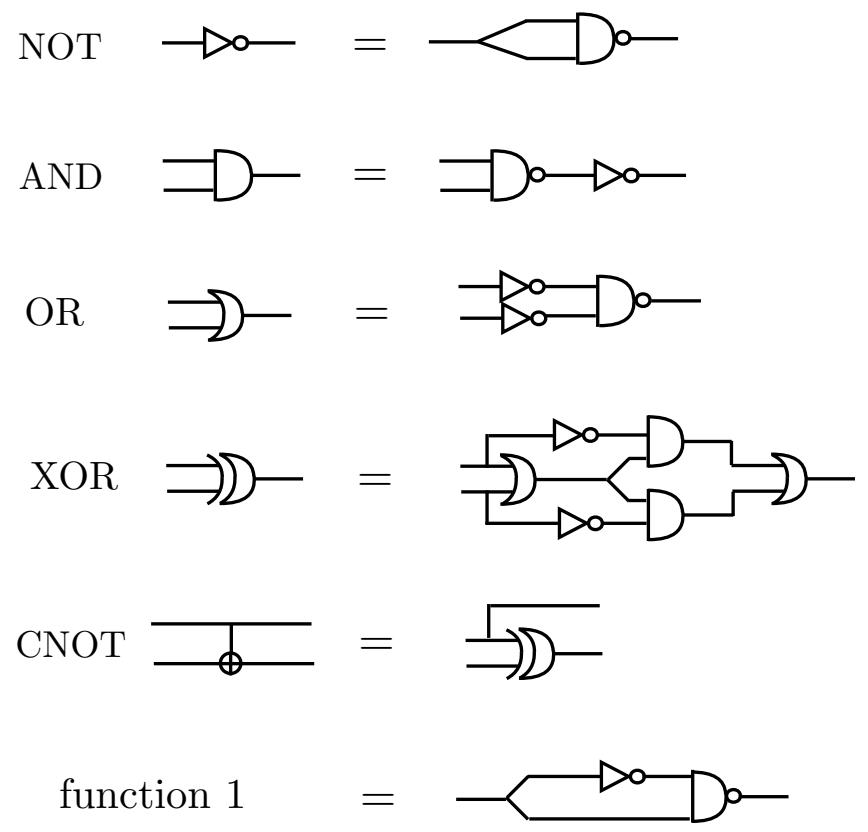
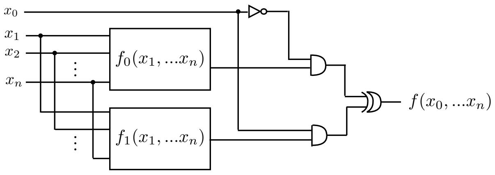

## 15 Lecture 15: Classical circuits

Circuits, with wires and gates, are a model of computation equivalent to the Turing machine, and often more convenient and realistic.

## 15.1 Basic gates

A classical logical gate is a function $f : \{ 0 , 1 \} ^ { n } \longrightarrow \{ 0 , 1 \} ^ { m }$ , taking n bits into m bits. When m = 1 the function is said to be boolean. For example, the NOT classical gate is a 1-bit to 1-bit function, the AND gate is a 2-bit to 1-bit function etc. Both implement boolean functions. Basic classical gates are given in Fig. 15.1.



<details>
<summary>text_image</summary>

NOT a → ▶ ○ → ā
AND a b → └ — ab
OR a b → └ — (āb̅)
XOR a b → └ — a ⊕ b
NAND a b → └ ○ → āb̅
NOR a b → ◇ ○ → āb̅
</details>

Fig. 15.1 Classical gates.

Example: a circuit that adds two 3-bit integers is shown in Fig. 15.2. It generalizes easily to n-bit integers.



<details>
<summary>text_image</summary>

HA
x
y
c
(carry bit)
x ⊕ y
</details>



<details>
<summary>flowchart</summary>


</details>



<details>
<summary>flowchart</summary>


</details>

Fig. 15.2 Adds two binary integers $x = x _ { 0 } x _ { 1 } x _ { 2 } , y = y _ { 0 } y _ { 1 } y _ { 2 }$ . The carry bit c in the half-adder HA is 1 if $x = y = 1$ . The carry bit $c ^ { \prime }$ in the full-adder FA is 1 if at least two input bits are 1.

Observation: any function f of n bits into m bits:

$$
f (x _ {1}, \dots x _ {n}) = (f _ {1} (x _ {1}, \dots x _ {n}), f _ {2} (x _ {1}, \dots x _ {n}), \dots , f _ {m} (x _ {1}, \dots x _ {n})) \tag {15.1}
$$

is equivalent to $m$ functions $f _ { 1 } , f _ { 2 } , . . . , f _ { n }$ of n bits to 1 bit (the “components” of the function $f )$ .

## 15.2 Universal set: NAND and FANOUT

Theorem: the gates NAND and FANOUT are a universal set: using only these gates, every function $f : \{ 0 , 1 \} ^ { n } \longrightarrow \{ 0 , 1 \} ^ { m }$ can be implemented in a circuit.

In virtue of the above observation, we need to prove the Theorem only for boolean functions $f ( x _ { 1 } , . . . , x _ { n } )$ .

We first give in Fig. 15.3 some examples of basic gates, realized with circuits that use only NAND and FANOUT.

  
Fig. 15.3 Basic gates in terms of NAND and FANOUT

The proof of the Theorem proceeds by induction on n. For $n = 1$ there are 4 possible boolean functions: the identity (represented by a wire), the NOT gate, the 0 function and the 1 function. These functions are all implementable using only NAND and FANOUT, see Fig. 15.3 (the 0 function is obtained from the 1 function simply by adding the NOT gate to the circuit).

Next we suppose that the Theorem holds for $n ,$ and prove that it holds for $n + 1$ , i.e. for boolean functions $f ( x _ { 0 } , x _ { 1 } , . . . , x _ { n } )$ . To do so we define

$$
f _ {0} (x _ {1},..., x _ {n}) \equiv f (0, x _ {1},..., x _ {n}), \quad f _ {1} (x _ {1},..., x _ {n}) \equiv f (1, x _ {1},..., x _ {n}) \tag {15.2}
$$

By the induction hypothesis, these two n-bit boolean functions are implemented by circuits with only NAND and FANOUT gates, represented in Fig. 15.4 with rectangular boxes. The same Figure proves the Theorem: indeed it realizes a circuit that computes $f ( x _ { 0 } , x _ { 1 } , . . . , x _ { n } )$ , using only NOT, AND, XOR and the rectangular boxes. All these circuit components can be realized with only NAND and FANOUT, cf. Fig. 15.3.

To be precise, Fig. 15.4 contains also CROSSOVER components, since there are crossings between the wires. We recall that CROSSOVER can be realized with three CNOT gates, and CNOT is realizable with NAND and FANOUT, as in Fig. 15.3.



<details>
<summary>flowchart</summary>

```mermaid
graph LR
  x0["x0"] --> f0["f0(x1, ...xn)"]
  x1["x1"] --> f0
  x2["x2"] --> f0
  xn["xn"] --> f0
  f0 --> AND1[""]
  f0 --> f1["f1(x1, ...xn)"]
  f1 --> AND2[""]
  AND1 --> f(x0, ...xn)
  AND2 --> f(x0, ...xn)
```
</details>

Fig. 15.4 Proof of universality of NAND and FANOUT