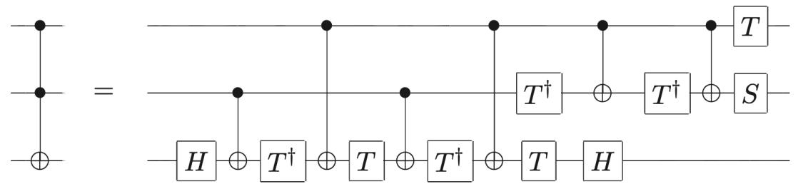

## 17 Lecture 17: Quantum circuits I

## 17.1 Rotation operators

We introduce the operators:

$$
R _ {x} (\theta) \equiv \exp (- i \frac {\theta}{2} X) = \cos \frac {\theta}{2} I - i \sin \frac {\theta}{2} X = \left( \begin{array}{c c} \cos \frac {\theta}{2} & - i \sin \frac {\theta}{2} \\ - i \sin \frac {\theta}{2} & \cos \frac {\theta}{2} \end{array} \right) (1 7. 1)
$$

$$
R _ {y} (\theta) \equiv \exp (- i \frac {\theta}{2} Y) = \cos \frac {\theta}{2} I - i \sin \frac {\theta}{2} Y = \left( \begin{array}{c c} \cos \frac {\theta}{2} & - \sin \frac {\theta}{2} \\ \sin \frac {\theta}{2} & \cos \frac {\theta}{2} \end{array} \right) \tag {17.2}
$$

$$
R _ {z} (\theta) \equiv \exp (- i \frac {\theta}{2} Z) = \cos \frac {\theta}{2} I - i \sin \frac {\theta}{2} Z = \left( \begin{array}{c c} \exp (- i \frac {\theta}{2}) & 0 \\ 0 & \exp (i \frac {\theta}{2}) \end{array} \right) (1 7. 3)
$$

where the exponential is defined by its Taylor series expansion. Note that even powers of $X , Y , Z$ give the identity, while odd powers reproduce the same Pauli matrices. For example $X ^ { 5 } = X ^ { 3 } = X$ . The rotation operators are unitary operators acting on 1-qubit states. They are called rotation operators because they rotate the qubits on the Bloch sphere, by an angle $\theta ,$ , respectively around the $x , y , z { \mathrm { ~ a x e s } }$ . For example

$$
R _ {x} (\theta) | \vec {r} \rangle = | \vec {r} ^ {\prime} \rangle , \quad \vec {r} ^ {\prime} = \mathcal {R} _ {x} (\theta) \vec {r} \tag {17.4}
$$

where $\mathcal { R } _ { x } ( \theta )$ acts on the 3-dimensional Bloch vector $\vec { r }$ by rotating it around the axis x by an angle $\theta$ (counterclockwise). Thus we have a 1-1 correspondence between operators $R$ on the qubit Hilbert space and geometric rotations $\mathcal { R }$ in the usual 3-dimensional euclidean space. We now justify eq. (17.4). Consider the qubit |0i, corresponding to the North pole on the Bloch sphere. Its components in the 2- dimensional vector space of qubit physical states are given by (1, 0). If we act on this vector with the rotation operator $R _ { x } ( \theta )$ we find:

$$
R _ {x} (\theta) | 0 \rangle = \left( \begin{array}{c c} \cos {\frac {\theta}{2}} & - i \sin {\frac {\theta}{2}} \\ - i \sin {\frac {\theta}{2}} & \cos {\frac {\theta}{2}} \end{array} \right) \binom{1}{0} = \binom{\cos {\frac {\theta}{2}}}{- i \sin {\frac {\theta}{2}}} \tag {17.5}
$$

The resulting vector corresponds to a rotation of the North pole by an angle ✓ around the x-axis (counterclockwise). Indeed the rotated point on the Bloch sphere corresponds to latitude $\theta$ and longitude $\phi = \textstyle { \frac { \pi } { 2 } }$ , and therefore corresponds to the qubit physical state

$$
| \psi \rangle = \cos \frac {\theta}{2} | 0 \rangle + e ^ {i \phi} \sin \frac {\theta}{2} | 1 \rangle = \cos \frac {\theta}{2} | 0 \rangle - i \sin \frac {\theta}{2} | 1 \rangle = \binom{\cos \frac {\theta}{2}}{- i \sin \frac {\theta}{2}} \tag {17.6}
$$

which indeed coincides with (17.5).

## 17.2 Universal set of quantum gates

Theorem 1: any unitary operation $U$ on n qubits can be realized using only CNOT and single qubit gates.

Theorem 2: any single qubit gate can be approximated by products of the Hadamard $\frac { \pi } { 8 }$ $T$

Thus CNOT, H, $T$ are an universal set for quantum computation.

The proof of these two Theorems can be found in the Lecture Notes on Quantum Computation, or in the standard references on quantum computation. Here we just give an example, the To↵oli gate in terms of CNOT and 1-qubit gates:

text_image

= T
H ⊕ T† ⊕ T ⊕ T† ⊕ T H
T† ⊕ T† ⊕ S

Note: the phase gate $S$ and the $\frac { \pi } { 8 }$ gate $T$ are given by the unitary matrices

$$
S = \left( \begin{array}{c c} 1 & 0 \\ 0 & i \end{array} \right), \quad T = \left( \begin{array}{c c} e ^ {- i \frac {\pi}{8}} & 0 \\ 0 & e ^ {+ i \frac {\pi}{8}} \end{array} \right) = e ^ {- i \frac {\pi}{8} Z} \tag {17.7}
$$