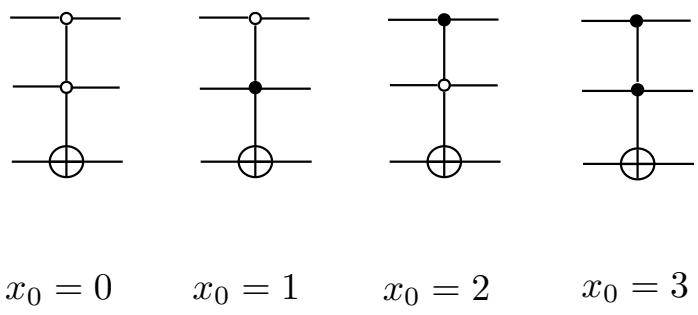
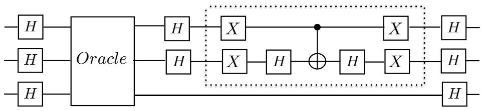
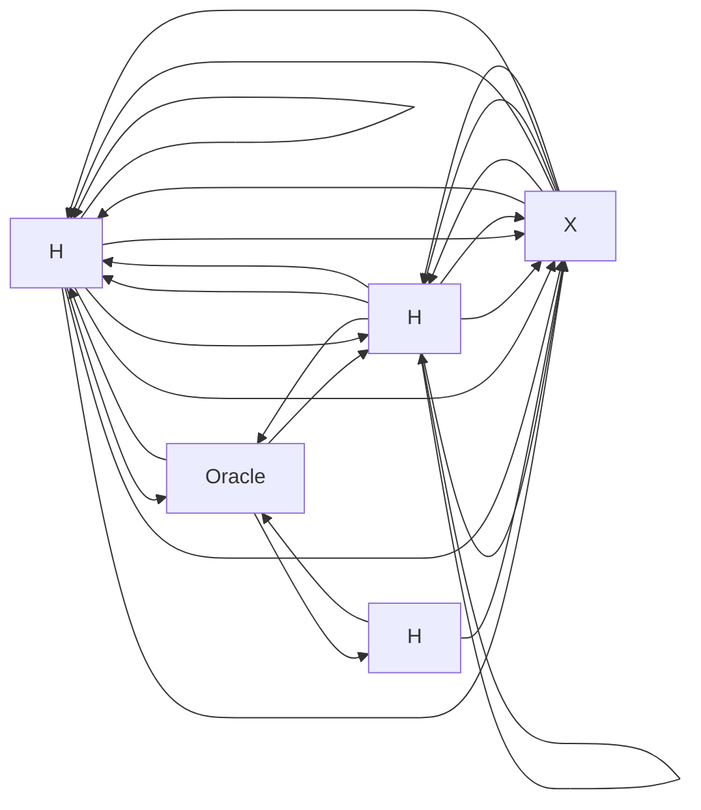

## 24 Lecture 24: Quantum search algorithm (Grover)

## 24.1 The problem

The problem is to find, in a set of $N \ = \ 2 ^ { n }$ elements, a subset of M elements that satisfies some given conditions. We say then that the search problem has M solutions.

We can assume the existence of a function $f ( x )$ from n bits to 1 bit, that takes the value $f ( x ) = 1$ if x is a solution and $f ( x ) = 0$ if x is not a solution.

We also assume that there is a black box (an “oracle”) $U _ { f }$ able to execute the operation on the $n + 1$ qubit state $| x \rangle | q \rangle$ , where $| x \rangle$ is a n-qubit state and $| q \rangle$ is a 1-qubit state:

$$
U _ {f} | x \rangle | q \rangle = | x \rangle | q \oplus f (x) \rangle \tag {24.1}
$$

In particular

$$
U _ {f} | x \rangle | 0 \rangle = | x \rangle | f (x) \rangle \tag {24.2}
$$

## 24.2 A two-bit example

In this example $N = 4$ , and the oracle that tests x is one of the four gates:

text_image

x₀ = 0
x₀ = 1
x₀ = 2
x₀ = 3

Fig. 24.4 Oracles for the four cases: solution $x _ { 0 } = 0 , \ldots$ solution $x _ { 0 } = 3$ .

each corresponding to a particular solution $x _ { 0 } .$

The first two qubits (the “query” qubits) encode $x ,$ the last qubit is the oracle response. The circuit for the search of the solution is:

flowchart

Fig. 24.5 circuit for the search of the solution $x _ { 0 }$

Initially, the two query qubits are in the state |00i, and the last qubit in the state |1i. Only one iteration is required to obtain exactly $x _ { 0 }$ . One can verify, using the circuit, that the measurement of the top two qubits gives $x _ { 0 }$ after using the oracle only once.

By contrast, a classical computer trying to find $x _ { 0 }$ by examining all the two-bit x (four of them) would require an average of 2.25 oracle calls.

Exercise: prove it.