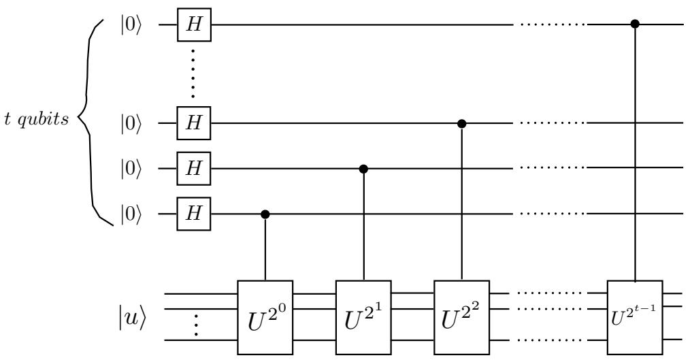

## 21 Lecture 21: Phase estimation

## 21.1 The circuit

Consider the eigenvalue equation for a unitary operator $U { : }$

$$
U | u \rangle = e ^ {2 \pi i \varphi} | u \rangle \tag {21.1}
$$

where U and the eigenvector $| u \rangle$ are known, and $\varphi$ is unknown. The $\mathrm { Q F T }$ provides an algorithm to find the phase $\varphi ,$ , assuming that black boxes (circuits) are available to prepare the state $| u \rangle$ and to implement controlled- $U ^ { 2 ^ { j } }$ .

The procedure of phase estimation uses two registers: the first register contains t qubits, each in the initial state $| 0 \rangle$ . The number t will depend on:

- the accuracy we want to reach in the estimation of the phase  
- the probability of success of the algorithm

The second register contains initially the eigenstate $| u \rangle$ , with the appropriate number of qubits necessary to encode the eigenstate.

The circuit for the phase estimation is given in Fig. 21.1. The e↵ect of the sequence of controlled-U gates on the state $| j \rangle | u \rangle$ is

$$
\left| j _ {1} \dots j _ {t} \right\rangle | u \rangle \longrightarrow \left| j _ {1} \dots j _ {t} \right\rangle U ^ {2 ^ {t - 1} j _ {1}} \dots U ^ {2 ^ {0} j _ {t}} | u \rangle = | j \rangle U ^ {j} | u \rangle \tag {21.2}
$$

and recalling the eigenvalue equation (21.1):

$$
\left| j \right\rangle \left| u \right\rangle \longrightarrow \left| j \right\rangle e ^ {2 \pi i \varphi j} \left| u \right\rangle \tag {21.3}
$$

The first register exits the H gates in the state:

$$
| 0 \rangle \longrightarrow \frac {1}{2 ^ {\frac {t}{2}}} \sum_ {j = 0} ^ {2 ^ {t} - 1} | j \rangle \tag {21.4}
$$

(remember $\begin{array} { r } { ( | 0 \rangle + | 1 \rangle ) ( | 0 \rangle + | 1 \rangle ) \cdot \cdot \cdot ( | 0 \rangle + | 1 \rangle ) = \sum _ { j _ { 1 } = 0 } ^ { 1 } \cdot \cdot \cdot \sum _ { j _ { t } = 0 } ^ { 1 } | j _ { 1 } \cdot \cdot \cdot j _ { t } \rangle = \sum _ { j = 0 } ^ { 2 ^ { t } - 1 } | j \rangle ) } \end{array}$

Thus the initial state of the two registers $| 0 \rangle | u \rangle$ is transformed by the circuit as:

$$
\left| 0 \right\rangle | u \rangle \longrightarrow \frac {1}{2 ^ {\frac {t}{2}}} \sum_ {j = 0} ^ {2 ^ {t} - 1} e ^ {2 \pi i \varphi j} | j \rangle | u \rangle = \frac {1}{2 ^ {\frac {t}{2}}} \sum_ {j = 0} ^ {2 ^ {t} - 1} e ^ {2 \pi i \frac {(2 ^ {t} \varphi) j}{2 ^ {t}}} | j \rangle | u \rangle \tag {21.5}
$$

Suppose now that the phase $\varphi$ can be expressed exactly with t bits:

$$
\varphi = 0. \varphi_ {1}... \varphi_ {t} \tag {21.6}
$$

(remember that the phase as defined in (21.1) is a real number between 0 and 1). Then applying the inverse $\mathrm { Q F T }$ to the first register gives

$$
\frac {1}{2 ^ {\frac {t}{2}}} \sum_ {j = 0} ^ {2 ^ {t} - 1} e ^ {2 \pi i \frac {(2 ^ {t} \varphi) j}{2 ^ {t}}} | j \rangle \longrightarrow | 2 ^ {t} \varphi \rangle = | \varphi_ {1}... \varphi_ {t} \rangle \tag {21.7}
$$

and measuring the register in the computational basis yields the phase $\varphi .$



<details>
<summary>flowchart</summary>

```mermaid
graph LR
  subgraph t_qubits["t qubits"]
    direction TB
  A["H"] --> B["......"]
    C["......"]
    D["......"]
  end

  subgraph u_u["|u⟩[\"|u⟩\"]"]
  E["U2^0"] --> F["......"]
  G["U2^1"] --> H["......"]
  I["U2^2"] --> J["......"]
  K["U2^{t-1}"] --> L["......"]
  end

  style A fill:#fff,stroke:#333
  style C fill:#fff,stroke:#333
  style D fill:#fff,stroke:#333
  style E fill:#fff,stroke:#333
  style F fill:#fff,stroke:#333
  style G fill:#fff,stroke:#333
  style H fill:#fff,stroke:#333
  style I fill:#fff,stroke:#333
  style J fill:#fff,stroke:#333
  style K fill:#fff,stroke:#333
  style L fill:#fff,stroke:#333
```
</details>

Fig. 21.1 The circuit for phase estimation.